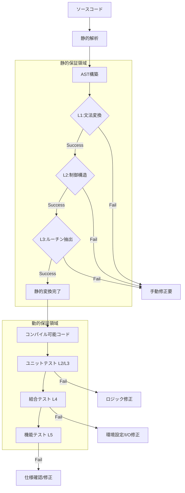
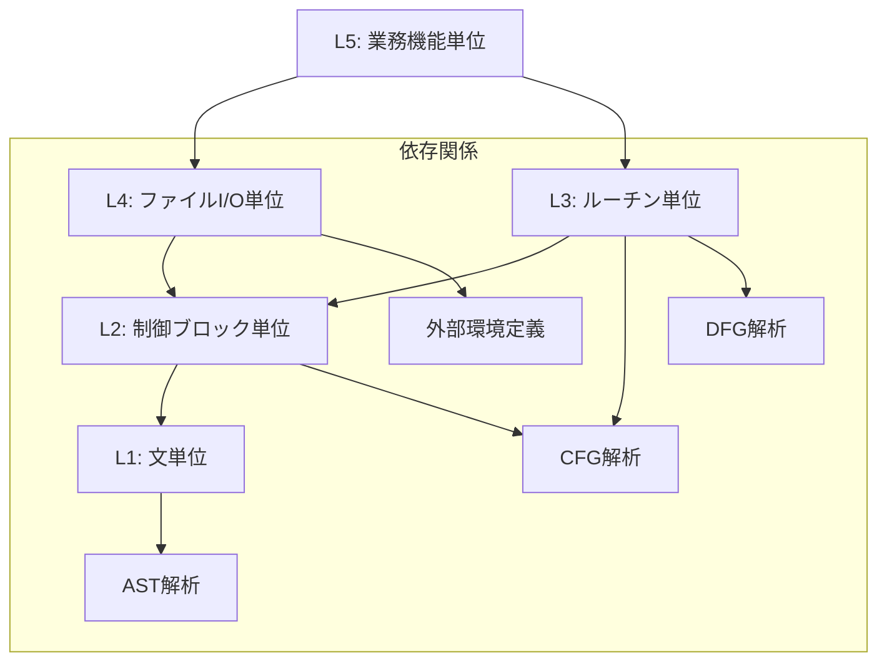

# 07_Guarantee-Unit-Definition

# 1. 問題定義

COBOLからモダン言語への移行プロジェクトにおいて、「構文的に変換可能であること（Syntactic Convertibility）」と「意味的に等価であること（Semantic Equivalence）」は、全く異なる次元の課題である。しかし、従来の移行アプローチでは、これらが混同され、「コンパイルが通れば成功」という安易な判断基準が採用されることが多い。その結果、結合テストフェーズにおいて、微細な挙動差異に起因するバグが大量発生し、プロジェクトが破綻する。

本定義書は、この問題を解決するために、移行プロセスにおける「保証対象単位（Guarantee Unit）」を構造的に定義するものである。どのレベルで何を保証し、何を保証しない（できない）かを明確に切り分けることで、移行リスクを定量的に評価・制御可能な状態にすることを目的とする。

# 2. 保証単位の抽象レベル分類

本構造設計では、保証単位を以下の5つの抽象レベルに分類する。各レベルは下位レベルの保証を前提として成立する。

## L1: 文単位 (Statement Level)

- **定義**: 単一のCOBOL命令文（MOVE, ADD, IF, DISPLAYなど）が、移行先言語の対応する構文またはライブラリ呼び出しに、構文的に正しく変換されること。
- **ASTとの関係**: ASTノードの1対1、または1対Nの局所的な変換パターンに対応する。
- **CFGとの関係**: 基本ブロック（Basic Block）内の単一ノード、または単純な分岐エッジに対応する。
- **DFGとの関係**: 単一ステートメント内での変数の定義（Def）と使用（Use）の関係。
- **静的保証可能性**: 極めて高い。構文解析とテンプレート適用により、100%に近い自動変換が可能。
- **動的保証必要性**: 低い。言語仕様レベルでの動作保証に委ねられる。
- **保証不能化条件**: ベンダー独自拡張命令、既に廃止された非推奨命令の使用。

## L2: 制御ブロック単位 (Control Block Level)

- **定義**: IF-ELSE, PERFORM-UNTIL, EVALUATEなどの制御構造が、論理的に等価なフローとして維持されること。スコープの閉じた制御ロジックの正当性。
- **ASTとの関係**: 複合ステートメント（Block Statement）およびそのネスト構造に対応する。
- **CFGとの関係**: 分岐、合流、ループ構造におけるグラフ同型性（Graph Isomorphism）の維持。
- **DFGとの関係**: 制御ブロック内でのデータの生存区間と、制御依存関係（Control Dependency）。
- **静的保証可能性**: 高い。構造化プログラミングの原則に従っている限り、静的に解析・変換可能。
- **動的保証必要性**: 中程度。境界値条件やループ終了条件のオフバイワンエラーなどをユニットテストで確認する。
- **保証不能化条件**: `ALTER`文による動的なフロー変更、構造を跨ぐ不規則な`GO TO`（スパゲッティコード）。

## L3: ルーチン単位 (Routine Level)

- **定義**: PERFORM A THRU B, セクション, 段落単位の処理のまとまりが、関数やメソッドとして正しくカプセル化され、入力・出力・副作用が管理されていること。
- **ASTとの関係**: 手続き部（PROCEDURE DIVISION）内のセクション（Section）または段落（Paragraph）の集合。
- **CFGとの関係**: コールグラフ（Call Graph）におけるノードと、サブルーチンへの出入り（Entry/Exit）。
- **DFGとの関係**: ルーチン間のパラメータ受け渡し、グローバル変数（共有データ）へのアクセスと更新。
- **静的保証可能性**: 中程度。Fall-through（段落の突き抜け実行）や変数の広域スコープにより、静的解析だけでは意図を完全に特定できない場合がある。
- **動的保証必要性**: 高い。結合テスト（内部結合）フェーズでの検証が必須。
- **保証不能化条件**: 複雑なFall-through構造、再帰的なPERFORMの誤用、エントリポイントの動的な変更。

## L4: ファイルI/O単位 (File I/O Level)

- **定義**: READ, WRITE, REWRITEなどのレコード操作が、ファイルシステムやデータベースへのアクセスとして正しく機能し、ステータスコード（FILE STATUS）や例外が正しくハンドリングされること。
- **ASTとの関係**: 環境部（ENVIRONMENT DIVISION）のファイル定義と、手続き部の入出力命令。
- **CFGとの関係**: I/O操作ノードと、それに続く成功/失敗/例外処理の分岐パス。
- **DFGとの関係**: レコードバッファへのデータの流入・流出、ファイルステータス変数の伝播。
- **静的保証可能性**: 限定的。インターフェースの整合性は保証できるが、実行時の振る舞いは環境に依存する。
- **動的保証必要性**: 極めて高い。外部システムとの結合テストが必須。
- **保証不能化条件**: 外部媒体の仕様差異、排他制御（ロック）のタイミング差異、文字コード変換によるバイト長の変化。

## L5: 業務機能単位 (Business Function Level)

- **定義**: プログラム全体として、特定の業務入力（画面、帳票、ファイル）に対して、仕様通りの出力結果が得られること。エンドツーエンドの整合性。
- **ASTとの関係**: プログラム全体のAST、およびコピー句を含む全ソースコード。
- **CFGとの関係**: プログラムのエントリから終了（STOP RUN / GOBACK）までの全実行パス。
- **DFGとの関係**: システム全体を通したデータフロー、データベースの整合性。
- **静的保証可能性**: 不可能。ビジネスロジックの正当性は、コードの構造からは導き出せない（仕様書が必要）。
- **動的保証必要性**: 必須。シナリオテスト、運用テストレベルでの検証。
- **保証不能化条件**: 仕様書の欠落、暗黙の業務ルール、現行システムのバグを「仕様」として継承している場合。

# 3. 静的保証と動的保証の分離モデル

# 4. 保証単位階層モデル

# 5. 保証不能発生ポイント

以下のポイントは、自動変換ツールによる静的保証の限界点であり、人間による判断または動的テストによる検証が不可欠となる。

1.  **動的SQLの構築と実行**: 文字列操作でSQLを組み立てる場合、コンパイル時にSQLの構文正当性を検証できない。
2.  **外部プログラム呼び出し (CALL identifier)**: 変数で指定されたモジュールを呼び出す場合、呼び出し先の存在やインターフェース整合性を静的に保証できない。
3.  **ポインタ操作とメモリ再定義 (REDEFINES)**: 異なるデータ型としてメモリ領域を共有する場合、データの内容に依存した振る舞いの差異が発生しやすい。
4.  **文字コード依存処理**: EBCDICとASCII/Unicodeの照合順序（Collating Sequence）の違いや、バイトサイズの違いによるロジック破綻。
5.  **特定環境への密結合**: メインフレーム特有のシステムコールや、ミドルウェア固有のAPIを使用している箇所。

# 6. 移行設計判断への接続

本定義に基づき、移行設計者は以下の判断を行う必要がある。

1.  **静的保証率の算出**: L1, L2レベルでの自動変換成功率を測定し、ツールの適用効果を定量化する。
2.  **リスクの局所化**: L3, L4レベルの保証が困難な箇所を特定し、重点的なレビューやテストリソースを配分する。
3.  **変換戦略の選択**: L2レベルで構造が破綻している（スパゲッティコード）場合、無理に構造化変換を行わず、GOTOを含む低レベルな変換を選択するか、リライト（再構築）を選択するかの判断基準とする。
4.  **テスト計画の策定**: L1, L2は自動テスト生成でカバーし、L4, L5は手動テストやシナリオテストでカバーするというような、階層別のテスト戦略を立案する。

---

# 結論

保証単位の定義によって初めて定量化可能になるもの：

1.  **自動化ツールの適用範囲と限界（ROIの算出根拠）**
2.  **移行後のシステムに残存する潜在的リスクの総量**
3.  **必要なテスト工数と、その配分の最適解**
