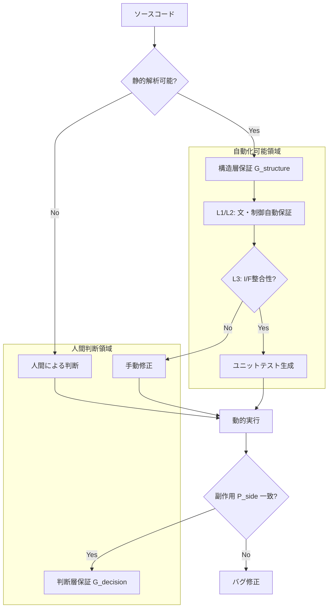

# 08_Formal-Definition-of-Guarantee

# 1. 問題設定

COBOLからモダン言語への移行において、「保証（Guarantee）」という言葉は極めて曖昧に使われている。「同じ動きをする」という自然言語の定義は、検証不可能な主観的基準となり、プロジェクト後半のトラブルの温床となる。

なぜ保証を形式化する必要があるのか。
それは、**「変換成功」と「移行成功」の乖離を埋めるため**である。

- コンパイルが通る（構文的成功）
- アルゴリズムが同じである（構造的成功）
- 業務結果が同じである（意味的成功）

これらを区別せず「保証する」と宣言することは、エンジニアリングとして誠実ではない。本定義書では、保証を「ある変換関数 $\Phi$ を適用した前後で、特定の性質 $P$ が不変であること」として数学的に形式化する。これにより、自動化ツールが**何を数学的に証明し、何を人間に委ねたか**を明確な境界線として提示可能にする。

# 2. 保証の基本定義

保証（Guarantee）とは、変換対象単位 $GU$ （Guarantee Unit）に対して、変換関数 $\Phi$ を適用した結果、保存すべき性質の集合 $\mathbb{P}$ が維持されることである。

$$
G(GU, \Phi, \mathbb{P}) \iff \forall P \in \mathbb{P}, P(GU) \equiv P(\Phi(GU))
$$

ここで、移行プロジェクトにおいて必須となる5つの保存観点を定義する。

### 1. 構文保存（Syntax Preservation: $P_{syn}$）
ソースコードが対象言語の文法規則 $\mathcal{L}$ に適合し、構文エラーを含まないこと。
$$
P_{syn}(S) \iff S \in \mathcal{L}_{target}
$$

### 2. 制御流保存（Control Flow Preservation: $P_{flow}$）
プログラムの制御フローグラフ（CFG）が、変換前後でグラフ同型（Graph Isomorphism）、または等価なパス集合を持つこと。
$$
CFG(S) \cong CFG(\Phi(S))
$$

### 3. データ依存保存（Data Dependency Preservation: $P_{data}$）
変数 $v$ の定義（Def）と使用（Use）の関係（DFG）が維持されること。ある地点での変数の値が、同一の計算過程を経て導出されること。
$$
DFG(S) \subseteq DFG(\Phi(S))
$$
※ $\subseteq$ は、変換後の言語仕様により新たな依存関係（例: オブジェクト参照）が増えることは許容するが、既存の依存が失われてはならないことを示す。

### 4. 副作用保存（Side Effect Preservation: $P_{side}$）
外部環境（ファイル、DB、画面、通信）への入出力順序と内容が維持されること。
$$
Trace(IO(S)) \equiv Trace(IO(\Phi(S)))
$$

### 5. 外部境界整合性（Boundary Consistency: $P_{bound}$）
モジュール境界（引数、戻り値、共有メモリ）のデータ型とメモリ配置の互換性が維持されること。
$$
Interface(S) \equiv Interface(\Phi(S))
$$

# 3. 層別保証モデル

保証の性質を、解析の深さに応じて3つの層に分離定義する。

## 3.1 構文層保証 ($G_{syntax}$)
コンパイラが保証可能な領域。

$$
G_{syntax}(S) \iff P_{syn}(S) \land P_{bound}(S)
$$
- **検証方法**: ターゲット言語のコンパイラ実行
- **自動化**: 100%可能

## 3.2 構造層保証 ($G_{structure}$)
静的解析によりグラフ理論的に保証可能な領域。

$$
G_{structure}(S) \iff G_{syntax}(S) \land P_{flow}(S) \land P_{data}(S)
$$
- **検証方法**: CFG/DFGの同型性判定、シンボリック実行
- **自動化**: 高度なツールにより可能（動的ディスパッチを除く）

## 3.3 判断層保証 ($G_{decision}$)
実行時の振る舞いと業務要件の一致。

$$
G_{decision}(S) \iff G_{structure}(S) \land P_{side}(S)
$$
- **検証方法**: 動的テスト（ユニットテスト、シナリオテスト）
- **自動化**: テストケース生成までは可能だが、正解判定は仕様書または現行動作に依存

# 4. Guarantee Unitとの接続

前章で定義したL1〜L5の単位に対し、適用される保証関数を定義する。

### G(L1): 文単位
$$
G(L1) = G_{syntax} \land P_{local\_data}
$$
- 単一ステートメントの構文正当性と、局所的な変数の読み書きの一致。
- $P_{flow}$ は基本ブロック内での自明な順序のみ。

### G(L2): 制御ブロック単位
$$
G(L2) = G(L1) \land P_{flow}
$$
- 制御構造（分岐、ループ）の構造的等価性が追加される。
- ここが崩れると「ロジック破綻」となる。

### G(L3): ルーチン単位
$$
G(L3) = G(L2) \land P_{bound} \land P_{data\_flow}
$$
- ルーチン間のインターフェース整合性と、ルーチンをまたぐデータの流れ（引数渡し、グローバル変数）が保証される。

### G(L4): ファイルI/O単位
$$
G(L4) = G(L3) \land P_{side}(IO)
$$
- I/O副作用の順序と内容の保存が要求される。
- 静的解析だけでは $P_{side}$ の完全証明は困難（環境依存のため）。

### G(L5): 業務機能単位
$$
G(L5) = G(L4) \land P_{biz\_spec}
$$
- 業務仕様 $P_{biz\_spec}$ との整合性。
- これは変換ツールの保証範囲外であり、移行プロジェクト全体の保証対象となる。

# 5. 保証成立条件と保証失敗条件

## 5.1 保証成立の必要条件
以下の条件がすべて満たされた場合のみ、自動変換による保証（$G_{structure}$）が成立する。

1.  **閉包性 (Closure)**: 解析対象のコードが、外部依存を含めてすべてASTとして解決可能であること。
2.  **決定性 (Determinism)**: 制御フローが静的に決定可能であること（`ALTER` や 変数による `GO TO` がない）。
3.  **型整合性 (Type Consistency)**: `REDEFINES` 等によるメモリ操作が、ターゲット言語の型システムに安全にマッピング可能であること。

## 5.2 保証崩壊条件 (Failure Conditions)
以下のいずれかが発生した場合、静的保証は「不能（Unknown）」と判定される。

- $\exists x \in S, IsDynamicSQL(x)$ （動的SQL）
- $\exists x \in S, IsDynamicCall(x)$ （動的CALL）
- $\exists x \in S, PointerArithmetic(x)$ （ポインタ演算依存）
- $CFG(S)$ が非構造的で、かつ変換パターンに適合しない（既約でない制御フロー）

# 6. 保証可能領域の境界モデル

# 7. 結論

保証の形式定義によって、以下の事項が明確化される。

1.  **定量化可能になるもの**:
    - 「静的に保証された行数」対「人間が保証すべき行数」の比率。
    - 移行リスクの総量（$G_{structure}$ が成立しないコードブロックの数）。

2.  **自動化可能になるもの**:
    - $P_{syn}, P_{flow}, P_{data}$ の検証プロセス。
    - $G_{structure}$ 成立領域に対する回帰テストケースの自動生成。

3.  **人間判断に残るもの**:
    - $P_{side}$ のうち環境依存部分の検証。
    - $G_{decision}$（業務仕様としての正しさ）の最終認定。

保証とは「何も変わらないこと」ではなく、「**定義された不変条件 $\mathbb{P}$ が数学的に守られていること**」である。この定義を受け入れることが、工学的移行の第一歩となる。
