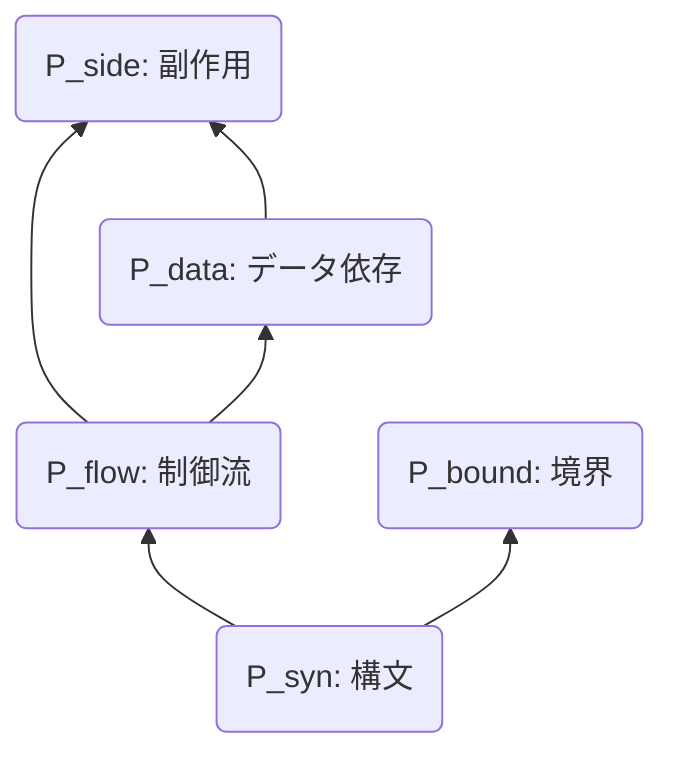
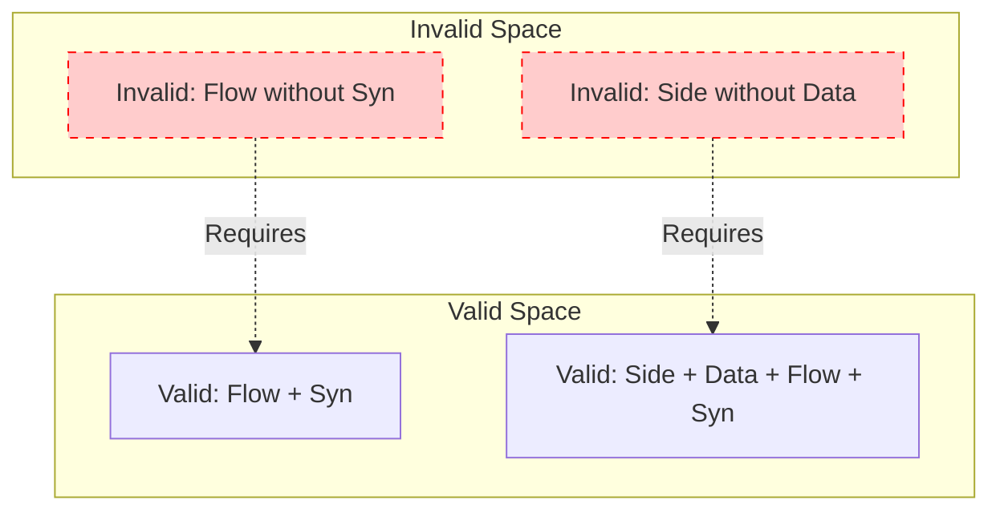

# 10_Dependent-Guarantee-Space

# 1. 動機と問題設定

## 1.1 独立仮定の限界
前章までの Guarantee Space の定義 $\mathcal{G} = \mathcal{P}(\mathbb{P})$ は、保存観点集合 $\mathbb{P}$ の要素が互いに独立であることを暗黙に仮定していた。すなわち、$\mathbb{P}$ のあらゆる部分集合が、論理的にあり得る保証状態として許容されていた。

しかし、工学的実態において以下の状態はあり得ない（Unreachable）：

- **構文が破壊されているが、制御流は保証されている**
  - ($P_{syn} \notin S$ かつ $P_{flow} \in S$)
  - 構文木（AST）が構築できなければ、制御フローグラフ（CFG）も構築できないため。
- **制御流が異なっているが、データ依存は保証されている**
  - ($P_{flow} \notin S$ かつ $P_{data} \in S$)
  - データ依存（Def-Use Chain）は制御パス上に定義されるため。

## 1.2 依存関係の導入必要性
保証空間を現実の物理的・論理的制約に適合させるためには、性質間の「依存関係（Dependency）」を形式化し、空間を「独立仮定」から「従属構造」へと再定義する必要がある。これにより、理論的に無意味な状態（Invalid States）を空間から排除し、探索空間を適正化できる。

---

# 2. 依存関係の順序理論的定義

保証空間に位相的制約を与える依存グラフを、順序集合として厳密に再定義する。

## 2.1 依存順序 $\leq_D$

保存観点集合 $\mathbb{P} = \{ P_{syn}, P_{flow}, P_{data}, P_{side}, P_{bound} \}$ 上に、依存関係に基づく二項関係 $\leq_D$ を定義する。

$$
p_j \leq_D p_i \iff (p_i \text{ を保証するには } p_j \text{ が必要})
$$

この関係 $\leq_D$ は以下の性質を満たすため、**半順序（Partial Order）** である。

1.  **反射律**: $p \leq_D p$ （任意の性質はそれ自身の成立を必要とする）
2.  **反対称律**: $p \leq_D q \land q \leq_D p \implies p = q$ （循環依存はないと仮定）
3.  **推移律**: $p \leq_D q \land q \leq_D r \implies p \leq_D r$

依存グラフ $D = (\mathbb{P}, E_{req})$ における辺 $p_i \xrightarrow{req} p_j$ は、順序関係 $p_j \leq_D p_i$ に対応する。すなわち、矢印の方向は「依存元から依存先」へ向かうが、順序の大小は「基礎（小さい）から応用（大きい）」へと向かう（$p_j$ の方が基礎的である）。

## 2.2 具体的な順序構造

本体系における依存順序 $(\mathbb{P}, \leq_D)$ は以下の通りである。

1.  $P_{syn} \leq_D P_{flow}$ （構文は制御の基礎）
2.  $P_{syn} \leq_D P_{bound}$ （構文は境界の基礎）
3.  $P_{flow} \leq_D P_{data}$ （制御はデータの基礎）
4.  $P_{flow} \leq_D P_{side}$ （制御は副作用の基礎）
5.  $P_{data} \leq_D P_{side}$ （データは副作用の基礎）

---

# 3. 依存閉包と不動点理論

依存順序に基づき、論理的に妥当な保証集合を定義するための閉包演算を導入する。

## 3.1 下集合（Lower Set）としての Valid State

保証集合 $S \subseteq \mathbb{P}$ が論理的に妥当である（Valid）とは、その集合が順序 $\leq_D$ についての下集合（Lower Set / Ideal）であることを意味する。

**定義:** $S$ が下集合であるとは、以下を満たすことである。
$$
\forall p \in S, \forall q \in \mathbb{P}, (q \leq_D p \implies q \in S)
$$

## 3.2 閉包演算子 $Cl_D$

任意の保証集合 $S \subseteq \mathbb{P}$ に対する依存閉包 $Cl_D(S)$ を、**$S$ を含む最小の下集合**として定義する。

$$
Cl_D(S) = \{ q \in \mathbb{P} \mid \exists p \in S, q \leq_D p \}
$$

## 3.3 閉包の性質と不動点

この演算子 $Cl_D: \mathcal{P}(\mathbb{P}) \to \mathcal{P}(\mathbb{P})$ は以下の性質を持つ。

1.  **有限性**: $\mathbb{P}$ は有限集合であるため、閉包は必ず有限ステップで計算可能である。
2.  **単調性**: $S_1 \subseteq S_2 \implies Cl_D(S_1) \subseteq Cl_D(S_2)$。
3.  **不動点**: $S$ が Valid である必要十分条件は、それが $Cl_D$ の不動点であること（$S = Cl_D(S)$）である。

Knaster–Tarski の不動点定理により、完全束上の単調関数である $Cl_D$ の不動点全体もまた完全束をなすことが保証される。

---

# 4. 依存付き Guarantee Space の再定義

## 4.1 定義：イデアル束としての $\mathcal{G}_{dep}$

**依存付き保証空間（Dependent Guarantee Space）** $\mathcal{G}_{dep}$ を、順序集合 $(\mathbb{P}, \leq_D)$ のイデアル（順序イデアル）全体の集合として再定義する。

$$
\mathcal{G}_{dep} = Idl(\mathbb{P}, \leq_D) = \{ S \in \mathcal{P}(\mathbb{P}) \mid S = Cl_D(S) \}
$$

## 4.2 定理：順序同型性

$\mathcal{G}_{dep}$ は、包含関係 $\subseteq$ を順序とすることで、束（Lattice）をなす。

**定理:**
保証空間 $\mathcal{G}_{dep}$ は、順序集合 $(\mathbb{P}, \leq_D)$ 上の分配束（Distributive Lattice）である。

---

# 5. 完備分配束性の証明

$\mathcal{G}_{dep}$ が完備分配束（Complete Distributive Lattice）であることを証明する。

## 5.1 完備性（Completeness）

任意の族 $\{ S_i \}_{i \in I} \subseteq \mathcal{G}_{dep}$ に対して：

1.  **Meet (共通部分)**: $\bigwedge S_i = \bigcap_{i \in I} S_i$
    - 下集合の共通部分は常に下集合であるため、$\mathcal{G}_{dep}$ 内に存在する。
2.  **Join (和集合)**: $\bigvee S_i = \bigcup_{i \in I} S_i$
    - 下集合の和集合は常に下集合であるため、$\mathcal{G}_{dep}$ 内に存在する。

任意の族に対して上限と下限が存在するため、$\mathcal{G}_{dep}$ は完備束である。

## 5.2 分配性（Distributivity）

$\mathcal{G}_{dep}$ の演算は集合の共通部分（$\cap$）と和集合（$\cup$）そのものであるため、集合演算の分配律を継承する。

$$
A \cap (B \cup C) = (A \cap B) \cup (A \cap C)
$$

よって、$\mathcal{G}_{dep}$ は完備分配束である。

---

# 6. Unreachable の形式定義

理論空間から除外されるべき無効状態を形式的に定義する。

## 6.1 定義

ある保証集合 $S \subseteq \mathbb{P}$ が **Unreachable（到達不能）** であるとは、それが依存閉包と一致しないことである。

$$
Unreachable(S) \iff S \neq Cl_D(S)
$$

## 6.2 意味論的解釈

$Unreachable(S)$ である状態は、工学的に「不安定」または「定義不能」な状態を意味する。
例えば $S = \{ P_{flow} \}$ は、$P_{syn} \leq_D P_{flow}$ であるにもかかわらず $P_{syn} \notin S$ であるため Unreachable である。これは「構文エラーがあるのに制御フローは正しい」という矛盾した状態を示しており、解析ツールの出力としてはあり得ない（バグである）。

---

# 7. 保証空間の視覚化

## 7.1 Hasse Diagram of Order $(\mathbb{P}, \leq_D)$

順序構造としての依存関係。下にあるものほど基礎（必須）である。



## 7.2 Ideal Lattice $\mathcal{G}_{dep}$ (Valid States)

妥当な状態のみで構成される分配束。

```mermaid
graph TD
    Top[Top: Full Guarantee]
    
    S_NoSide[No SideEffect<br>{Syn, Flow, Data, Bound}]
    S_NoBound[No Boundary<br>{Syn, Flow, Data, Side}]
    
    S_Data[Data Struct<br>{Syn, Flow, Data}]
    S_BoundFlow[Bound & Flow<br>{Syn, Flow, Bound}]
    
    S_Flow[Flow Struct<br>{Syn, Flow}]
    S_Bound[Boundary<br>{Syn, Bound}]
    
    S_Syn[Syntax Only<br>{Syn}]
    
    Bot[Bot: None]

    %% Lattice Edges (Subset relation)
    Top --> S_NoSide
    Top --> S_NoBound
    
    S_NoSide --> S_Data
    S_NoSide --> S_BoundFlow
    
    S_Data --> S_Flow
    S_BoundFlow --> S_Flow
    S_BoundFlow --> S_Bound
    
    S_Flow --> S_Syn
    S_Bound --> S_Syn
    
    S_Syn --> Bot
```

## 7.3 Unreachable State Example (Red)

理論空間から除外される状態の例。



---

# 8. 結論

本改訂により、保証空間 $\mathcal{G}_{dep}$ は単なる集合の集まりではなく、**順序集合 $(\mathbb{P}, \leq_D)$ 上のイデアル束**として厳密に定式化された。
この数学的構造は完備分配束であり、任意のマージ操作（Join）や共通部分抽出（Meet）が常に空間内で閉じることを保証する。これは、複数の解析ツールや検証結果を統合する際の理論的基盤となるものである。
