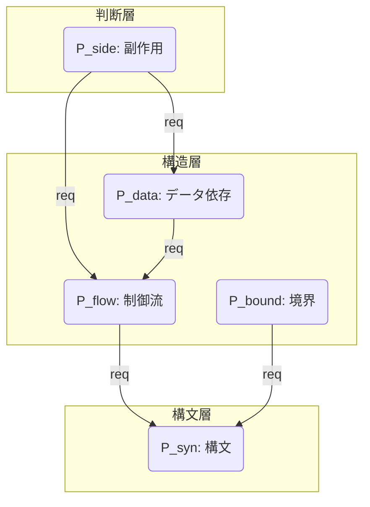

# 10_Dependent-Guarantee-Space

# 1. 動機と問題設定

## 1.1 独立仮定の限界
前章までの Guarantee Space の定義 $\mathcal{G} = \mathcal{P}(\mathbb{P})$ は、保存観点集合 $\mathbb{P}$ の要素が互いに独立であることを暗黙に仮定していた。すなわち、$\mathbb{P}$ のあらゆる部分集合が、論理的にあり得る保証状態として許容されていた。

しかし、工学的実態において以下の状態はあり得ない（Unreachable）：

- **構文が破壊されているが、制御流は保証されている**
  - ($P_{syn} \notin S$ かつ $P_{flow} \in S$)
  - 構文木（AST）が構築できなければ、制御フローグラフ（CFG）も構築できないため。
- **制御流が異なっているが、データ依存は保証されている**
  - ($P_{flow} \notin S$ かつ $P_{data} \in S$)
  - データ依存（Def-Use Chain）は制御パス上に定義されるため。

## 1.2 依存関係の導入必要性
保証空間を現実の物理的・論理的制約に適合させるためには、性質間の「依存関係（Dependency）」を形式化し、空間を「独立仮定」から「従属構造」へと再定義する必要がある。これにより、理論的に無意味な状態（Invalid States）を空間から排除し、探索空間を適正化できる。

---

# 2. Dependency Graph の形式定義

保証空間に位相的制約を与える依存グラフを定義する。

## 2.1 定義
依存グラフ（Dependency Graph）を有向グラフ $D = (\mathbb{P}, E_{req})$ として定義する。

- **頂点集合 $\mathbb{P}$**: 保存観点の集合 $\{ P_{syn}, P_{flow}, P_{data}, P_{side}, P_{bound} \}$
- **辺集合 $E_{req} \subseteq \mathbb{P} \times \mathbb{P}$**: 依存関係（Prerequisite Relation）

## 2.2 辺の意味論
辺 $(p_i, p_j) \in E_{req}$ を $p_i \xrightarrow{req} p_j$ と表記し、以下の意味を持つものとする。

> **「性質 $p_i$ を保証するためには、性質 $p_j$ の保証が前提条件（Prerequisite）として必須である」**

これは論理的な含意 $p_i \implies p_j$ と同値である。「$p_i$ が真ならば、必然的に $p_j$ も真でなければならない（さもなくば矛盾する）」ことを示す。

## 2.3 具体的な依存構造
本体系における依存関係を以下のように定義する。

1.  $P_{flow} \xrightarrow{req} P_{syn}$
    - [構造層 $\to$ 構文層]: CFG構築にはASTが必要。
2.  $P_{data} \xrightarrow{req} P_{flow}$
    - [構造層内依存]: DFG構築にはCFGが必要。
3.  $P_{bound} \xrightarrow{req} P_{syn}$
    - [構造層 $\to$ 構文層]: インターフェース定義には構文解析が必要。
4.  $P_{side} \xrightarrow{req} P_{flow} \land P_{data}$
    - [判断層 $\to$ 構造層]: 副作用（I/O）の順序保証には制御流が、内容保証にはデータ依存が必要。

---

# 3. 依存閉包（Dependency Closure）

依存グラフに基づき、ある保証集合が論理的に妥当であるかを判定するための閉包演算を定義する。

## 3.1 閉包演算子 $Cl_D$
任意の保証集合 $S \subseteq \mathbb{P}$ に対する依存閉包 $Cl_D(S)$ を以下のように再帰的に定義する。

$$
Cl_D(S) = S \cup \{ q \in \mathbb{P} \mid \exists p \in S, p \xrightarrow{req} \dots \xrightarrow{req} q \}
$$

すなわち、$S$ に含まれる全ての性質について、その前提条件となる性質を（推移的に）全て含めた集合である。

## 3.2 閉包の性質
この演算子 $Cl_D: \mathcal{P}(\mathbb{P}) \to \mathcal{P}(\mathbb{P})$ は、クラトフスキの閉包公理（Kuratowski closure axioms）を満たす。

1.  **拡大性**: $S \subseteq Cl_D(S)$
2.  **冪等性**: $Cl_D(Cl_D(S)) = Cl_D(S)$
3.  **単調性**: $S_1 \subseteq S_2 \implies Cl_D(S_1) \subseteq Cl_D(S_2)$

## 3.3 妥当な保証状態（Valid Guarantee State）
保証集合 $S$ が論理的に妥当である（Valid）とは、その集合が依存関係について閉じていることであると定義する。

$$
Valid(S) \iff S = Cl_D(S)
$$

これは順序理論における**「下集合（Lower Set / Ideal）」**に相当する（依存矢印を順序 $p \ge q$ と見なした場合）。

---

# 4. 依存付き Guarantee Space の再定義

独立仮定に基づく空間 $\mathcal{P}(\mathbb{P})$ を、依存関係を考慮した空間 $\mathcal{G}_{dep}$ へと縮退させる。

## 4.1 定義
**依存付き保証空間（Dependent Guarantee Space）** $\mathcal{G}_{dep}$ を、妥当な保証状態のみの集合として定義する。

$$
\mathcal{G}_{dep} = \{ S \in \mathcal{P}(\mathbb{P}) \mid S = Cl_D(S) \}
$$

## 4.2 空間の縮退
$$
\mathcal{G}_{dep} \subset \mathcal{P}(\mathbb{P})
$$

$\mathbb{P}$ の要素数が $N=5$ の場合、単純な冪集合のサイズは $2^5=32$ であるが、$\mathcal{G}_{dep}$ のサイズは依存制約により大幅に削減される（後述の図式化参照）。これにより、移行プロジェクトが目指すべき「マイルストーン」が厳選される。

---

# 5. 束構造の保存性検証

依存制約を導入した後も、保証空間が数理的な扱いやすさ（束構造）を維持していることを証明する。

## 5.1 共通部分（Meet）の保存
任意の $A, B \in \mathcal{G}_{dep}$ について、その共通部分 $A \cap B$ もまた $\mathcal{G}_{dep}$ に属する。

**証明:**
$p \in A \cap B$ とする。$p \xrightarrow{req} q$ となる任意の $q$ について、
$A$ は閉包なので $q \in A$。$B$ は閉包なので $q \in B$。
ゆえに $q \in A \cap B$。
よって $A \cap B$ も依存関係について閉じている。

$$
A \land_{dep} B = A \cap B
$$

## 5.2 和集合（Join）の保存
任意の $A, B \in \mathcal{G}_{dep}$ について、その和集合 $A \cup B$ もまた $\mathcal{G}_{dep}$ に属する。

**証明:**
$p \in A \cup B$ とする。
場合1: $p \in A$ ならば、その前提 $q$ は $A$ に含まれるため $A \cup B$ に含まれる。
場合2: $p \in B$ ならば、その前提 $q$ は $B$ に含まれるため $A \cup B$ に含まれる。
よって $A \cup B$ も依存関係について閉じている。

$$
A \lor_{dep} B = A \cup B
$$

## 5.3 結論：分配束（Distributive Lattice）
$\mathcal{G}_{dep}$ は、集合の包含関係 $\subseteq$ を順序とし、$\cap, \cup$ を演算とする**分配束（Distributive Lattice）**をなす。
これは、$\mathcal{G}_{dep}$ が $\mathcal{P}(\mathbb{P})$ の**部分束（Sublattice）**であることを意味する。

---

# 6. 保証空間の視覚化

## 6.1 Dependency Graph (G)



## 6.2 Dependent Guarantee Space Lattice ($\mathcal{G}_{dep}$)

有効な（Closedな）状態のみで構成される束構造。

```mermaid
graph TD
    Top[Top: Full Guarantee]
    
    %% Intermediate States
    S_NoSide[No SideEffect<br>{Syn, Flow, Data, Bound}]
    S_NoBound[No Boundary<br>{Syn, Flow, Data, Side}]
    %% Note: Side requires Flow&Data. Bound is separate branch from Flow usually, 
    %% but logically Bound requires Syn.
    
    S_Data[Data Struct<br>{Syn, Flow, Data}]
    S_BoundFlow[Bound & Flow<br>{Syn, Flow, Bound}]
    
    S_Flow[Flow Struct<br>{Syn, Flow}]
    S_Bound[Boundary<br>{Syn, Bound}]
    
    S_Syn[Syntax Only<br>{Syn}]
    
    Bot[Bot: None]

    %% Lattice Edges (Subset relation)
    Top --> S_NoSide
    Top --> S_NoBound
    
    S_NoSide --> S_Data
    S_NoSide --> S_BoundFlow
    
    S_Data --> S_Flow
    S_BoundFlow --> S_Flow
    S_BoundFlow --> S_Bound
    
    S_Flow --> S_Syn
    S_Bound --> S_Syn
    
    S_Syn --> Bot
    
    %% Invalid State Examples (Implicitly Excluded)
    %% e.g. {P_side} only is impossible because it requires others.
```

---

# 7. 意味論的解釈

依存付き保証空間の導入により、理論体系は以下のように強化された。

## 7.1 「保証」の物理的意味の確立
「$P_{flow}$ は満たすが $P_{syn}$ は満たさない」といった、現実には観測不能な状態が理論空間から排除された。これにより、移行ツールの評価において「あり得ない組み合わせ」を議論する無駄が省かれる。

## 7.2 マイルストーンの正当化
空間内の各ノード（Valid State）は、移行プロジェクトにおける有効なマイルストーンを表す。
- $S_{Syn}$: コンパイルが通る状態
- $S_{Flow}$: ロジックフローが同じ状態（データ値は未検証）
- $S_{Data}$: 値の計算ロジックまで同じ状態（I/Oは未検証）

これらは「中途半端」ではなく「数学的に安定した部分空間」として定義される。

## 7.3 検証順序の示唆
依存グラフの矢印の逆方向は、検証手順（Verification Order）を示唆する。
$P_{syn}$（構文）を検証せずに $P_{flow}$（制御）を検証することはできない。保証の積み上げは、必ず依存グラフの根（$P_{syn}$）から葉（$P_{side}$）に向かって行われなければならない。

---

# 8. 結論

本稿では、保証空間に依存構造を導入し、$\mathcal{G}_{dep}$ として再定義した。
この空間は分配束の性質を保持しており、部分保証の合成や比較が可能である。
この理論的精密化により、COBOL構造解析における「保証」は、単なる概念から、数学的な操作対象（Operable Object）へと昇華された。
