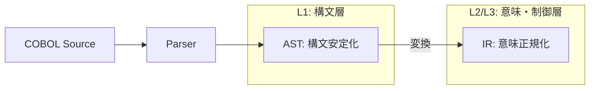

# 01_AST-Scope-Definition

# 1. ASTの定義と目的

**Abstract Syntax Tree (AST)** は、COBOLソースコードの構文的構造を抽象化した木構造データであり、本プロジェクトにおける解析パイプラインの起点となる中間成果物である。

## 目的
ASTの目的は「**構文の安定化**」に限定される。
ソースコードのテキスト表現から、意味解析に必要な構造情報のみを抽出し、コメントや空白、継続行などの非本質的な要素を捨象することで、後続のIR変換プロセスに対して安定した入力を提供する。

# 2. 責務の境界（Scope Boundary）

ASTが「持つべきもの」と「持ってはいけないもの」を厳格に分離する。

## 2.1 ASTが持つもの（In Scope）
1.  **階層構造**: Program, Division, Section, Paragraph, Statement の包含関係。
2.  **構文要素**: 命令語（Verb）、変数参照、リテラル、式。
3.  **データ定義**: レコード構造、レベル番号、PICTURE句などの属性。
4.  **ソース位置情報**: 各ノードに対応するソースコード上の位置（Span: 行・列の範囲）。
5.  **安定ID**: ノードを一意に識別するためのID（NodeId）。

## 2.2 ASTが持たないもの（Out of Scope）
1.  **制御フローの解決**: Basic Blockへの分割、Jump先の解決は行わない（CFGの責務）。
2.  **意味の展開**: `MOVE CORRESPONDING` や `COMPUTE` の演算展開は行わない（IRの責務）。
3.  **副作用の明示**: I/O操作に伴うファイル状態遷移や例外分岐（`AT END` 等）の制御構造化は行わない（IRの責務）。
4.  **名前解決**: 変数参照（Reference）と定義（Definition）の結合は行わない（Symbol Table / Semantic Analysisの責務）。
5.  **実行順序**: `PERFORM THRU` や `GO TO` による実行順序の確定は行わない。

# 3. 形式的定義

ASTは以下の要素からなるタプルとして定義される。

$$
AST = (Nodes, Edges, Root, SpanMap, NodeIdMap)
$$

- $Nodes$: 有限のノード集合
- $Edges$: ノード間の親子関係（有向非循環木）
- $Root$: ルートノード（ProgramNode）
- $SpanMap$: $Nodes \to SourceSpan$
- $NodeIdMap$: $Nodes \to StableId$

## 不変条件 (Invariants)
1.  グラフ構造ではなく、厳密な木構造である。
2.  各ノードは最大1つの親を持つ（Rootを除く）。
3.  すべてのノードはソース位置情報（Span）を持つ。

# 4. 抽象化レベル

本定義におけるASTの抽象度は **L1（構文層）** に位置する。
L2（意味層）およびL3（制御層）への昇格は、ASTから生成されるIR（Intermediate Representation）の役割とする。

