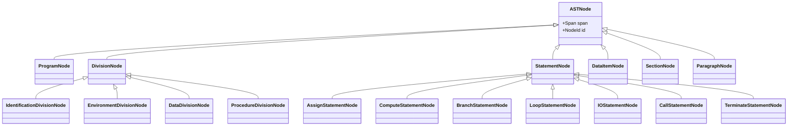

# 03_AST-Node-Taxonomy

# 1. ノード分類の目的

ASTを構成するノードの種別（Taxonomy）を定義し、構文要素を漏れなく、かつ過不足なく分類する。
本定義は、AST実装における継承構造（Class Hierarchy）の基盤となる。

# 2. 階層的分類（Hierarchical Taxonomy）

ASTノードは、以下の4層の階層構造を持つ。

## Level 0: Program Node
ルートノードとして、プログラム全体の構造（4つのDivision）を保持する。

- `ProgramNode`

## Level 1: Division Node
各部（Division）に対応するコンテナノード。

- `IdentificationDivisionNode`: プログラムID、作成者情報など
- `EnvironmentDivisionNode`: 構成節、入出力節（File-Control）
- `DataDivisionNode`: データ記述（File/Working-Storage/Linkage）
- `ProcedureDivisionNode`: 手続き記述（Section/Paragraph）

## Level 2: Data Structure Node
データ定義に関わる要素。

- `DataItemNode`: レベル番号を持つ基本項目または集団項目
    - 属性: `Level`, `Name`, `Picture`, `Usage`, `Occurs`, `Redefines`
- `FileDescriptionNode`: FD記述項

## Level 3: Procedure Structure Node
手続き部（Procedure Division）の制御構造。

- `SectionNode`: 節（Section）
- `ParagraphNode`: 段落（Paragraph）

## Level 4: Statement Node
手続き記述内の個々の命令文。機能カテゴリごとに抽象化する。

- **Assign Category**: 代入・転記
    - `AssignStatementNode` (`MOVE`, `INITIALIZE` 等)
- **Compute Category**: 算術演算
    - `ComputeStatementNode` (`ADD`, `SUBTRACT`, `MULTIPLY`, `DIVIDE`, `COMPUTE`)
- **Branch Category**: 条件分岐
    - `BranchStatementNode` (`IF`, `EVALUATE`)
- **Loop Category**: 繰り返し制御
    - `LoopStatementNode` (`PERFORM`, `PERFORM UNTIL`, `PERFORM VARYING`)
- **IO Category**: 入出力操作
    - `IOStatementNode` (`READ`, `WRITE`, `REWRITE`, `START`, `DELETE`, `OPEN`, `CLOSE`)
- **Call Category**: 外部呼出し
    - `CallStatementNode` (`CALL`)
- **Terminate Category**: 終了制御
    - `TerminateStatementNode` (`STOP RUN`, `GOBACK`, `EXIT PROGRAM`)

# 3. ノード構成図（Class Diagram）

# 4. 未分類・特殊ノード

以下の構文要素については、個別検討とし、必要に応じて専用ノードを追加するか、既存カテゴリの属性として扱う。

- `INSPECT`, `STRING`, `UNSTRING`: 文字列操作（Assignまたは専用ノード）
- `GO TO`: 制御フロー（Branchまたは専用Jumpノード）
- `COPY`: プリプロセッサ命令（AST構築時に展開済みとするか、ノードとして残すか）
- `USE` (Declaratives): 宣言節（Declarativesセクションとして扱う）

# 5. 結論

本分類体系により、COBOLの主要な構文要素を網羅し、かつ意味的に凝集度の高いASTを構築できる。
Statementレベルでの抽象化（Assign, Compute, ...）により、個別の命令語（`ADD` vs `SUBTRACT`）の差分を吸収し、後続の解析を容易にする。
