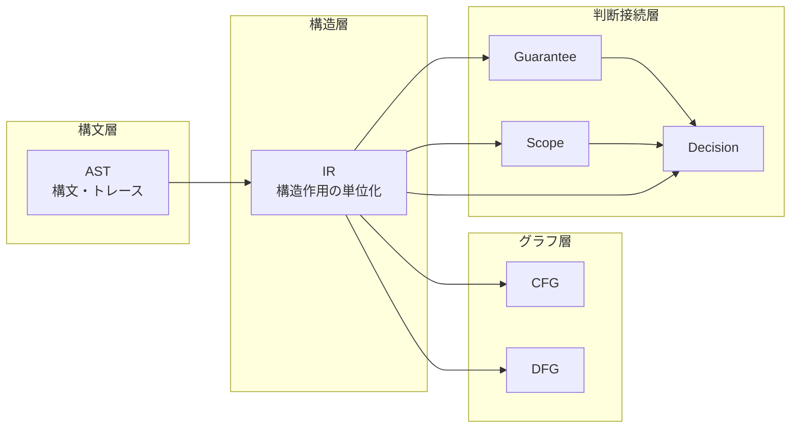

# IR Core Definition

## 1. Purpose
本稿は、COBOL 構造解析研究における **IR（Intermediate Representation）** の中核定義を確立する。先行して `10_ast` では構文層としての粒度と分類が整備され、`50_guarantee`・`60_scope`・`60_decision` では、それぞれ保証・境界・移行判断に関する判断接続層の概念が与えられてきた。しかし、構文観測から制御・データ・境界の作用へ、さらに Guarantee / Scope / Decision へ至るまでの **構造的作用の中間媒体** が形式的に固定されていなければ、後段のグラフ理論・保証評価・判断は、いずれも「何に対して」成立するのかを一貫して説明できない。

Phase8 の `20_ir` が担うのは、単なる変換パイプライン上の実装用中間コードの定義ではない。**AST が与える構文構造を、解析可能な構造作用単位へ再編成し、CFG / DFG の母体となりうると同時に、Guarantee / Scope / Decision に接続可能な判断可能構造を供給する抽象層** を理論として固定することが、本稿の目的である。

## 2. Definition of IR
**一文定義**：本研究空間における IR とは、**COBOL ソースから AST により観測された構文要素を、制御作用・データ作用・境界作用・副作用などの意味ある構造単位へ再構成した、構造層（structural action layer）の表現である。**

本研究における IR は、構文木の次に置かれる低レベル命令列ではない。一般的な compiler IR が code generation や最適化の都合で設計されるのに対し、本研究の IR は **理解・比較・影響分析・移行判断の根拠提示** を主目的とする。したがって、特定言語への生成順序やターゲット固有命令から独立した **研究上の構造抽象** として定義される。

この違いは本質的である。compiler IR はしばしば「実行に近い均質な操作列」へ寄るが、本研究の IR は **作用の種類と境界の違いを保持したまま、判断材料となる単位を整える**。ゆえに IR は、AST を単に潰した中間段ではなく、構文層から判断層へ向かうための **構造作用層** と位置づけられる。

## 3. Why IR is Needed After AST
AST だけでは、次の不足が残る。

第一に、**構文カテゴリと解析単位の不一致** である。COBOL の一文は複数の作用を内包しうる。paragraph / section は構文的にはコンテナであるが、PERFORM や GO TO によって **制御上の入口・出口・遷移先** として意味を持つ。AST はそれらを構文的に表現できるが、制御依存やデータ依存の分析、保証適用、判断説明に必要な **作用単位の再編成** までは自動的に与えない。

第二に、**判断可能構造の欠如** である。Guarantee は何が保存されるかを、Scope はどこまでが閉じた対象かを、Decision は移行可否やリスクを論じる。しかしそれらはすべて、「どの単位に対して主張するのか」という問いを伴う。AST ノードは観測には十分でも、保証単位や判断単位としては細かすぎたり粗すぎたりすることがある。

第三に、**移行判断研究における説明責任** である。移行可否は、構文の有無ではなく、制御の跳躍、境界越え、状態遷移、外部依存、複合データ変換といった **構造的リスク要因** に依存する。IR は、これらを比較可能な形に正規化する前段として、判断材料を生成する。

## 4. Boundary of IR
IR が扱うものは、次である。

- 制御の分岐・反復・移譲・終端
- データの定義・利用・変換・集約・分解
- 外部との入出力や呼出に伴う境界作用
- paragraph / section に結びつく制御意味
- 複数作用を束ねる合成単位

一方で、IR が直接扱わないものは、字句規則、構文木の具象形状そのもの、ソース上のコメントや空白、特定ターゲット言語の生成規則、実行時最適化のような実装層の都合である。これらは構文層または実装層の論題であって、IR の直接責務ではない。

AST / CFG / DFG との責務分離も明確である。AST は **観測された構文** を保持し、IR は **作用構造** を保持し、CFG は制御遷移を、DFG はデータ依存をグラフとして表現する。IR は CFG・DFG の **ノード候補・辺候補・作用ラベルの源泉** であり、グラフそのものではない。

## 5. IR as a Structural Layer
研究モデルは、少なくとも三層で理解される。

- **構文層**：COBOL の文法に沿った構造。AST が代表する。
- **構造層**：実行意味を持つ作用への再編成。IR が中心となる。
- **判断層**：Guarantee / Scope / Decision による保証・境界・判断の層。

IR は、構文層と判断層のあいだで **橋渡し** を行う。AST でトレース可能だった構文的根拠を失わずに、Guarantee / Scope / Decision が要求する **単位化・境界化・リスク説明** に耐える表現へ昇格させるのである。

IR の抽象度は、アルゴリズムの手順ではなく **作用の種類と関係** のレベルに置かれる。したがって IR は、構文の具体性と判断の抽象性の中間にありつつ、両者を断絶させない構造層として機能する。

## 6. Relationship to AST / CFG / DFG
AST は IR の **入力観測** である。AST から IR への写像は 1 対 1 に限られず、分割、統合、補助構文の吸収を含む。ゆえに AST と IR の関係は、単なる変換ではなく **再編成を伴う射影** と理解されるべきである。

CFG への接続では、IR 上の制御作用が **分岐、合流、反復、ジャンプ、終端** の骨格を供給する。IR は join 点や loop back edge の要請を意味の上で保持し、CFG フェーズがそれを具体グラフへ落とす。

DFG への接続では、IR 上のデータ作用・境界作用が **def-use・変換・伝播・副作用依存** の候補となる。IR は「どの作用がどのデータに触るか」を識別し、DFG が依存の詳細を定める。

## 7. Relationship to Guarantee / Scope / Decision
**Guarantee** の観点から見れば、IR は保証を掛けうる構造候補を供給する。AST の構文カテゴリ名そのものではなく、作用のまとまりが保証の粒度と対応しうるからである。

**Scope** の観点から見れば、IR はスコープ境界候補を供給する。ループ単位、手続境界、境界作用のまとまり、呼出単位などは、閉じた推論対象の候補となる。

**Decision** の観点から見れば、IR は移行可否やリスクの **構造的根拠** を保持する。制御の非構造化、境界依存、終端の不統一、データ変換密度などは、IR 上で記述できる特徴であり、判断はそれらに依拠する。

この意味で IR は、構文から判断へ向かうための **根拠生成層** である。

## 8. Risks of Not Defining IR Properly
IR が未定義、あるいは AST と混同された場合、次の問題が生じる。

- CFG が構文追随に留まり、PERFORM や GO TO の実効構造を説明できない
- DFG が表層的になり、一文多作用や境界作用の分離が不十分になる
- Guarantee が対象単位を失い、主張の適用範囲が揺れる
- Scope が境界根拠を欠き、閉包や影響伝播の説明が弱くなる
- Decision が説明責任を持てず、判断が慣習依存になる

また、IR を実装寄りに定義しすぎた場合、研究基盤としての **理論的独立性** が失われる。特定生成物の都合で粒度や分類が揺れれば、比較可能性と再現可能性が損なわれる。

## 9. Summary
本稿は、IR を **構文層の次に置かれる構造作用層** として定義し、AST との差分、扱う責務範囲、CFG / DFG への接続、および Guarantee / Scope / Decision との判断接続を固定した。IR は構文の写しではなく、移行判断に耐える **構造単位への再編成** である。この定義は、Phase8 以後の Unit taxonomy、AST 写像、制御抽象、データ抽象、境界抽象の共通基盤となる。
