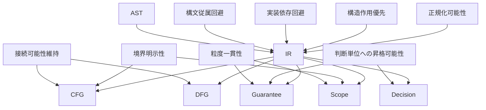

# IR Design Principles

## 1. Why Design Principles Are Needed
IR の一文定義だけでは、設計判断の安定した基準は得られない。どの情報を落とし、どの作用を分離し、どの粒度で単位化するかは、文書や実装者の解釈差に敏感である。原則が不在だと、**AST への回帰**、**特定生成物への従属**、**グラフ層への先取り**、**判断層との不整合** が同時に発生し、研究としての比較可能性が損なわれる。

したがって本稿は、IR を **移行判断に耐える構造表現** として設計するための規範群を明示する。原則は、後続の Unit 分類・AST 写像・CFG / DFG 接続の **整合条件** として機能する。

## 2. Core Principles
本研究で IR 設計に従うべき中核原則を、次のように掲げる。

1. **構文従属回避**
2. **実装依存回避**
3. **構造作用優先**
4. **接続可能性維持**
5. **粒度一貫性**
6. **正規化可能性**
7. **境界明示性**
8. **判断単位への昇格可能性**

これらは独立した規則の列ではなく、IR を研究基盤として成立させるための相互依存的原則群である。

## 3. Detailed Explanation of Each Principle
### 3.1 構文従属回避
**定義**：IR の分類軸は parser が返す構文ラベルではなく、プログラムが **何をしているか** に基づく。

**必要性**：構文従属は、COBOL の表記揺れや句の差異を、そのまま分析差として固定してしまう。

**守らない場合の問題**：同じ作用が異なる構文形で別物として扱われ、差分分析や保証適用が不安定になる。

**他原則との関係**：正規化可能性と粒度一貫性を支え、実装依存回避とも補強し合う。

### 3.2 実装依存回避
**定義**：IR の形状を、特定ターゲット言語や生成ツールの都合で決めない。

**必要性**：研究基盤は資産横断の比較と判断の説明に耐えなければならない。

**守らない場合の問題**：生成都合で境界作用が内包化されたり、制御が均質化され、リスク説明が失われる。

**他原則との関係**：判断単位への昇格可能性や接続可能性維持の前提となる。

### 3.3 構造作用優先
**定義**：IR は命令の列ではなく、**制御・データ・境界などの作用の単位と関係** を表す。

**必要性**：DFG・Guarantee・Decision は、構文名ではなく作用に結びつく。

**守らない場合の問題**：一文多作用の分解や境界の分離ができず、依存やリスクの説明が粗くなる。

**他原則との関係**：接続可能性維持の内容を具体化する中心原則である。

### 3.4 接続可能性維持
**定義**：IR は、CFG・DFG・Guarantee・Scope・Decision へ橋を断たないよう設計される。

**必要性**：IR を孤立した中間物にすると、後段理論が各々別物になり、研究の一貫性が崩れる。

**守らない場合の問題**：グラフは存在しても IR と整合せず、判断は再び構文へ退行する。

**他原則との関係**：境界明示性や粒度一貫性と強く結びつく。

### 3.5 粒度一貫性
**定義**：同一の分析目的において、類似構造は類似の粒度で IR 化される。

**必要性**：比較、スライス、閉包、保証単位化は粒度が揃って初めて安定する。

**守らない場合の問題**：一部だけ過度に細かく、一部だけ粗い IR が生まれ、依存閉包や Scope の比較が歪む。

**他原則との関係**：正規化可能性と緊張関係を持ちうるため、目的に応じた意図的例外を後続文書で規定する必要がある。

### 3.6 正規化可能性
**定義**：意味的に近い構造を、IR 上で比較可能なパターンへ寄せる余地を持つこと。

**必要性**：資産間比較、パターン検出、保証テンプレの再利用に不可欠である。

**守らない場合の問題**：構文差がそのまま IR 差となり、「同じリスク」が検出できなくなる。

**他原則との関係**：構文従属回避の実効性を担保する。

### 3.7 境界明示性
**定義**：外部 I/O、CALL、環境依存、終端などの境界越え作用を、内部計算と混同しない。

**必要性**：移行リスクの主因はしばしば境界と契約である。

**守らない場合の問題**：READ と MOVE が同一視され、検証範囲やスコープ推定が誤る。

**他原則との関係**：DFG の副作用依存、Scope の境界候補、Decision のリスク説明と直結する。

### 3.8 判断単位への昇格可能性
**定義**：各 IR Unit が、Guarantee の対象、Scope の候補、Decision の根拠として語れるように設計すること。

**必要性**：IR が単なる実装都合の塊では、判断理論への接続が切れる。

**守らない場合の問題**：説明不能な黒箱単位が増え、監査可能性と再現性が失われる。

**他原則との関係**：接続可能性維持の判断層側の具体化である。

## 4. Tensions and Trade-offs Among Principles
原則群は相互に補強する一方で、いくつかの緊張を持つ。

第一に、**抽象化 vs 情報保持** である。作用優先は情報圧縮を促すが、CFG / DFG に必要な手掛かりを落とせば接続可能性が損なわれる。解は、意味に無関係な構文情報だけを削り、作用に関わる情報は保持することである。

第二に、**正規化 vs COBOL 特有性保持** である。過度の正規化は、PERFORM THRU や EVALUATE ALSO のような COBOL 特有の制御意味を消しかねない。解は、正規化パターンの上に由来タグや補助注記を許容し、比較可能性と固有性を両立することである。

第三に、**粒度細分化 vs 可読性** である。細かい IR は DFG や Guarantee には有利だが、人間レビューや Composite Unit の安定性を損なう可能性がある。そのため、基準粒度を固定し、必要時のみ分解する二段設計が望ましい。

## 5. Principles as Preconditions for Later Models
CFG に対しては、構造作用優先・境界明示性・接続可能性が、分岐・反復・移譲・終端の骨格を支える。DFG に対しては、作用優先と境界明示性が、def-use と副作用伝播の起点を支える。

Guarantee に対しては、判断単位への昇格可能性と粒度一貫性が、保証適用単位を支える。Scope に対しては、境界明示性と粒度一貫性が、閉じた対象の候補と伝播起点を支える。Decision に対しては、上記すべてが、リスクの構造的説明と証拠射程を支える。

## 6. Summary
IR 設計原則は、定義を **運用可能な規範** に落とすものである。構文従属と実装依存を避けつつ、作用を中心に、グラフ層と判断接続層へ至る道を断たない。原則間の緊張は、正規化・粒度・固有性のバランスとして明示的に管理されるべきであり、この原則群が Phase8 全体の安定条件となる。
