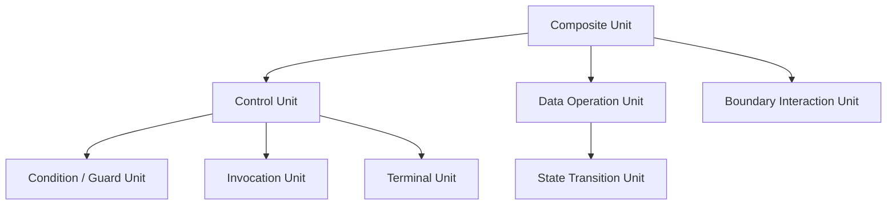

# IR Unit Taxonomy

## 1. What Is an IR Unit
**一文定義**：IR Unit とは、IR 上で識別される最小の意味ある構造作用のまとまりであり、制御・データ・境界などの観点から責務を型付けした分析単位である。

ここでいう Unit は、AST のノード型や COBOL の文法カテゴリそのものではない。`statement` は構文層の区切りであるが、必ずしも単一の作用に対応しない。したがって IR Unit は **文の写像先** として定義されつつも、必要に応じて **一文から複数 Unit へ分解** され、あるいは複数構文要素を **単一 Unit へ統合** しうる。これは、DFG の精度、Guarantee の適用粒度、Scope の閉包妥当性を同時に満たすためである。

## 2. Why a Taxonomy Is Needed
IR の定義と設計原則が与えられても、構成単位が不明確なままでは分析モデルにならない。分類体系がなければ、AST 写像は揺れ、CFG / DFG 接続は恣意化し、Guarantee / Scope / Decision に対しても統一した語彙を与えられない。

Taxonomy が必要なのは、IR を「ノードの寄せ集め」ではなく、**後続分析に耐える型付き構造** として扱うためである。特に重要なのは、分類を構文カテゴリ名で代用しないことである。さもなければ COBOL の表記揺れに分析が引きずられ、研究上の比較可能性が壊れる。

## 3. Classification Axes
IR Unit を配置する主要軸は次のとおりである。

- **制御作用**：実行順序・分岐・反復・移譲を変えるか
- **データ作用**：データ項の定義・参照・変換を行うか
- **状態遷移**：制御や処理モードに効く状態を更新するか
- **境界越え**：外部ファイル・他プログラム・端末・環境に触れるか
- **呼出**：手続やプログラム境界を跨ぐ移譲を伴うか
- **条件判定**：真偽や選択空間の分割を行うか
- **複合構成**：複数作用を束ねる単位か
- **終端 / 例外 / 中断**：終了や脱出を明示するか

これらは排他的な単軸分類ではなく、1つの Unit が複数軸に関与しうる。ただし、Taxonomy としては **主たる責務** を定める必要がある。

## 4. Proposed Taxonomy of IR Units
本研究で採用する型の族は、次の八類を中核とする。

1. **Control Unit**
2. **Condition / Guard Unit**
3. **Data Operation Unit**
4. **State Transition Unit**
5. **Boundary Interaction Unit**
6. **Invocation Unit**
7. **Composite Unit**
8. **Terminal Unit**

これらは、IR を **作用の型付き集合** として扱うための最小語彙である。

## 5. Detailed Description of Each Unit Type
### 5.1 Control Unit
**定義**：順序、分岐、反復、移譲など、制御フローの骨格を形成する Unit である。  
**典型 COBOL 構造**：IF、EVALUATE、PERFORM 系、GO TO、NEXT SENTENCE。  
**保持すべき情報**：分岐の型、合流点の有無、反復の終了条件、遷移先の種別。  
**後続分析との関係**：CFG のノード・辺候補であり、Scope の制御境界候補にもなる。

### 5.2 Condition / Guard Unit
**定義**：真偽や選択空間の分割を与える条件評価 Unit である。  
**典型 COBOL 構造**：IF 条件、EVALUATE の選択条件、PERFORM UNTIL の条件。  
**保持すべき情報**：条件式の抽象、参照データ、選択空間の分割型。  
**後続分析との関係**：CFG では branch / dispatch の条件核となり、DFG では use 側の候補になる。

### 5.3 Data Operation Unit
**定義**：内部データの更新・変換・集約・分解を担う Unit である。  
**典型 COBOL 構造**：MOVE、COMPUTE、ADD、STRING、UNSTRING、INSPECT。  
**保持すべき情報**：source、target、変換の型、位置依存性。  
**後続分析との関係**：DFG の中心であり、Guarantee のデータ不変条件に直結する。

### 5.4 State Transition Unit
**定義**：処理モードや制御状態に影響する状態遷移を明示する Unit である。  
**典型 COBOL 構造**：フラグ更新、状態コード設定、制御スイッチ変更。  
**保持すべき情報**：遷移前後の状態役割、制御への影響。  
**後続分析との関係**：CFG・DFG の両方にまたがり、Decision 上の複雑性説明に効く。

### 5.5 Boundary Interaction Unit
**定義**：外部リソース、他手続、端末、環境との交差を持つ Unit である。  
**典型 COBOL 構造**：READ、WRITE、REWRITE、CALL、ACCEPT、DISPLAY。  
**保持すべき情報**：境界種別、方向、外部依存、可観測副作用。  
**後続分析との関係**：Scope の外縁候補、Guarantee 困難性、Decision リスク要因となる。

### 5.6 Invocation Unit
**定義**：手続呼出や範囲実行に伴う制御移譲を表す Unit である。  
**典型 COBOL 構造**：CALL、PERFORM paragraph、PERFORM THRU。  
**保持すべき情報**：移譲先、戻り点、範囲、呼出規律。  
**後続分析との関係**：CFG の手続境界、Scope の階層化、Decision の結合度説明に使われる。

### 5.7 Composite Unit
**定義**：複数の Unit を1つの論理塊として束ねる Unit である。  
**典型 COBOL 構造**：paragraph 群、トランザクション的手続のまとまり、複合制御ブロック。  
**保持すべき情報**：内部 Unit 列、入口・出口、外部インタフェース。  
**後続分析との関係**：Scope 候補や移行単位候補の中間表現となる。

### 5.8 Terminal Unit
**定義**：終了、復帰、中断、停止を明示する Unit である。  
**典型 COBOL 構造**：STOP RUN、GOBACK。  
**保持すべき情報**：終了種別、戻り先の有無、実行停止の範囲。  
**後続分析との関係**：CFG の出口候補であり、Decision の切替可能性や安全停止性に関わる。

## 6. Relationships Among Unit Types
IR Unit 間には、少なくとも次の関係が定義できる。

- **包含**：Composite Unit が他の Unit を内部に持つ
- **依存**：Data Operation Unit が Condition / Guard Unit や Boundary Interaction Unit に依存する
- **合成**：複数の Unit が sequence / nested / boundary-inclusive に束ねられる
- **派生**：複数 AST ノードから単一 IR Unit が派生することがある

この関係整理により、IR は単なる型一覧ではなく、**型どうしがどう組み合わさって構造を作るか** を表す体系になる。

## 7. Risks of Poor Taxonomy
分類が曖昧だと、同じ作用が複数型に散らばり、CFG・DFG の生成規則が衝突する。分類を文法カテゴリに回収すると、parser のラベルがそのまま Unit 名になり、表記揺れが分析差になる。逆に過度に細分化しすぎると、Composite Unit なしには Scope が組めず、レビューも困難になる。

したがって、良い Taxonomy とは、細かさを競うものではなく、**後続分析と判断接続に必要な区別をちょうどよく保持する分類** である。

## 8. Summary
IR Unit Taxonomy は、IR を **構文ではなく作用** で型付けする枠組みである。本稿では、Control、Guard、Data Operation、State Transition、Boundary Interaction、Invocation、Composite、Terminal の八類を中核とし、それぞれの責務と後続分析との関係を整理した。この分類の安定が、AST 写像、CFG / DFG 接続、Guarantee / Scope / Decision への接続全体の基盤となる。
