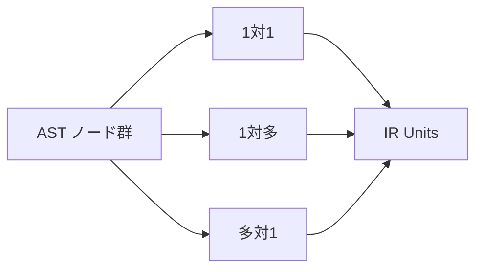

# AST to IR Mapping

## 1. Why Mapping Is Needed
AST は構文層として、観測の忠実さとトレーサビリティを与える。しかし移行判断に必要なのは、制御・データ・境界の **作用のまとまり** である。写像は、AST が持つ構文情報を **失わずに参照可能** に残しつつ、IR が要求する単位へ **再構成** する操作として位置づけられる。

写像段階で保存すべきは、ソース位置、構文由来の識別子、コンテナ階層などの根拠である。再構成すべきは、一文多作用の分割、補助句の統合、paragraph / section を制御境界としての単位へ昇格させることである。したがって AST→IR 写像は、単なる変換ではなく **構文層から構造層への射影規則** である。

## 2. Mapping Principles
AST→IR 写像には、少なくとも次の原則が必要である。

- **作用優先**：ノード数の一致ではなく、作用責務がどの IR Unit 型に載るかを基準にする
- **トレーサビリティ保持**：各 IR Unit は、根拠となる AST 範囲へ逆参照できる
- **単位一貫性**：同じ構造パターンは同じ族の IR パターンへ寄せる
- **判断接続の予約**：Guarantee / Scope / Decision が参照しうる境界・終端・呼出規律を欠落させない

これらにより、AST から IR への写像は、正規化の入り口でありながら、判断材料の元情報を失わない形で行われる。

## 3. Basic Mapping Patterns
写像の基本パターンは少なくとも次のとおりである。

### 3.1 1対1写像
単一構文要素が単一 IR Unit になる場合である。単純な MOVE や明確な終端文などが典型である。

### 3.2 1対多写像
単一構文が複数 IR Unit に分解される場合である。一文に I/O とデータ更新が混在する場合や、PERFORM が呼出・反復・範囲実行を同時に含む場合がこれに当たる。

### 3.3 多対1写像
複数 AST ノードが単一 IR Unit に統合される場合である。補助句を親作用へ吸収したり、複数の構文断片を1つの Boundary Interaction Unit として扱う場合がある。

### 3.4 コンテナ→境界写像
paragraph / section のような構文コンテナが、IR では **境界単位や呼出可能領域** として意味を持つ場合である。

### 3.5 補助句の吸収
冗長な clause や補助的構文が、独立 Unit ではなく親 Unit に帰属する場合である。

### 3.6 条件表現の統合
IF や EVALUATE における条件部分を、Guard Unit と Control Unit の関係として統合する場合である。

## 4. Mapping Rules for Major COBOL Structures
### 4.1 paragraph / section
構文的にはコンテナだが、IR では PERFORM や GO TO の対象・範囲・遷移先として **制御境界** を持つ。必要に応じて Composite Unit や Invocation Unit の核になる。

### 4.2 IF
Guard Unit と Branch 型 Control Unit に分解される。暗黙の join は制御抽象として保持される。

### 4.3 EVALUATE
複数 Guard と Dispatch 型 Control Unit の組合せに写される。単なる switch 還元ではなく、条件空間分割として扱う余地を持つ。

### 4.4 PERFORM
Invocation、Iteration、あるいは bounded-range execute の複合として写される。PERFORM THRU は単一 call に潰してはならない。

### 4.5 MOVE / COMPUTE
Data Operation Unit へ写される。ただし一文複数作用を含む場合は 1対多写像となる。

### 4.6 READ / WRITE
Boundary Interaction Unit として写される。成功 / 失敗経路は Control Unit と結びつき、I/O 後のデータ更新は Data Operation Unit として分離しうる。

### 4.7 CALL
Invocation Unit として写される。引数の流れは後続の DFG 接続で扱う手掛かりを持つ。

### 4.8 STOP RUN / GOBACK
Terminal Unit に写される。プログラム停止と呼出元復帰は意味上区別される。

## 5. Information Preserved, Added, and Lost
### 保持する情報
- ソース位置
- AST ノード由来の識別子
- コンテナ階層
- paragraph / section 所属

### IR 生成時に新たに付与する情報
- IR Unit 型
- 作用カテゴリ
- 制御境界タグ
- 正規化パターン ID
- 判断接続用の注記

### 失われうる情報
- 冗長な構文飾り
- 意味に影響しない句の表出差
- 正規化により吸収される表記揺れ

### 後続層へ渡す情報
- 制御骨格
- データ作用候補
- 境界・呼出・終端フラグ
- 条件依存の骨格

## 6. Mapping as the Entry Point of Normalization
AST→IR 写像は、**正規化の第一段** である。clause ベースで散らばる条件や、同一意味の異なる構文形を、IR 上の Guard / Control / Data / Boundary のパターンへ寄せる。完全な正規化は `08_IR-Composition-and-Normalization.md` で扱うが、写像時点で **何を揃え、何を固有タグとして残すか** を決めておかなければ、後続の比較・差分分析は安定しない。

## 7. Risks and Failure Modes
写像が曖昧な場合、同じ AST パターンが異なる IR に散らばり、比較不能になる。情報を落としすぎると、境界作用や終端が消え、CFG / DFG / Decision が過小評価を起こす。AST の粒度と IR の粒度が整合しない場合、Guarantee や Scope の単位が揺れ、研究全体の説明責任が弱くなる。

## 8. Summary
AST→IR 写像は、構文層から構造層への射影規則である。1対1 / 1対多 / 多対1、コンテナの境界化、補助構文の吸収を通じて、CFG / DFG および判断接続層へ一貫した入力を与える。写像は正規化の入口でもあり、ここでの規律が後続全体の安定性を決定する。
