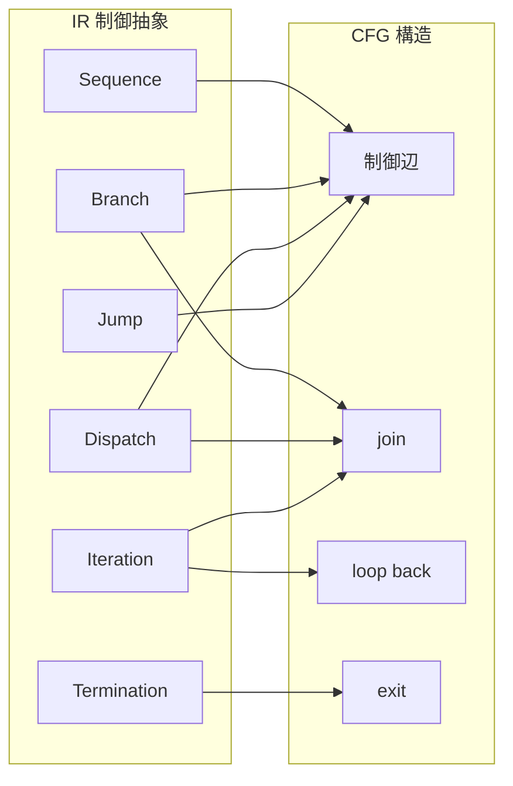

# IR Control Abstraction

## 1. Why Control Abstraction Is Needed
AST は IF や PERFORM を構文的に正しく表す。しかし CFG は **遷移** を、Scope は **境界と閉包** を、Decision は **非構造化や手続結合** を論じる。これらに直結するのは、「branch か」「dispatch か」「反復か」「移譲か」といった **制御作用のカテゴリ** である。IR 上で制御を抽象化せずに CFG を生成すると、構文ノードの数だけノードが増え、join や loop back edge が不明瞭になり、説明不能なグラフが生成されやすい。

したがって制御抽象は、CFG 直接生成の前段として、制御の意味カテゴリを固定する作業である。ここで問うのは「どう辺を張るか」ではなく、「何を制御単位として数えるか」である。

## 2. Core Categories of Control in IR
IR における制御の中核カテゴリは次のとおりである。

- **Sequence**：順次進行
- **Branch**：二択または少数択の条件分岐
- **Dispatch**：条件空間の分割に基づく多択
- **Iteration**：条件またはカウンタに基づく反復
- **Jump**：無条件または条件付きの直接遷移
- **Return / Exit / Termination**：手続・プログラムの終了や復帰

これらは Control Unit / Guard Unit / Terminal Unit と組み合わさり、Invocation Unit とも交差する。制御抽象の目的は、COBOL の多様な制御記法を、このような安定した構造カテゴリへ還元することである。

## 3. Abstraction of Major COBOL Control Structures
### IF
Guard Unit と Branch 型 Control Unit の組として扱う。条件と分岐骨格を分離し、暗黙の合流点を制御抽象として保持する。

### EVALUATE
Dispatch として扱う。単純な switch 還元に閉じず、**条件空間の分割** として理解する。ALSO や複合条件は dispatch の内部構造として保持される。

### PERFORM paragraph
Invocation に近い手続範囲実行として扱う。戻り点が重要な要素であり、単なる Jump とは異なる。

### PERFORM THRU
範囲実行として扱う。単一呼出ではなく、複数 paragraph にまたがる制御範囲として抽象化する。

### PERFORM UNTIL / VARYING
Iteration として扱う。条件 Guard、本体 Sequence、戻り条件を分けて記述することで、後続の CFG 接続が安定する。

### GO TO
Jump として扱う。参照先 paragraph / section は制御境界上のラベルとして IR に現れる。

### NEXT SENTENCE
局所的スキップに相当する Jump / 順序調整として扱う。これは構造化を阻害する要因であり、Decision でも重要なリスクになる。

### STOP RUN / GOBACK
Termination として扱う。プログラム停止と呼出元への復帰は、意味上区別されるべき終端種別である。

## 4. Paragraph and Section as Control Boundaries
paragraph / section は、単なる構文コンテナではない。PERFORM の対象、GO TO の着地点、THRU の範囲端、スコープ候補としての **callable region** を形成しうる。

IR では、少なくとも次を区別する必要がある。

- **参照先**：名前解決されたエントリ
- **遷移先**：Jump の着地点
- **戻り先**：Invocation や範囲実行後の復帰点

これらは AST のコンテナ階層だけでは十分に固定されないため、IR の制御抽象で明示される必要がある。paragraph / section を制御境界として扱うことにより、後続の CFG・Scope・Decision との接続が安定する。

## 5. Connection from IR Control Units to CFG
IR の制御抽象は、CFG において次のような構造へ橋渡しされる。

| IR 制御抽象 | CFG 上の対応 |
|-------------|--------------|
| Sequence | 直列の辺 |
| Branch | 分岐辺と join |
| Dispatch | 多分岐と合流 |
| Iteration | ループヘッダ、back edge、出口 |
| Jump | 直接辺、または中間ノードを介した遷移 |
| Termination | 出口ノード |

IR は join の要請、loop の戻り、終端の種別を意味の上で保持し、CFG フェーズがそれを具体グラフへ落とす。IR を飛ばすと、これらの説明責任が CFG 単体へ押しつけられ、構造理解が不安定になる。

## 6. Risks and Pitfalls
PERFORM を単純 call とみなすと、THRU、反復、戻り点が失われ、Scope や CFG が実構造から乖離する。EVALUATE を単純 switch とみなすと、条件領域の重なりや ALSO の意味を落とし、Guard の依存と分岐の説明が不足する。GO TO の扱いを曖昧にすると、着地点が構造上どこにあるかを見失い、非構造化リスクを過小評価する。

## 7. Summary
IR における制御抽象は、COBOL の手続制御を Sequence / Branch / Dispatch / Iteration / Jump / Termination に整理し、paragraph / section を **制御境界** として明示する作業である。これにより CFG への橋が意味的に整い、Guarantee / Scope / Decision は制御複雑性を構造的に説明できる。本稿の抽象は実装アルゴリズムではなく、解析と判断のための分類である。
