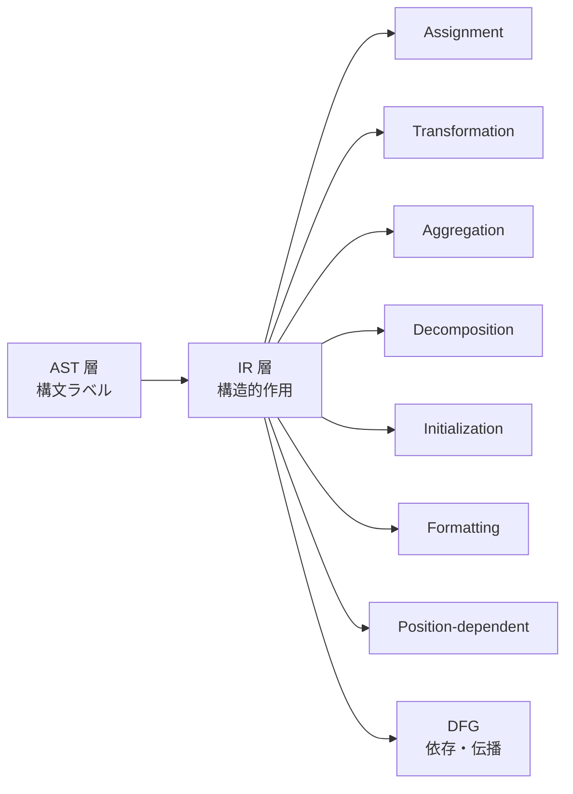
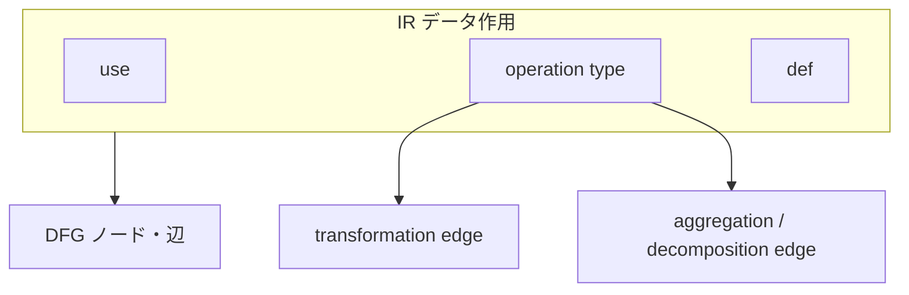

# IR Data Operation Model

## 1. Why Data Operation Abstraction Is Needed
データ作用抽象とは、AST 層で観測される文法上のデータ操作を、移行判断と依存分析に耐える **構造的作用単位** へ再編成する IR 上のモデルである。AST は MOVE や STRING を構文ノードとして識別できるが、同一の構文形が異なる意味的作用、たとえば単純代入、変換、分解、集約を内包しうる。したがって DFG を前提とする分析では、**文法ラベルではなく作用の種類とデータ関係** を IR で明示しなければならない。

この抽象が必要な理由は三つある。第一に、構文層だけでは依存の実効的形が定まらないこと。第二に、COBOL は一文に複数のターゲットや中間領域を含みうるため、文単位のままでは DFG の辺候補が過剰統合または過剰分割されること。第三に、移行判断では「何がどのデータ状態をどう変えるか」が説明責任の中心となるため、Guarantee / Scope / Decision が参照できる観測可能な作用記述が必要なことである。

## 2. Core Categories of Data Operations
IR 上のデータ操作は、少なくとも次の分類軸で整理される。

| 区分 | 意味 |
|------|------|
| Assignment | 値または参照先の束縛・複写 |
| Transformation | 演算や変形による意味内容の変化 |
| Aggregation | 複数ソースから単一ターゲットへの収束 |
| Decomposition | 単一ソースから複数ターゲットへの分配 |
| Initialization | 既定状態への初期化・正規化 |
| Formatting / Rearrangement | 書式や配置の再構成 |
| Position-dependent operation | 桁・区切り・位置に依存する処理 |

これらは構文名による区別ではなく、**作用意味** による区別である。同じ MOVE でも単純 Assignment の場合と Formatting を伴う場合があり、同じ STRING でも Aggregation と Position-dependent operation の複合になることがある。

## 3. Abstraction of Major COBOL Data Operations
### MOVE
単純複写から、編集項目や対応付けによる再配置まで幅がある。IR ではコピー単位と位置依存の有無を区別し、単一 Assignment に還元できない場合は Formatting や Decomposition を伴うものとして扱う。

### COMPUTE
典型的には Transformation である。演算、丸め、条件付き更新などがあれば、Transformation と Assignment の合成として読む。

### ADD / SUBTRACT / MULTIPLY / DIVIDE
ターゲットへの累積更新として、Transformation + Assignment とみなすのが自然である。SIZE ERROR のような制御的分岐は別の Control Unit との合成になる。

### INITIALIZE
Initialization に分類される。単純なゼロクリアではなく、「論理領域を既定状態へ戻す」という意味で扱う。

### INSPECT
置換、検査、カウントを含みうるため、Transformation と Position-dependent operation の複合として扱うことが多い。

### STRING
複数ソースの連結は Aggregation、ターゲット領域への書込は Assignment である。POINTER のような位置状態更新は必要に応じて別作用として切り出す。

### UNSTRING
単一ソースから複数受け手への分配であるため、Decomposition と Position-dependent operation の複合として扱う。

## 4. Information Retained in Data Operation Units
各データ作用 IR Unit は、最低限次の情報を保持すべきである。

- **source**：読取・参照となる論理オペランド
- **target**：書込・更新対象
- **intermediate transformation**：source から target への意味写像の種別
- **positional dependency**：桁、区切り、オフセット、配置依存の有無
- **side effect possibility**：例外経路や外部作用と接続する可能性

ここで重要なのは、IR が構文木の写しを保持することではなく、**後続の DFG・Guarantee・Scope が必要とするデータ作用の骨格** を保持することである。

## 5. Connection from IR Data Units to DFG
DFG は IR のデータ作用を母体として構築される。接続規則の骨格は次のとおりである。

- **def / use**：target を def、source を use として展開する
- **transformation edge**：COMPUTE や INSPECT のような変換作用を、変換依存として展開する
- **aggregation / decomposition edge**：STRING / UNSTRING のような多対一、一対多の関係を保持する
- **state change**：フラグや状態項目の更新を、単純データ流に埋め込まず状態変化として注記する

Guarantee への接続では、どの変換が不変条件を破りうるかを特定する手掛かりになる。Scope への接続では、データ作用の伝播外縁がスコープ候補の根拠になる。

## 6. Risks and Failure Modes
見た目の文法差だけで分類すると、同じ Aggregation が別物の DFG になる。複合操作を単一代入として扱うと、STRING / UNSTRING のような分割・収束構造が消え、移行リスクを過小評価する。位置依存性を落とすと、INSPECT や編集 MOVE のような処理が移行後に非等価になりやすい。副作用可能性を無視すると、境界モデルとの接続が崩れ、Guarantee の適用範囲が曖昧になる。

## 7. Summary
データ作用は AST の構文ラベルではなく、IR 上では Assignment、Transformation、Aggregation、Decomposition、Initialization、Formatting、Position-dependent operation として再分類される。主要 COBOL 操作はいずれもこれらの合成として記述され、DFG では def / use、変換辺、集約・分解辺として展開される。この抽象が、Guarantee / Scope / Decision に対するデータ観点の説明可能性を支える。
