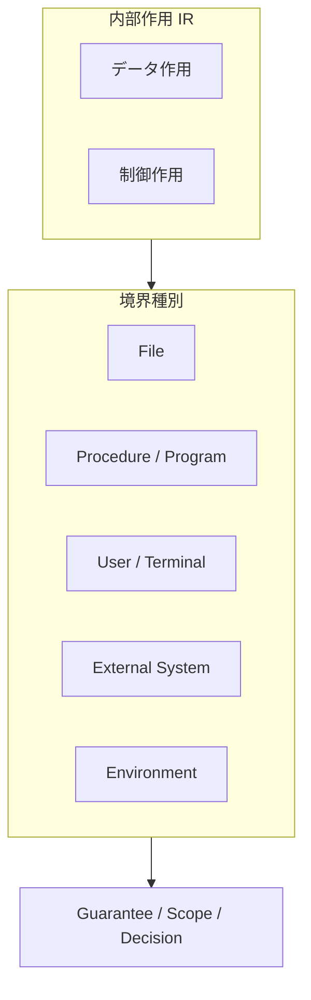
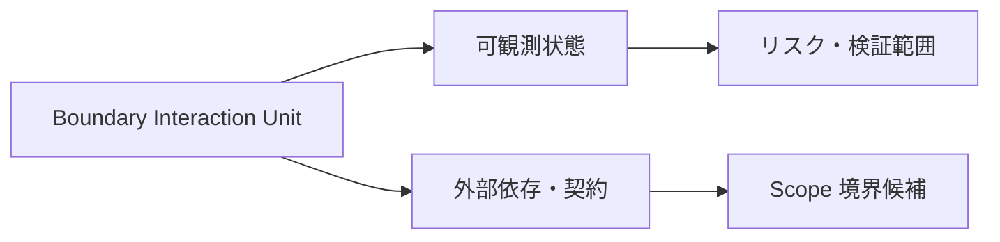

# IR Boundary and Side Effect Model

## 1. Why Boundary Modeling Is Needed
境界作用とは、手続内部の論理データ更新だけで完結せず、**外部資源・他手続・利用者・実行環境** と交差する IR 上の構造的作用である。通常のデータ操作と境界作用を同一の箱に入れると、依存分析は **観測可能な変化の所在** を誤り、移行では契約・プロトコル・環境差に関するリスクがデータ流の中へ埋没する。

境界を IR で分離する理由は三つある。第一に、Guarantee はしばしば手続内の不変条件だけでは語れず、ファイル属性や呼出規約のような **外部前提** に依存するからである。第二に、Scope は有界な意味対象を選ぶが、境界作用はその **外縁** を定義しうるからである。第三に、Decision は「何が変えられ、何が観測されるか」を説明できなければならず、境界を隠すと判断根拠が内部実装の見かけへ還元されるからである。

## 2. Types of Boundaries in IR
IR は少なくとも次の境界種別を区別する。

| 境界種別 | 指すもの |
|----------|----------|
| File boundary | ファイル・レコード格納との交差 |
| Procedure / program boundary | CALL や他コンパイル単位への越境 |
| User / terminal boundary | ACCEPT / DISPLAY などの端末入出力 |
| External system boundary | 外部サブシステムやメッセージ先との交差 |
| Environment boundary | 日付、環境値、実行条件へのアクセス |

これらの境界は、単なる入出力デバイス分類ではなく、**どこで内部の意味空間が外部の契約や状態と接続されるか** を示す構造区分である。

## 3. Major COBOL Boundary Operations
### READ / WRITE / REWRITE / DELETE / START
File boundary の中核である。レコード存在、順序、鍵、ファイル状態は可観測状態を更新しうるため、単純なデータ移送として扱ってはならない。

### CALL
Procedure / program boundary の典型である。パラメタ契約、共有ストレージ、呼出規約は外部依存として IR に現れる。

### ACCEPT / DISPLAY
User / terminal boundary を構成する。人間観測可能な状態変化として、テスト容易性や移行後 UI 代替の議論に直結する。

### SORT / MERGE
ファイルと一時領域にまたがる複合境界として扱う。詳細アルゴリズムではなく、入出力集合と順序意味を保持することが重要である。

これらは AST では文種として識別されるが、IR では **Boundary Interaction Unit** として通常の Data Operation Unit と型を分ける。

## 4. Side Effects as Structural Elements
本研究における副作用は、単なる実装上の副次結果ではなく、**構造概念** である。少なくとも次の三点で捉えられる。

- **可観測状態変化**：プロセス外または手続外から観測可能な結果の変化
- **内部状態変化との区別**：WORKING-STORAGE の更新は内部状態であり、外部資源更新とは区別される
- **外部依存の存在**：境界作用は前提となる資源・契約を伴う

副作用を構造概念として扱うことで、IR は「何が変わったか」だけでなく、「その変化が内部に閉じるのか外部へ漏れるのか」を明示できる。

## 5. Connection to Guarantee / Scope / Decision
Guarantee に対しては、境界作用は **保証困難性** を高める。なぜなら外部振る舞いが閉じた意味空間に含まれにくく、保存主張には環境や資源の前提が必要になるからである。

Scope に対しては、境界作用の集合が **Scope boundary candidate** となる。ファイル読書きのまとまり、CALL 連鎖の入口、端末入出力の塊は、どこまでを一つの有界対象とみなすかの根拠になる。

Decision に対しては、境界の種類と密度が直接の **リスク指標** になる。I/O 集中、深い CALL 依存、未文書化の外部境界は、移行可否、段階移行、ラッパ要否を左右する。

## 6. Risks and Pitfalls
境界を見落とすと、READ を単なる代入として扱い、順序・鍵・再実行安全性が判断から消える。CALL を内部関数化してしまうと、Scope と DFG が実依存より狭くなる。WRITE を単純な target 更新とみなすと、永続化とロールバックの問題が Guarantee から脱落する。

## 7. Summary
境界作用は通常のデータ作用と型を分離し、File、Procedure、User、External System、Environment の境界種別として IR に現れる。副作用は実装細目ではなく、**可観測状態と外部依存** を伴う構造として記述される。Guarantee / Scope / Decision はいずれも境界を前提・外縁・リスクとして読む必要があり、IR はそのための基盤単位を供給する。
