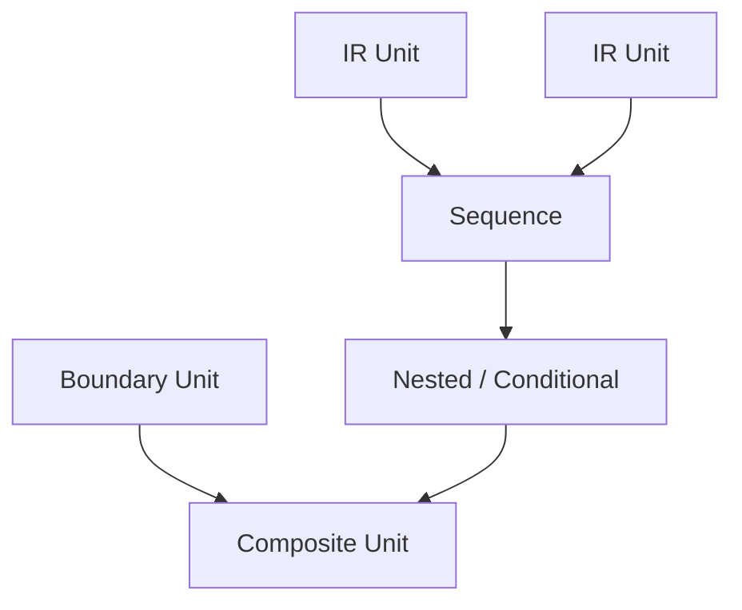
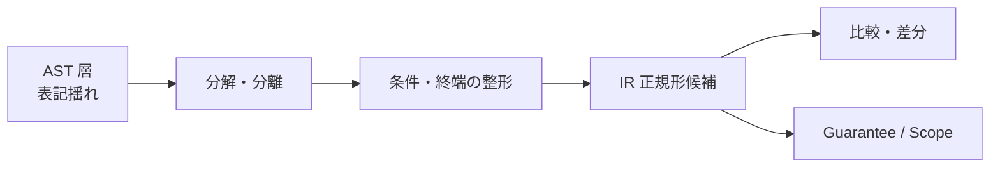

# IR Composition and Normalization

## 1. Why Composition Matters
IR Unit の分類だけでは、プログラム片を **比較可能なまとまり** として扱えない。実際の COBOL は、文の列、入れ子の条件、反復、境界作用が **合成** された形で現れる。合成規則がなければ、同一の意味構造を異なる表層列として扱ってしまい、Scope の包含関係や Guarantee の適用範囲の比較が不安定になる。

合成が必要なのは、解析対象が常に複合的であり、CFG / DFG が単一 Unit ではなく **Unit の配置関係** に依存し、Migration Decision も単文ではなく手続やスライス全体に対して下されるからである。

## 2. How IR Units Compose
IR の合成は、少なくとも次の形として整理される。

| 合成の形 | 意味 |
|----------|------|
| Sequence composition | 実行順序に沿った隣接合成 |
| Nested composition | 条件・境界の内側に入れ子で含まれる合成 |
| Conditional composition | 分岐により排他的に選ばれる合成 |
| Iterative composition | 反復により繰り返される合成 |
| Boundary-inclusive composition | 内部作用と境界作用を同一塊として束ねる合成 |

Composite Unit は、これらの合成規則によって形成される **論理的なまとまり** である。重要なのは、Composite が AST の入れ子そのものではなく、観測・保証・判断の単位を選ぶための階層だということである。

## 3. Why Normalization Is Needed
正規化とは、構文表現の揺れを吸収し、IR 上で **同型の意味構造を同型に見せるための理論的操作** の族である。目的は次の三つである。

- **比較可能性**：資産間・版間で同じパターンかどうかを構造作用で照合する
- **差分分析可能性**：変更の意味的影響を表記差ではなく作用差で捉える
- **Guarantee / Scope 単位化**：保証適用域と有界対象を正規形上の境界で安定化する

正規化がなければ、構文差がそのまま IR 差となり、同じ構造リスクや保証テンプレートを再利用できない。

## 4. What Should Be Normalized
正規化対象として、少なくとも次を想定する。

- **複合文の分解**：一文多作用を作用単位へ分離する
- **入れ子構造の平準化**：解析上は比較可能な制御骨格へ寄せる
- **条件表現の整形**：同値な条件を比較しやすい標準形へ寄せる
- **制御終端の明示**：分岐、ループ、終了の出口を一意に参照可能にする
- **作用単位への分離**：制御・データ・境界が同一文に混在する場合に型分離する

## 5. Limits of Normalization
正規化には限界がある。COBOL 特有構造を失いすぎれば、PERFORM THRU や特殊な境界処理の意味が消える。抽象化しすぎれば、リスクパターンの識別が不可能になる。さらに、桁、符号、編集、端数処理など **意味的非等価になりうる差異** は、正規化で潰してはならない。

したがって正規化は、情報削除ではなく **等価類への整列** と理解されるべきである。保持すべき差異と吸収すべき揺れを分けることが核心である。

## 6. Risks and Failure Modes
正規化しない場合、同一パターンが散在し、Guarantee テンプレートや Scope 候補の再利用が効かなくなる。過正規化した場合、トレーサビリティが失われ、監査や説明責任を満たせなくなる。粒度が崩壊すると、分解しすぎて Composite の意味が壊れるか、統合しすぎて境界が見えなくなる。

## 7. Summary
合成は IR を **手続的意味のまとまり** として扱うための規則であり、正規化は **比較・差分・判断単位の安定** のための規則である。両者は異なる概念だが、互いに補完しあう。AST 層の多様な表現は IR 層で型付きの作用と合成に収斂し、そこから CFG / DFG および Guarantee / Scope / Decision へ一貫した橋が架けられる。
