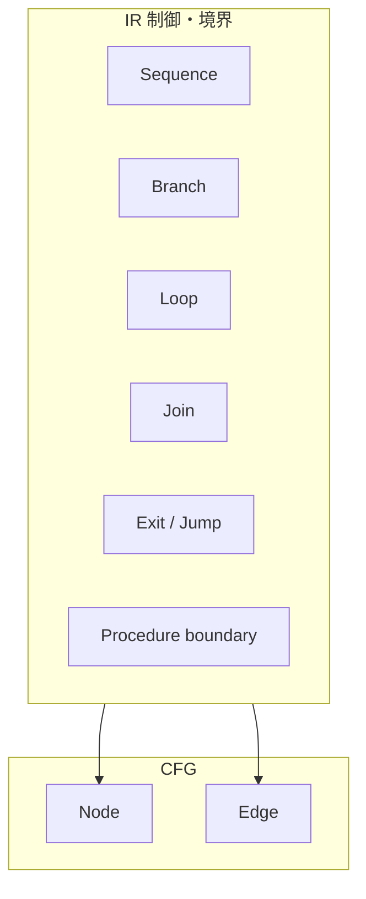
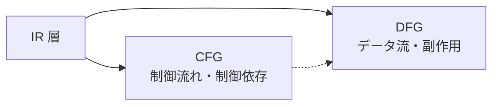

# IR Connection to CFG and DFG

## 1. Why the Connection Layer Is Needed
IR は構造的作用の整理層であり、単体では制御の全順序やデータ依存の閉包をグラフとして固定しない。CFG / DFG は解析・検証・移行判断に不可欠だが、AST から直接グラフを構築すると、構文ノードの粒度と作用の粒度が不一致となり、分岐の合流や def / use の実効が歪みやすい。

接続層が必要なのは、IR がすでに **branch / loop / join / exit** および **def / use / transformation** を型付けしており、それを CFG / DFG へ渡すための理論的インタフェースになるからである。また、制御依存とデータ依存を混同しないためにも、AST とグラフのあいだに IR を置く必要がある。

## 2. IR to CFG Connection
IR の制御抽象は、CFG において次の対応を持つ。

| IR 側の骨格 | CFG 側の読み |
|-------------|--------------|
| Sequence | 直列の制御流れ辺 |
| Branch | 条件付きの複数後続 |
| Loop | 後退辺・継続条件 |
| Join | 分岐後の合流点 |
| Exit | 手続・段落・プログラムからの脱出 |
| Jump | GO TO 等の非構造化遷移 |
| Procedure boundary | PERFORM / CALL に伴う入口・出口・復帰 |

IR は CFG のノードや辺をそのまま与えるのではなく、**何がノード候補であり、どこで流れが分かれ、どこで閉じるか** を定める。特に paragraph / section の制御境界、PERFORM の戻り点、STOP RUN / GOBACK の終端種別は、CFG 側で安定した表現を得るための重要な手掛かりである。

## 3. IR to DFG Connection
IR のデータ作用・境界作用は、DFG において次の対応を持つ。

| IR 側の作用 | DFG 側の読み |
|-------------|--------------|
| def / use | 変数・論理領域の定義・使用 |
| transformation | 演算や書式変換による依存 |
| propagation | 複数文にわたる値の伝播 |
| decomposition / aggregation | 一対多・多対一のデータ構造依存 |
| side effect influence | 境界作用による外部状態依存 |

ここで重要なのは、制御 IR とデータ IR を分けておくことである。条件付き def / use のような場合でも、制御辺とデータ辺を同一視してはならない。IR はそれらの交点を明示しつつ、型の混同を防ぐ層として働く。

## 4. Node Generation Rules
CFG ノード候補となるのは、制御上 **順序が分かれる最小作用点**、分岐、合流、ループ頭、手続境界の入口 / 出口、ジャンプの着地点である。単純データ作用は必ずしも独立 CFG ノードを要しないが、制御上重要な観測点と結びつく場合はノード化されうる。

DFG ノード候補となるのは、**def / use が生じる単位**、変換の演算節、境界作用の可観測イベントである。同一文から複数 DFG ノードが生じることもありうる。

一対一でない場合の扱いも明記されるべきである。複合 IR は複数 CFG ノードまたは複数 DFG ノードへ展開されうるし、逆に意味的に透明な中間はグラフ上で省略されうる。ただし、その場合もトレーサビリティは維持されなければならない。

## 5. Edge Generation Rules
### control flow edge
IR の順序合成と分岐選択から生成される。Jump は例外的遷移や非構造化遷移として辺化される。

### control dependence edge
条件がどの作用の実行可否に効くかを、IR 上の Branch / Dispatch 構造から導く。

### data flow edge
def から use への値依存を表す。Transformation や Aggregation / Decomposition は、その種別に応じた中間構造を介して展開される。

### dependency propagation
境界作用は外部ノードへ接続され、影響分析やスライスの起点になる。

## 6. Risks and Failure Modes
IR 側で合流や出口が十分に表現されていないと、CFG に偽の直列が入りやすい。接続規則が曖昧だと、同じ IR が CFG と DFG で別物として数えられ、Scope の射影が不整合になる。DISPLAY や CALL のような境界作用を制御のみ、またはデータのみへ寄せすぎると、検証範囲と依存範囲の両方が誤る。

## 7. Summary
IR は CFG / DFG の **母体** である。CFG 接続は sequence、branch、loop、join、exit、jump、procedure boundary をノードと制御辺へ写像し、DFG 接続は def / use、transformation、propagation、aggregation / decomposition、副作用をデータ辺へ写像する。ノード生成と辺生成を区別し、一対一を前提にしないことが、後続フェーズ `30_cfg`・`40_dfg` に耐える接続設計となる。
