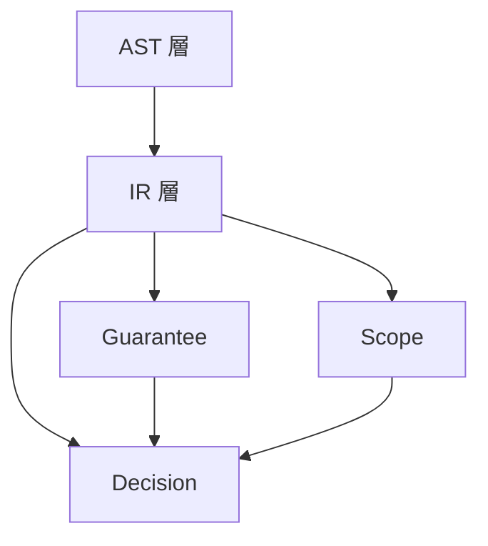
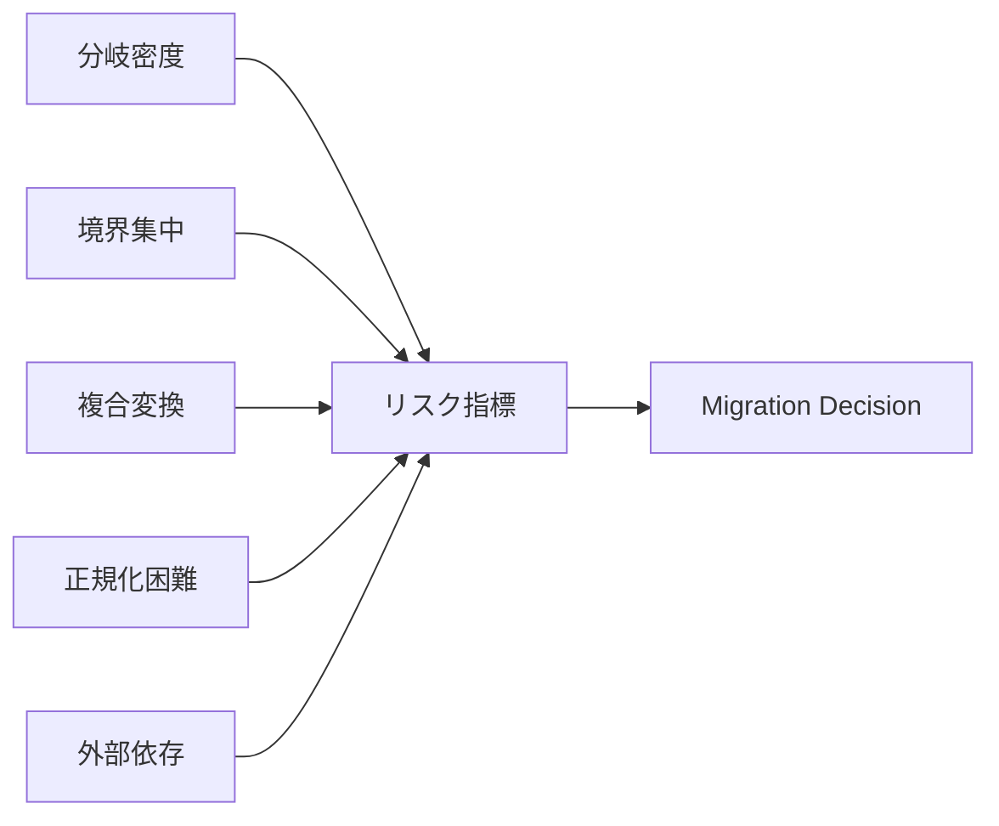

# IR Connection to Guarantee, Scope, and Decision

## 1. Why IR Must Connect to Judgment Models
本研究における IR は、変換パイプライン上の実装都合の中間形式ではない。AST で得た構造を **構造的作用** として再編し、Guarantee / Scope / Decision という **判断接続層** へ渡すための層である。Guarantee は「何が保存されるか」を、Scope は「何に対して推論するか」を、Decision は「移行が許容されるか」を扱うが、いずれも **根拠の載る単位** がなければ説明責任を果たせない。IR はその判断可能構造単位の供給源である。

IR が判断モデルに接続されない場合、Guarantee は構文の見かけに張り付き、Scope は恣意的な区切りになり、Decision は再現可能な根拠を欠く。Phase8 の価値は、この接続を理論として固定することにある。

## 2. IR and Guarantee
Guarantee Unit は保存主張の **評価単位** であり、IR Unit は作用・境界・制御の **観測単位** である。両者は一対一に対応するとは限らない。単一の Guarantee が複数 IR Unit の合成に掛かることもあれば、単一 IR Unit が複数保証観点を持つこともある。

IR が Guarantee に接続されるのは、IR が「この作用の下で何が変わるか」を明示するからである。制御作用、データ作用、境界作用、終端作用が識別されていれば、どの Unit に対してどの保存主張を評価すべきかが定まる。

保証困難性を高める IR 特徴としては、次が挙げられる。

- 境界作用の密集
- 位置依存の強いデータ変換
- 非構造化ジャンプ
- 正規化困難な表記揺れ
- 外部依存の強い呼出連鎖

これらは Guarantee Space 上の主張コストを上げ、検証前提を増大させる。

## 3. IR and Scope
Scope は、境界条件と射影族を備えた **有界な意味的対象** である。IR は、その対象集合と境界条件の候補を与える。

第一に、IR Unit は **Scope boundary candidate** になる。paragraph / section、CALL の出入口、ファイル I/O のまとまり、反復単位は、どこまでを1つの閉じた対象とみなせるかの根拠になる。

第二に、IR は **閉包・包含・伝播** の議論を支える。データ作用 IR は依存の内側を、境界作用 IR は外縁を示し、Control Unit はどこで作用が合流・脱出するかを示す。これにより Scope は、構文的ではなく構造的に境界づけられる。

第三に、paragraph / section や boundary interaction は AST 上ではコンテナや文種に見えるが、IR 上では **制御目的地・callable region・越境点** として理解される。この理解が Scope の妥当性を支える。

## 4. IR and Migration Decision
Migration Decision に必要な IR 情報は少なくとも次を含む。

- 作用の型と合成の形
- 外部依存と可観測変化
- 正規化可能性
- 境界の密度と位置
- 説明可能な制御・データパターン

IR は、可否判断を単なる印象論ではなく、**構造的根拠** として説明するための中間表現である。たとえば、高密度分岐、境界作用の集中、複合データ変換、正規化困難性、強い外部依存は、いずれも高リスク IR パターンとして読みうる。

## 5. Structural Features of IR as Risk Indicators
| IR 上の構造特徴 | 判断・リスク上の含意 |
|-----------------|----------------------|
| 高密度制御分岐 | 経路カバレッジと保証コストの増大 |
| 境界作用の集中 | 契約・環境・データ準備要件の増加 |
| 複合データ変換 | 等価性議論と観測点の増加 |
| 正規化困難性 | パターン化移行支援の失効 |
| 外部依存の強さ | ラッパ、段階移行、ロールバック設計の必要性 |

## 6. Conditions for IR to Become a Judgment Unit
IR が判断単位として成立するためには、少なくとも次が必要である。

- **観測可能性**：AST から一意に、または許容可能な曖昧さつきでトレースできること
- **境界明示性**：内部作用と境界作用が混同されないこと
- **他層接続可能性**：CFG / DFG / Guarantee / Scope / Decision へ型整合的に接続できること
- **比較可能性**：正規化と合成の下で他資産と照合できること
- **保証可能性**：少なくとも「なぜ保証困難か」を構造的に説明できること

これらを満たすとき、IR Unit は単なる中間表現ではなく、研究上の **判断単位** として成立する。

## 7. Risks and Failure Modes
IR が判断接続できない場合、Decision は定性的な印象に留まり、監査に耐えない。Guarantee Unit と IR Unit の粒度が不整合な場合、主張の適用漏れや二重適用が起こる。Scope との粒度不整合があると、影響伝播や閉包の説明が弱まる。さらに、リスク要因が IR に現れない設計では、移行理論としての反証可能性が失われる。

## 8. Summary
IR は AST 層の次に位置する **構造的作用層** であり、Guarantee / Scope / Decision という判断接続層への入力である。Guarantee は IR を保存主張の載る現実として、Scope は有界対象の根拠として、Decision は可否・段階・証拠の説明材料として読む。IR の構造特徴はリスク指標となり、判断単位としての成立条件は観測可能性、境界明示性、接続可能性、比較可能性、保証可能性によって与えられる。したがって `20_ir` は、`50_guarantee`、`60_scope`、`60_decision` を分断しないための共通中間理論である。
