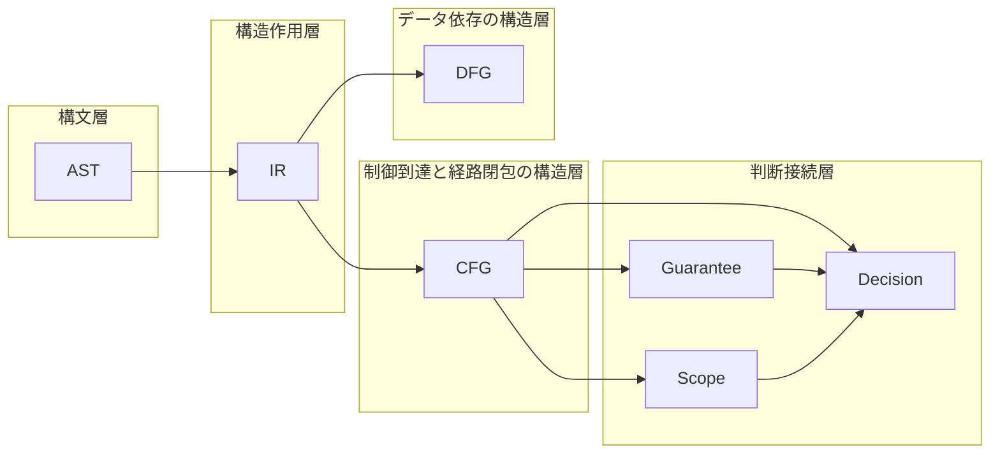

# CFG Core Definition

## 1. 目的
本稿は、COBOL 構造解析研究における **CFG（Control Flow Graph）** の中核定義を確立する。先行して `10_ast` では **構文層** としての観測粒度が与えられ、`20_ir` では **構造作用層（IR）** として制御・データ・境界の作用が再編成されてきた。しかし、分岐点・合流点・反復・非構造遷移・経路の閉包といった **制御到達と経路閉包** を、グラフとして固定しなければ、**判断接続層** における Guarantee（保証）・Scope（境界）・Decision（移行判断）は、「どの制御構造に対して主張するのか」を一貫して説明できない。

Phase9 の `30_cfg` が担うのは、実行トレースの逐次再生図でも、構文木の別表現でもない。**IR が供給する制御作用の骨格を、到達可能性・経路集合・局所閉包の観点からグラフ化し、移行判断・影響分析・保証境界の基礎構造として運用可能にする「制御到達と経路閉包の構造層」** を理論として固定することが、本稿の目的である。

## 2. CFG の定義
**一文定義**：本研究空間における CFG とは、**プログラムの制御が実効的に遷移しうる順序関係を、ノードと有向辺により表した、制御到達と経路閉包の構造層の表現である。**

本研究の CFG は、コンパイラ最適化用の低水準ジャンプ列の可視化を主目的としない。一般の「制御フロー図」が実装都合で均質化されうるのに対し、本研究の CFG は **どこで分岐し、どこで合流し、どの経路集合が閉じるか** を、COBOL における paragraph / section / PERFORM / GO TO 等の実効構造を踏まえて保持する **研究上の制御抽象** として定義される。

CFG は **構文層（AST）** の具象形状そのものではなく、**構造作用層（IR）** の作用列そのものでもない。AST は観測、IR は作用の再編成、CFG は **制御の到達関係と経路構造の閉包** を担う。したがって CFG は、構文から判断へ至る道のりにおいて、**経路と閉包を操作可能な形で外在化する層** と位置づけられる。

## 3. なぜ AST と IR のあとに CFG が必要か
AST のみでは、次の不足が残る。

第一に、**構文カテゴリと制御到達単位の不一致** である。COBOL の一文・一段落は、複数の実効遷移を内包しうる。AST は構文的トレースには十分でも、**分岐の開き方・合流の再統合・ループの戻り** を経路として固定する作業までは与えない。

第二に、**経路閉包の欠如** である。移行可否やリスクはしばしば「どの経路を通れば到達しうるか」「どの領域が局所的に閉じているか」に依存する。AST ノード集合は、経路集合や閉包の代わりにはならない。

第三に、**IR 単体ではグラフとしての制御順序が固定されない** である。IR は branch / join / loop / jump を型付けしうるが、**実際の遷移の骨格** をノード・辺として確定するのは CFG の役割である（`20_ir` の接続議論と整合する）。

## 4. CFG の責務境界
CFG が扱うものは、次である。

- 制御の分岐・合流・反復境界・終端・手続境界に伴う遷移
- paragraph / section を跨ぐ実効遷移（明示的・暗黙的を含む）
- 非構造遷移（GO TO 等）による辺の存在
- 経路（path）として理解されるべき順序関係の骨格
- 局所解析単位（基本ブロック、制御領域）への分解の前提となる分割点

一方で、CFG が直接扱わないものは、字句規則、構文木の具象形状、データの def-use 関係そのもの、外部入出力の意味論、特定ターゲット言語への生成規則である。データ依存は **DFG** の論題であり、保証命題の妥当性そのものは **Guarantee**、境界の業務閉包は **Scope**、総合判断は **Decision** の論題である。CFG はそれらに **構造入力** を供する。

## 5. 最小語彙：ノード・辺・経路・領域
本研究空間における最小語彙は、後続文書で精緻化される前提で、次のとおり固定する。

- **ノード**：制御上、観測・分割・合流のために識別される点。実行可能な直列片の代表、分岐点、合流点、ループ頭、終端、手続境界上の観測点などが候補となる。
- **辺**：あるノードから別ノードへの **実効的制御遷移** を表す有向関係。条件付き・無条件・後退・非構造などの意味分類は別稿で与える。
- **経路**：始点から終点（または観測区間）に至る **辺の有限列** として理解される対象。同一ノード集合でも経路が異なれば、到達意味や保証適用が異なりうる。
- **領域**：CFG 上で入口・出口・内部遷移により **局所的にまとまり** をなす部分グラフ。閉包性は `08` 以降で精密化するが、本稿では「経路・分割の単位としてのまとまり」として位置づける。

## 6. COBOL における単位の二層性
COBOL では **業務・保守上の自然単位**（paragraph / section）と、**制御解析上の最小単位**（基本ブロック等）が一致しないことが常である。本研究では、

- **制御解析単位**＝CFG 上の分割・到達の基準（典型：基本ブロック）
- **業務参照単位**＝paragraph / section 名や手続コンテナ

を区別する。CFG は前者を主として構成しつつ、後者との **対応（トレーサビリティ）** を失わないことが、移行判断において説明責任を満たす条件となる。

## 7. 他モデルとの関係
研究モデルは、次のように理解される。

| 層 | 代表 | 担うもの |
|---|------|----------|
| 構文層 | AST | 文法に沿った観測構造 |
| 構造作用層 | IR | 作用の種類と再編成（制御・データ・境界） |
| 制御到達と経路閉包の構造層 | CFG | 遷移の骨格、経路、合流、閉包の前提 |
| データ依存の構造層 | DFG | def-use・変換・伝播 |
| 判断接続層 | Guarantee / Scope / Decision | 保証・境界・移行判断 |

## 8. 判断接続層への接続（前提）
**Guarantee** に対して CFG は、保証を分割・統合する際の **経路依存性** の骨格を与える。同一ノードでも経路によって成立条件が異なりうるからである。

**Scope** に対して CFG は、影響伝播や閉じた推論対象の **境界候補** を与える。制御的閉包と業務的閉包のずれは、CFG 上の領域構造として説明されうる。

**Decision** に対して CFG は、非構造遷移、多出口、深い分岐ネット、未合流経路など **リスクを増幅しうる制御パターン** の根拠を与える。

## 9. 定義不全のリスク
CFG が未定義、あるいは構文層と混同された場合、次が生じる。

- 分岐・合流が図示されず、保証の適用範囲が偽の直列化になる
- PERFORM / GO TO の実効構造が説明できず、移行判断が慣習依存になる
- DFG や Scope との接続が不整合になり、影響分析が信頼できない

## 10. まとめ
本稿は、CFG を **制御到達と経路閉包の構造層** と定義し、構文層（AST）・構造作用層（IR）・データ依存（DFG）・判断接続層（Guarantee / Scope / Decision）との役割分担を固定した。CFG は実行の写しではなく、**経路と閉包を判断可能にする外在化** である。

### 用語簡易表
| 用語 | 本稿での位置づけ |
|------|------------------|
| AST | 構文層 |
| IR | 構造作用層 |
| CFG | 制御到達と経路閉包の構造層 |
| DFG | データ依存の構造層 |
| Guarantee / Scope / Decision | 判断接続層 |

### 他文書との参照関係
- 前提：`20_ir`（IR 中核定義、IR–CFG 接続）
- 続稿：`02` ノード／辺分類、`03` 基本ブロック／領域、`04` 写像、`05` 経路

### Mermaid 図の説明
上図は、AST→IR→CFG/DFG の流れと、CFG が判断接続層へ入力を与える関係を示す。

### 未解決論点
- 「同一 paragraph 内」のみでは足りない閉包の精密定義（`08` へ）
- 動的制御（ALTER 等）を静的 CFG にどう埋め込むかの方針レベルの保留
