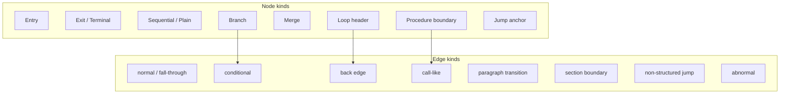

# CFG Node and Edge Taxonomy

## 1. 目的
本稿は、`01_CFG-Core-Definition` で与えた CFG の中核に対し、**ノード型** と **辺型** の分類体系を確定する。分類は実装の都合ではなく、**移行判断・危険構造の識別・保証・境界説明** に直結する軸で与える。構文層（AST）のカテゴリ名と同一視せず、**制御到達と経路閉包の構造層** として何が観測点となり、何が遷移として辺化されるかを固定することが目的である。

## 2. 定義対象のスコープ
対象は、COBOL プログラムに由来する CFG 上のノード・辺の **意味分類** である。データ依存辺（DFG）や型システムは対象外とする。非構造制御の詳細な類型は `07` で拡張しうるが、本稿では **structured / non-structured** の判別基準までを与える。

## 3. 分類の原則
**ノード** は「制御が分割・観測・再統合される点」であり、**辺** は「実効的遷移」である。同一の構文要素が、ノード化と辺化の両方を要請しうるが、**役割を混同しない**。分類軸は次の三つを併用する。

1. **制御役割**（順序・分岐・合流・反復・終端・境界）
2. **遷移様式**（無条件・条件・後退・呼出様・非構造）
3. **COBOL 固有のコンテキスト**（paragraph / section 境界、範囲 PERFORM 等）

## 4. ノード分類
**ノード** を、少なくとも次の型に分類する。

| ノード型 | 定義的要旨 |
|----------|------------|
| Entry | プログラム・手続・解析対象領域の制御入口 |
| Exit / Terminal | 制御が当該単位から逸脱する点 |
| Sequential / Plain | 分岐・合流・ループ頭を内包しない直列実行片の代表点 |
| Branch | 条件または選択により **複数の後続** を持つ観測点 |
| Merge | 複数前駆から **再統合** される観測点 |
| Loop header | 反復制御の **継続判定・反復入口** に相当する観測点 |
| Procedure boundary | PERFORM / CALL 等に伴う **入口・出口・復帰点** の観測 |
| Jump anchor | GO TO の **出発・到着** を明示するための観測点 |
| Exception / interrupt hook | 例外的制御遷移の接続点 |

## 5. 辺分類
**辺** を、少なくとも次の型に分類する。

| 辺型 | 定義的要旨 |
|------|------------|
| Normal / fall-through | 条件なしの **順次進行** または暗黙の次文・次段落への流れ |
| Conditional | 分岐選択に応じた **一対一の遷移** |
| Back edge | 反復に伴う **後退** |
| Call-like transfer | PERFORM / CALL に伴う **下位への移譲** と **復帰** |
| Paragraph transition | paragraph 名を介した **単位間遷移** |
| Section boundary | section 境界を跨ぐ遷移 |
| Non-structured jump | GO TO 等による **構造化パターンから逸脱した** 遷移 |
| Abnormal / exceptional | エラー・中断・終了系の **通常フロー外** 遷移 |

## 6. Structured edge と Non-structured edge
**Structured edge** とは、分岐・合流・反復・手続呼出の **型付け可能な制御パターン** の内部に収まる辺である。すなわち、対応する branch / merge / loop header / procedure boundary により、**経路の再統合または終端** が理論上説明できる遷移を指す。

**Non-structured edge** とは、上記の型付けに **局所的に回収できない** 遷移である。典型は GO TO による **任意ラベルへの飛び** であり、merge の欠落、多入口、ループ外への逸脱などを生じうる。同一グラフ上に両者を載せ、**辺型で差を明示** する。

## 7. COBOL 特有論点
paragraph は保守上の単位であるが、CFG では **paragraph transition 辺** として普遍化する。section は **section boundary** として境界候補と接続しうる。PERFORM THRU は、単一の手続呼出に還元できない **範囲遷移** を生じ、ノード分割と辺の束ね方に影響する。EXIT PARAGRAPH / EXIT SECTION / GOBACK / STOP RUN は **Exit / Terminal** 系のノード・辺分類に接続される。

## 8. 他フェーズとの接続
**構文層（AST）** は、本 taxonomy のラベルではなく **根拠となる観測** を与える。**構造作用層（IR）** は、branch / join / loop / jump / procedure boundary の **意味骨格** を型付けし、CFG はそれを **ノード・辺の具体配置** に落とす。**DFG** とは辺の意味が異なり、混同しない。**判断接続層** では、non-structured edge の密度、merge の欠如、多出口が **リスク指標** となりうる。

## 9. 移行判断への意味
taxonomy は、次の判断質問に答えるための **共通語彙** である。

- どこが分岐点か、どこで経路が再統合されるか
- 非構造遷移が **局所か横断か** を辺型から読み取れるか
- 保証を **経路単位** で分割する必要がある箇所が識別できるか

## 10. まとめ
本稿は、CFG ノード・辺の **型体系** を定義し、structured / non-structured の **判別基準** を与えた。paragraph / section 遷移は **汎用辺型** に収めることで、COBOL 特有性を失わずに一般 CFG 語彙へ接続した。

### 用語簡易表
| 記号 | 意味 |
|------|------|
| Merge | 経路の再統合点 |
| Back edge | 反復の後退遷移 |
| Non-structured | 型付け回収不能な遷移 |

### 他文書との参照関係
- 前提：`01_CFG-Core-Definition`
- 続稿：`03` 基本ブロック／領域、`05` 分岐・合流・経路

### Mermaid 図の説明
ノード族と辺族の対応を概観し、どの観測点がどの遷移型と強く結びつくかを示す。

### リスク観点
non-structured jump と abnormal edge が多い領域は、merge を欠く経路が増え、**保証分割** と **テスト設計** の複雑性を高める。

### 未解決論点
- 例外フローを同一 CFG に統合する粒度
- 動的制御の辺型への写し方
