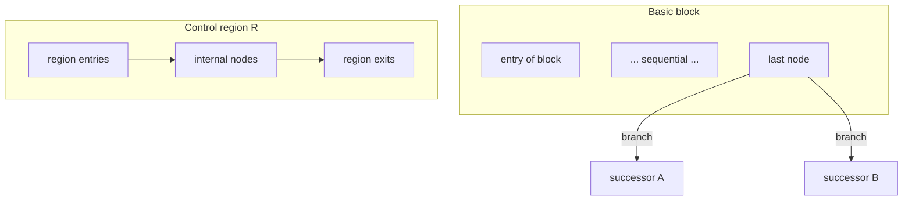

# Basic Block and Control Region

## 1. 目的
本稿は、CFG を **局所解析単位** として操作するための二つの概念、**基本ブロック（basic block）** と **制御領域（control region）** を定義する。構文層（AST）の statement 列や、業務参照単位である paragraph / section との **意図的なズレ** を明文化し、**制御到達と経路閉包の構造層** 上で、どこまでが直列か、どこから局所閉包が成立しうるかを固定する。Scope 候補との接続可能性を示すことが副次的目的である。

## 2. 定義対象のスコープ
対象は、CFG 上の **分割** と **領域まとまり** の理論定義である。支配・ポスト支配・厳密な閉包演算は `08` で精密化する。本稿では **入口・出口・内部遷移** による領域の直観と、paragraph との二層モデルを確定する。

## 3. 基本ブロックの定義
**基本ブロック** とは、CFG のノード列を次を満たすように分割した **最大の直列実行片** である。

1. ブロック内の任意二点は、ブロック内のみを通る有向路で結ばれる
2. ブロックは **単一入口** を持つ
3. ブロックの最後は、**分岐・ジャンプ・合流への参加・終端** のいずれかにより、直列性が終了する

基本ブロックは **制御解析単位** の典型である。statement 単位や文法上の一行単位ではない。

## 4. 単一入口・単一出口について
**単一入口（SE）** は基本ブロックの要件として採用する。**単一出口（SX）** は基本ブロックに常に課さない。すなわち、一つの基本ブロック末尾から **複数の後続** が出ることはあるが、ブロック内部で出口が分岐しない。

より大きな **領域** に対して SE/SX を論じる場合、SX は「領域を抜ける辺が本質的に一種類に集約できるか」という **閉包議論** に接続する。本稿では、SX を基本ブロックの必須条件とはせず、**control region** 側で扱う。

## 5. 制御領域（control region）の定義
**制御領域** とは、CFG の部分グラフ \(R\) であって、次を満たすものとして定義される。

1. **入口集合** と **出口集合** が識別できる
2. \(R\) の内部の遷移は、\(R\) のノードに閉じて説明できる部分を持つ
3. 領域は **単一入口** を持ちうるし、**単一出口** を持ちうる

領域は **構文の塊** ではなく、**制御のまとまり** として与える。

## 6. statement 単位・block 単位・paragraph 単位
| 単位 | 性質 |
|------|------|
| statement（構文層） | AST 上の記述単位。複数作用・複数遷移を内包しうる |
| basic block（構造層・CFG） | 分岐・合流のない直列片。制御解析の最小単位の典型 |
| paragraph / section（業務参照） | 名付けられた保守・業務単位。CFG 分割点と一致しないことが多い |

## 7. paragraph / section と region のズレ
paragraph は **一続きの文の列** を束ねうるが、PERFORM や GO TO により **実効 CFG は paragraph 境界を恣意的に出入り** する。したがって「paragraph = region」とは限らない。section は **境界候補** として強いが、制御閉包と一致しない場合がある。このズレは **Scope** と **migration unit** の議論で中核となる。

## 8. region と Scope 候補の関係
**Scope 候補** は、影響が伝播しうる範囲を **閉じた推論対象** として切り出す単位である。control region は、その **制御的候補** を供する。ただし業務閉包と制御閉包は一致しないため、Scope は **単一の region 写像** に還元できない場合がある。CFG は **制御側の根拠** を与えるに留まる。

## 9. 構造作用層（IR）・判断接続層との接続
**IR** は、procedure boundary や branch / join を型付けし、**どこでブロック境界が生じうるか** の手掛かりを与える。**Guarantee** は、region 内の経路集合に対して命題を貼りうる。**Decision** は、SE/SX を欠く領域や多出口を **移行難易度** へ写しうる。

## 10. 移行判断への意味
基本ブロックは **変更影響の局所化** と **カバレッジ単位** の基礎となる。control region は **まとめて移行可能か**、**分割が必要か** の初見の構造指標となる。

## 11. まとめ
本稿は、基本ブロックを **単一入口の最大直列片** と定義し、制御領域を **入口・出口・内部遷移による部分グラフのまとまり** として定義した。paragraph / section は **業務参照単位** として区別し、制御解析単位との二層モデルを固定した。

### 用語簡易表
| 用語 | 要約 |
|------|------|
| Basic block | 分岐・合流のない最大直列片、単一入口 |
| Control region | 入口・出口付きの部分グラフのまとまり |
| 二層モデル | 制御解析単位 ≠ paragraph 参照単位 |

### 他文書との参照関係
- 前提：`01`、`02`
- 続稿：`04` 写像、`08` 閉包・支配

### Mermaid 図の説明
基本ブロックの末尾分岐と、領域の入口・内部・出口の模式を示す。

### リスク観点
一つの paragraph が複数基本ブロックに跨り、かつ region が多出口であるとき、**保証単位の分割** と **テストの経路爆発** が同時に悪化しうる。

### 未解決論点
- SE/SX region の十分必要条件を COBOL 実務でどこまで要求するか
- 宣言部・入出力例外を region に含めるかの境界
