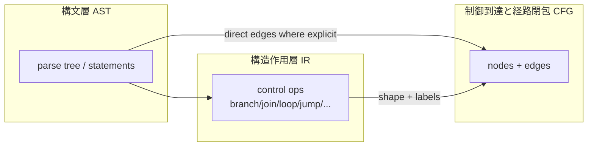

# CFG Mapping from AST and IR

## 1. 目的
本稿は、**構文層（AST）** および **構造作用層（IR）** から、**制御到達と経路閉包の構造層（CFG）** をどう構成するかの **写像規則** を定義する。構文ノードからの機械的な「そのままグラフ化」ではなく、**どの制御構造がノード・辺に落ちるか**、**何が失われ何が保持されるか** を明文化する。DFG 構築とは **別接続面** であることを明示する。

## 2. 定義対象のスコープ
対象は、COBOL の代表的制御構造に対する **理論的写像** である。実装手順やアルゴリズムは扱わない。fall-through、paragraph 跨ぎ、範囲 PERFORM を含む。**動的制御** は静的 CFG では近似ラベルとして扱う余地を残す。

## 3. 写像の二経路：AST 直結と IR 媒介
**AST 直結** で足りる部分は、構文上明示された **順序接続**、単純な **IF / EVALUATE の分岐木**、**GO TO のターゲット** など、構文観測だけで遷移関係が定まる骨格である。

**IR 媒介** が本質的な部分は、一文多作用の分解、paragraph の制御意味の正規化、PERFORM の **入口・出口・復帰** の型付け、branch / join / loop の **意味ラベル**、非構造化度の明示である。IR は CFG に **ノード候補・辺候補・境界ラベル** を供し、CFG はそれを **グラフ配置** に確定する。

## 4. 構文（AST）→CFG の対応（骨格）
| 構文層の観測 | CFG 上の読み（骨格） |
|--------------|----------------------|
| 順次文列 | 基本ブロック内の直列（辺：normal / fall-through） |
| IF | branch ノード、条件辺、合流 merge |
| EVALUATE | 多分岐 branch、各選択肢辺、共通 merge |
| PERFORM（単一） | call-like：手続入口へ、復帰点へ戻る |
| PERFORM THRU | 範囲入口から出口への **順路** と復帰を含む部分グラフ |
| GO TO | non-structured jump 辺、jump anchor ノード |
| EXIT PARAGRAPH / SECTION | 当該単位の出口へ向かう **終端・脱出** 系辺 |
| STOP RUN / GOBACK | Terminal 系ノード・辺 |

**Fall-through** は、次の paragraph 先頭への暗黙遷移を **明示的 control edge** として表現する点が重要である。

## 5. IR（構造作用層）→CFG の対応（骨格）
| IR 側の制御骨格 | CFG 側の読み |
|-----------------|---------------|
| Sequence | 直列の control flow edge |
| Branch | 条件付き複数後続 |
| Loop | 後退辺・継続条件に対応する骨格 |
| Join | 分岐後の merge |
| Exit | 手続・段落・プログラムからの脱出 |
| Jump | GO TO 等の非構造遷移 |
| Procedure boundary | PERFORM / CALL の入口・出口・復帰 |

IR は **ノード・辺を唯一決定しない** 場合がある。同一 IR 複合が複数 CFG ノードに展開されうるし、意味的に透明な点は省略されうる。ただし **トレーサビリティ** を失わないことが研究上の条件である。

## 6. statement 列から基本ブロックを構成する規則
1. **分岐点・合流点・ジャンプの出発・ジャンプの到着・手続境界の観測点** をブロック境界とする。
2. 境界間の最大直列片を **一基本ブロック** とする。
3. paragraph 名は **ラベル** としてノード注釈に付与しうるが、ブロック分割の十分条件ではない。

## 7. paragraph / section を跨ぐ制御
- **明示 PERFORM**：paragraph transition 辺＋call-like の復帰
- **GO TO**：section / paragraph を跨ぐ non-structured jump となりうる
- **section 境界**：section boundary 辺として記録し、Scope 候補と対応付けうる

## 8. 情報の保持と喪失
**保持される典型** は、分岐構造、合流、ループ骨格、非構造遷移の存在、終端種別、手続復帰点である。

**落ちうる典型** は、コメント、空白、ソース上の整形、**データ依存の詳細**、実行時のみ成立する経路である。静的 CFG は **構文的経路の上限近似** を与えるにとどまる。

## 9. DFG との区別
CFG の辺は **制御遷移** である。def-use は **DFG** で表す。条件式がデータに依存する場合でも、**制御辺とデータ辺を同一視しない**。IR は交点を型付けし、二つのグラフへの射影を分離する。

## 10. 判断接続層への含意
写像規則が曖昧だと、**同じソースに対し複数の CFG** が競合し、Guarantee / Scope / Decision の根拠が揺れる。よって写像は **研究規約** として固定し、トレーサビリティを維持する必要がある。

## 11. まとめ
本稿は、AST からの **明示遷移** と IR からの **意味骨格** を組み合わせて CFG を構成する規則を示し、代表構文ごとの対応と情報の保持・喪失を整理した。

### 用語簡易表
| 用語 | 意味 |
|------|------|
| 写像規則 | AST/IR 要素から CFG 要素への対応規約 |
| Fall-through | 暗黙順序を明示辺化すること |

### 他文書との参照関係
- 前提：`20_ir`（IR 中核、IR–CFG 接続）、`01`〜`03`
- 続稿：`05` 経路、`06`〜`07` ループ・非構造

### Mermaid 図の説明
AST からの直接辺化と、IR 媒介による骨格付与の二経路を示す。

### リスク観点
IR で join が省略されると CFG に偽直列が入り、**保証範囲** が過大・過小に歪む。

### 未解決論点
- ALTER 等の動的制御の静的近似のラベル規約
- COPY 展開後の「唯一の CFG」の定義
