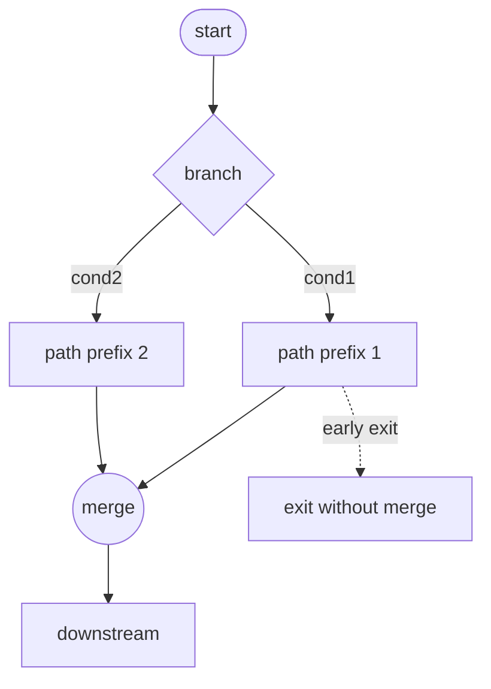

# Branch, Merge, and Path Structure

## 1. 目的
本稿は、CFG を **経路の構造** として読むための概念、**分岐（branch）**、**合流（merge）**、**経路（path）** を定義する。merge を図上の交点に還元せず、**判断上の再統合点** として扱う。実行可能経路・保証対象経路といった **準備概念** を導入し、**Guarantee** が経路依存になりうる理由を明文化する。**判断接続層** への接続の下地を固定する。

## 2. 定義対象のスコープ
対象は **制御到達と経路閉包の構造層（CFG）** における経路論の基礎である。ループの細目は `06`、非構造遷移の類型は `07`、支配・閉包は `08` で精密化する。本稿では **path の定義**、**branch の開き**、**merge の意味**、**多分岐**、**早期脱出**、**path-sensitive 保証の準備** に焦点を当てる。

## 3. 分岐（branch）
**分岐** とは、CFG 上のノード \(b\) が **二つ以上の後続** を持ち、かつ制御がそのうち **一つを選択** して進む構造として理解される関係である。条件分岐・選択分岐を含む。EVALUATE は **単一ノードの多分岐** として抽象化されうる。

**分岐の開き方** として、各選択肢は **別辺** として表現され、それぞれが **異なる初期経路接頭辞** を生む。

## 4. 合流（merge）
**合流** とは、**二つ以上の異なる前駆** から制御が **同一ノード** \(m\) に入る構造である。merge は **経路が再統合される点** であり、以降の実行は **どの前駆から来たか** によって状態が異なりうる。

判断上、merge は次の意味を持つ。

- **再統合点**：分岐で分かれた経路が **同一の後続解析領域** に戻る
- **観測点**：path-sensitive な性質を持つ場合、merge 以降の主張は **経路履歴** に依存しうる

## 5. 経路（path）
**経路** とは、CFG の辺の有限列 \((e_1,\ldots,e_n)\) であって、辺同士が **首尾一貫して接続** されるものである。経路は **ノードの集合** ではない。同一ノード集合を通っても **辺列が異なれば別経路** ありうる。

**始点・終点** は、解析目的に応じて、プログラム入口から某 merge まで、某 branch から終端までなど **区間** を指定する。

## 6. 経路分類の観点
次の区別は、後続の保証・テスト論で精密化される **準備概念** として導入する。

| 観点 | 説明 |
|------|------|
| 構文的経路 | CFG 上で辺接続として存在する経路 |
| 実行可能経路 | データ・環境制約のもとで **実際にありうる** 経路 |
| 保証対象経路 | Guarantee によって **性質が主張される** 経路部分集合 |
| 未カバー経路 | テスト・証明が **未着手** の経路 |

静的 CFG は **構文的経路の上限近似** を与える。

## 7. 多分岐構造
EVALUATE や多条件 IF は、**扇状の branch** と **共通 merge** として表現される。共通 merge が省略される場合、**経路は合流せず並行して終端** へ向かう。これは **保証の分割** を要請しうる。

## 8. 早期脱出（early exit / early transfer）
EXIT PARAGRAPH、EXIT SECTION、GO TO による **手続・領域からの早期脱出** は、**通常の merge へ至らない経路** を生む。これは **path 集合の分断** を意味し、**カバレッジ・保証単位** の複雑性を上げる。早期脱出は **non-structured** と限らないが、**合流の欠落** と併発しうる。

## 9. ノード集合と経路概念の区別
「ノード集合が同じ」ことは「同一経路」ではない。Guarantee が **状態不変条件** を含む場合、**どの分岐選択列を通ったか** が主張の前提となる。よって **Guarantee Unit は経路依存になりうる**。

## 10. 判断接続層との接続（準備）
- **Guarantee**：保証を **経路単位** で分割・統合する必要の有無は、branch の深さ、merge の有無、早期脱出の有無に依存する
- **Scope**：経路が **領域外へ逸脱** するかどうかは、境界ノード・辺で識別する
- **Decision**：経路数増大、未合流、非構造遷移の混在は **移行リスク** の指標となりうる

## 11. 移行判断への意味
経路構造は、**テスト可能か**、**仕様が経路で分岐しているか**、**移行後も同じ経路集合が意味を持つか** を論じるための **共通言語** である。

## 12. まとめ
本稿は、branch・merge・path を定義し、merge を **再統合点** として位置づけ、経路の **列としての同一性** を強調した。静的 CFG 上の経路と、実行可能・保証対象経路の **段階的区別** を導入し、Guarantee の経路依存性の根拠を与えた。

### 用語簡易表
| 用語 | 要約 |
|------|------|
| Path | 辺の有限接続列 |
| Merge | 経路の再統合点 |
| Path-sensitive | 経路履歴に依存する主張 |

### 他文書との参照関係
- 前提：`01`〜`04`、`20_ir`（branch/join 骨格）
- 続稿：`06` ループ、`08` 支配・閉包、`09` 判断接続の詳細

### Mermaid 図の説明
分岐→合流の正常形と、合流を経由しない早期脱出経路の対比を示す。

### リスク観点
merge が欠けたまま終端が増えると **経路集合が指数的に肥大** し、**条件網羅** と **契約保証** のコストが跳ね上がる。

### 未解決論点
- feasible 経路を静的に近似する規約
- 同一 merge 後にいつ path-sensitive を解消してよいか
