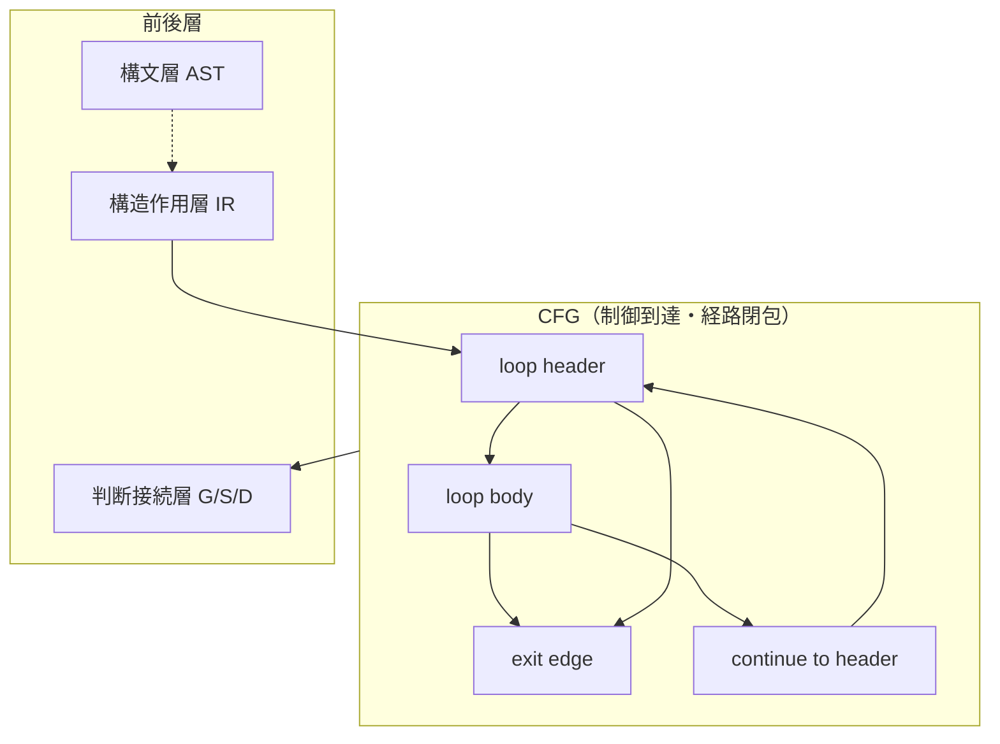

# ループと反復モデル（Loop and Iteration Model）

## 1. 目的
本稿は、Phase9 `30_cfg` において、**CFG を制御到達と経路閉包の構造層**として扱う際の中核要素である **反復構造** を、単なるグラフ上の後退辺（back edge）の存在として還元せず、**制御抽象として識別・分類可能な構造単位**として定式化する。先行する分岐・合流・経路の議論（`05`）と、後続の非構造制御（`07`）、支配・閉包（`08`）、判断接続層（`09` `10`）との接続において、ループが **移行難易度・保証単位・説明責任** に与える差分を固定することが目的である。

**構文層（AST）** は `PERFORM` 等の表層記法を与えるにとどまり、**構造作用層（IR）** は反復に関与する制御作用（条件・範囲・復帰）を型付けする。本稿が扱うのは、その作用が **CFG 上でどのような反復スキーマ（header / body / exit）として現れるか** の理論的整理である。

## 2. 定義対象のスコープ
本稿は次を対象とする。

- `PERFORM` 系に由来する反復（条件反復、添字反復、回数反復、段落範囲反復）
- 単一ループ、入れ子ループ、複合条件を伴う反復の **構造的位置づけ**
- ループ境界における **合流・出口・後退** の意味分類

対象外とするのは、具体的な解析アルゴリズム、ループ不変条件の自動推論、実行時性能、特定ターゲット言語への機械的変換手順である。

## 3. コア概念の定義
### 3.1 反復スキーマ（iteration schema）
**反復スキーマ** とは、CFG の部分構造として、**同一の制御領域を繰り返し通過しうる閉じた経路族** を特徴づける最小の構造パターンである。反復スキーマは、少なくとも次の役割分担を備える。

- **ループ頭（loop header）**：反復が「再入」される観測点
- **ループ本体（loop body）**：反復ごとに実行されうる作用列に対応する領域
- **出口辺（exit edge）**：反復から脱出し、ループ外の合流または後続へ至る辺
- **継続辺（continue edge）**：本体の末尾または中間からループ頭へ戻る経路要素

**一文定義**：本研究空間における反復は、**ループ頭・本体・出口・継続が制御依存として識別可能な閉路構造** として定義される。

### 3.2 後退辺（back edge）の位置づけ
後退辺は反復の **十分条件ではなく記述手段** である。同一の後退辺表象でも、ループ頭の単一性、出口の個数、本体の非連結性などにより **移行リスクと保証難易度は異なりうる**。したがって本稿では、back edge をループ定義の代用とせず、反復スキーマへ還元して語る。

### 3.3 終了条件（termination）の構造的位置づけ
終了条件は **構文層の述語そのもの** ではなく、CFG 上では次のいずれかとして現れる。

- **先判定型**：ループ頭での条件分岐により、継続と出口が分離される
- **後判定型相当**：本体実行後に再条件化され、継続辺がループ頭へ戻る
- **カウンタ／添字駆動**：更新点と境界判定点が本体内部または header に分散する

終了可能性の証明は本稿の主題ではないが、**判断接続層** においては「終了条件が単一箇所に集約されているか」「分散しているか」が、説明可能性と検証コストに直結する。

## 4. ループ分類（loop taxonomy）
| 区分 | 構造的要約 | CFG 上の読み |
|------|------------|--------------|
| 条件反復（UNTIL 型） | 真偽条件による継続／脱出 | header での branch、exit と continue |
| 添字反復（VARYING 型） | 添字範囲と更新による反復 | header／本体に分散した更新・判定、合流の複雑化 |
| 回数反復（TIMES 型） | 回数上限による反復 | 明示カウンタに相当する制御構造 |
| 段落範囲反復 | 単一段落または THRU 範囲の反復実行 | 手続境界ノードと loop header の関係が強い |
| 入れ子反復 | 反復領域の包含 | 内側 exit が外側 header と交差しないことが望ましいが、COBOL では崩れうる |

## 5. COBOL 特有の構造論点
COBOL の反復は、**段落（paragraph）・節（section）** をコンテナとして持ち、`PERFORM THRU` により **制御領域が構文コンテナと一致しない** ことがある。これは次の論点を生む。

- **ループ本体の非連結性**：本体が複数ブロックに分割され、合流が単純化されない
- **出口の暗黙化**：`EXIT PARAGRAPH` / `EXIT SECTION` 等が、CFG 上の出口辺として分散しうる
- **入れ子の交差**：内側の脱出が外側ループの構造を壊す場合、反復スキーマの単純木モデルが失効する

## 6. 他モデルとの接続
- **構文層（AST）**：`PERFORM` の構文種別とオプションが、反復スキーマ推定の手掛かりとなる
- **構造作用層（IR）**：branch／loop／join／procedure boundary の型が、header・exit の候補を供給する
- **制御到達と経路閉包の構造層（CFG）**：本稿の反復は、path 族の閉包性と、merge の多重度を通じて記述される
- **判断接続層**：Guarantee は反復内の経路網羅、Scope は反復領域の境界、Decision は打ち切り困難性や構造複雑性を読む

## 7. 移行判断への意味
反復は移行において次の意味を持つ。

- **状態空間の圧縮失敗**：同一ノード集合でも反復回数に依存する挙動は、単純な「ブロック単位置換」を危うくする
- **テスト・保証の経路爆発**：merge と continue の組合せが多いほど、経路ベースの主張が重くなる
- **境界の曖昧化**：段落範囲反復は、業務単位と制御閉包のズレを増幅し、Scope 候補の選定を難しくする

## 8. まとめ
本稿は、CFG 上の反復を **ループ頭・本体・出口・継続** から成る反復スキーマとして定義し、`PERFORM` 系の差異を構造 taxonomy に落とし込んだ。後退辺はループの表象手段にとどめ、終了条件の配置と合流構造を通じて **判断接続層** に橋を架ける。これにより、反復は「循環がある」という弱い記述から、移行・保証・説明に耐える **独立した制御抽象** へ昇格する。

## 9. 用語簡易表
| 用語 | 意味 |
|------|------|
| 反復スキーマ | header／body／exit／continue が識別可能な閉路構造 |
| ループ頭 | 反復の再入点・条件の主座 |
| 出口辺 | 反復領域からの脱出経路 |
| 後退辺 | ループ頭方向への制御辺（表象） |

## 10. 他文書との参照関係
- 前提：`05_Branch-Merge-and-Path-Structure.md`
- 続接：`07_NonStructured-Control-and-GOTO.md`、`08_Dominance-Reachability-and-Closure.md`、`09_CFG-to-Scope-Guarantee-Decision.md`

## 11. Mermaid 図の説明
上図は、IR から供給される制御候補がループ頭へ集約され、継続と出口が分岐する最小スキーマを示す。判断接続層は、このスキーマが生成する **経路閉包** を読む。

## 12. 未解決論点
- 動的制御が反復スキーマに与える不確定性の扱い
- 終了条件とデータ作用が強結合する場合の DFG との合同議論
