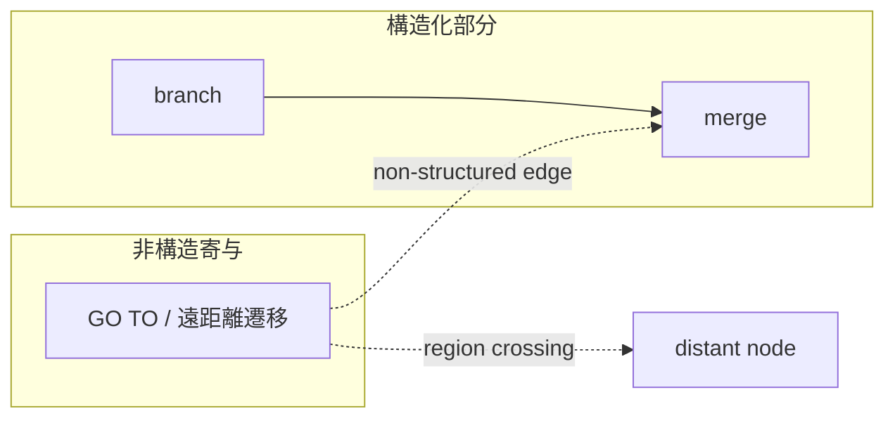

# 非構造制御と GO TO（Non-Structured Control and GOTO）

## 1. 目的
本稿は、COBOL プログラムに現れる **非構造制御** を、道徳的排除の対象ではなく、**CFG 上で観測可能な構造破壊の程度** として理論化する。`30_cfg` における CFG は **制御到達と経路閉包の構造層** であり、構造化された分岐・合流・反復と **同一グラフ上** に非構造辺を載せ、エッジ分類によって差異を明示する立場を採る。

**構文層（AST）** は `GO TO` 等の記法を与え、**構造作用層（IR）** は jump・exit・手続境界として型付けする。本稿は、その結果として **判断接続層** にどの種類の説明負債が発生するかを構造言語で固定する。

## 2. 定義対象のスコープ
対象とするのは次に相当する制御現象である。

- 明示ジャンプ（`GO TO`）に代表される **任意着地点への制御移譲**
- paragraph／section を跨ぐ遷移、および **fall-through** に伴う制御の非構造性
- ループや単一入口領域を破壊する **構造破壊ジャンプ**

対象外とするのは、ジャンプ解決の実装手順、ラベル解析の詳細アルゴリズム、特定ツールによる自動リファクタリング戦略である。

## 3. コア概念の定義
### 3.1 非構造制御（non-structured control）
**非構造制御** とは、CFG を **単一入口・単一出口の合成規則だけで再構成できない** 制御の寄与である。ここで「再構成できない」は、ソース上の整形可能性ではなく、**与えられた CFG の経路構造における合成制約の破れ** として理解する。

### 3.2 非構造辺（non-structured edge）
非構造辺は、通常の順序辺・条件辺に加え、次の性質のいずれかを持つ制御辺として定義される。

- **領域横断性**：固定された control region の境界を、構造化合成の規則に沿わずに跨ぐ
- **入口多重化の誘発**：同一の制御観測点へ、意図的でない多様な前駆から到達しうる状態を安定化する
- **出口多重化の誘発**：同一の意味単位から、非対称な複数の脱出先へ分散する
- **ループ破壊**：反復スキーマの header／exit の読みを、単一の閉路モデルで説明できなくする

### 3.3 構造回復可能性（recoverability）
**構造回復可能性** とは、非構造辺を **等価な構造化スキーマ** へ置換しうるかを、CFG の性質として評価する観念である。

- **局所回復**：限定された部分グラフ内で、多入口・多出口を解消しうる
- **大域回復**：プログラム全体の意味保存のもとで、単一入口単一出口領域へ分解しうる

回復不能性は「悪」の宣告ではなく、**移行・検証・説明コストの上界** を示す記号である。

## 4. 非構造制御の分類
| 類型 | 構造破壊の主効果 | 典型的な判断影響 |
|------|------------------|------------------|
| 局所ジャンプ | 小領域内の出口／入口の再配線 | 局所テストで吸収しうるが、merge の説明が複雑化 |
| 領域横断ジャンプ | control region／paragraph 境界を直接短絡 | Scope 候補と CFG 閉包のズレが拡大 |
| ループ破壊ジャンプ | 反復スキーマの単純モデル失効 | 経路保証・不変条件の説明が困難 |
| 入口多重化 | 単一入口仮定の崩壊 | 保証単位の前提が弱まる |
| 出口多重化 | 合流前の意味分岐の増加 | Decision におけるリスク要因として顕在化 |

## 5. COBOL 特有の構造論点
- **paragraph 横断**：業務記述の自然単位と CFG の最小単位が一致しないため、非構造辺が「遠距離依存」として現れやすい
- **section 境界**：宣言と実行の境界が、制御の見通しを損なう
- **fall-through**：構文上は直列に見えるが、実効は多入口化・多出口化を伴うことがある
- **EXIT 系と jump の混線**：出口制御が分散すると、非構造度の定量化が難しくなる

## 6. 他モデルとの接続
- **IR**：Jump／Exit／Procedure boundary が非構造辺候補を供給する
- **分岐・合流（`05`）**：merge の手前で非構造辺が集中すると path 説明が破綻しやすい
- **反復（`06`）**：ループ破壊は反復スキーマの失効として記録される
- **支配・閉包（`08`）**：入口／出口構造の理解に post-dominator 等が必要になる
- **判断接続層**：Guarantee は経路の未整理さ、Scope は領域横断、Decision は回復コストとして読む

## 7. 移行判断への意味
非構造制御は、次を通じて移行リスクを押し上げる。

- **説明不能経路の増加**：置換言語側の構造化 idiom への写像が一意でなくなる
- **スコープ分割の困難**：制御閉包と業務閉包の不一致が拡大する
- **テスト設計の負荷**：入口・出口の組合せが増え、カバレッジ方針と Guarantee の整合が取りにくい

## 8. まとめ
本稿は、非構造制御を CFG の **辺の意味分類** として定義し、局所／領域横断／ループ破壊・多入口・多出口という軸で類型化した。構造回復可能性は、移行可否の **説明責任とコスト** を見積るための構造指標として位置づけられる。

## 9. 非構造度の指標候補
アルゴリズムではなく **観測可能な構造特徴** として、次を候補とする。

- 非構造辺の密度
- 遠距離遷移の件数
- 多入口・多出口ノード／領域の個数
- ループ破壊辺の有無と反復スキーマ単純性の喪失度

## 10. 用語簡易表
| 用語 | 意味 |
|------|------|
| 非構造制御 | 単一入口単一出口合成で再構成しにくい制御寄与 |
| 非構造辺 | 上記を生じさせる制御辺のクラス |
| 構造回復 | 等価な構造化スキーマへの置換可能性 |

## 11. 他文書との参照関係
- 前提：`02_CFG-Node-and-Edge-Taxonomy.md`、`05`〜`06`
- 続接：`08`、`09`、`10`

## 12. Mermaid 図の説明
上図は、局所的分岐・合流に対し、遠距離への非構造辺が「領域横断」として重ね掛けされる状況を模式的に示す。

## 13. 未解決論点
- 動的制御による **辺集合そのものの変動** の扱い
- 「等価性」の基準をどの判断接続層概念に結びつけるか
