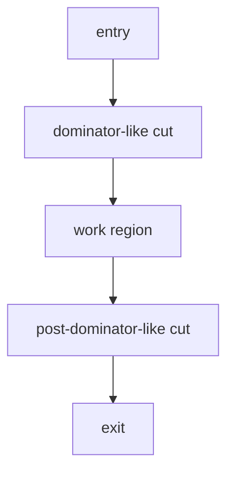

# 支配・到達性・閉包（Dominance, Reachability, and Closure）

## 1. 目的
本稿は、CFG を **制御到達と経路閉包の構造層** として扱う際に不可欠な **到達性（reachability）・支配（dominance）・閉包性（closure）** を、証明論ではなく **移行単位の切り出し・保証境界の説明・影響伝播の読み** に接続する水準で定義する。数学的厳密さより、**判断接続層** が参照しうる操作可能概念として固定することが目的である。

## 2. 定義対象のスコープ
対象とするのは、単一プロシージャ／コンパイル単位に対する CFG 上の関係である。複数プログラム間の呼出は、手続境界ノードとして **入口・出口条件** に還元して扱う。

本稿は **アルゴリズム** を扱わない。

## 3. コア概念の定義
### 3.1 到達性（reachability）
ノード \(v\) がノード \(u\) から **到達可能** であるとは、\(u\) から \(v\) へ至る **制御経路** が存在することをいう。到達性は、「その作用は実行されうるか」という **最弱の前提** を与える。到達不能は **デッドコード** の手掛かりとなるが、本研究では主に **保証・テストの無駄削減** と **説明範囲の切断** に用いる。

### 3.2 支配（dominance）
ノード \(d\) がノード \(n\) を **支配** するとは、入口から \(n\) への任意の経路が \(d\) を通過しなければならないことをいう。**直観** として、\(n\) に至る前に **必ず通る関所** である。

### 3.3 ポスト支配（post-dominance）
ノード \(p\) がノード \(n\) を **ポスト支配** するとは、\(n\) から各終端への任意の経路が \(p\) を通過しなければならないことをいう。**直観** として、\(n\) 以降で **必ず通る合流・出口前関所** である。

### 3.4 制御閉包（control closure）
**制御閉包** とは、部分グラフ \(R\) が、与えられた入口・出口の取り方の下で **内部の制御流れが外部へ逸脱せず説明できる** という性質である。実務的には次の区別を採る。

- **弱閉包**：内部から外部への辺が存在しない
- **強閉包**：単一入口・単一出口に近い合成規則で **置換可能** である

### 3.5 単一入口・単一出口領域（SESE）
**SESE 領域** は、支配とポスト支配を用いて **カット可能な制御断片** として理解される。COBOL では非構造辺により SESE 仮定が容易に崩れる点が論点となる。

### 3.6 還元不能性（irreducible control）
**還元不能な制御** とは、ループ構造を単純な階層木で表すことが困難な、**絡み合った後退** を伴う制御である。本稿ではアルゴリズム的判定ではなく、**説明構造としての複雑性** として扱う。

## 4. COBOL 特有の構造論点
- **多出口・分散出口**：`EXIT` 系・非構造辺により、ポスト支配の基準となる出口集合が曖昧化しうる
- **段落モデルとのズレ**：支配関係は basic block 粒度で安定しやすいが、業務説明は paragraph 粒度で行われる
- **例外・I/O 境界**：宣言部や例外ハンドラは、制御閉包の「外」と「内」を分断しうる

## 5. 他モデルとの接続
- **構文層（AST）**：入口・出口の候補を構文的に与える
- **構造作用層（IR）**：branch／join／exit の骨格が支配・ポスト支配の **候補カット** となる
- **非構造制御（`07`）**：支配関係の説明力を弱める要因として記録される
- **判断接続層**：
  - **Scope**：制御閉包は境界候補の十分条件になりうるが、業務閉包と一致しない
  - **Guarantee**：支配関係は「必ず実行される前提」や「条件付き実行」の説明に効く
  - **Decision**：SESE に近いほど分割容易性が高い、という **構造指標** を与える

## 6. 移行判断への意味
- **migration unit の切り出し**：支配／ポスト支配で挟まれた領域は、置換単位の候補となるが、非構造辺があるとカットが無意味化する
- **影響伝播**：変更点からの到達・逆到達で、説明すべき経路集合を束ねる
- **保証の説明責任**：「すべての経路で」を主張するほど、支配・合流・出口の配置が説明の主役になる

## 7. 制御閉包とスコープ閉包の不一致
制御閉包だけでは Scope が十分に決まらない典型理由は次のとおりである。

- paragraph 名で見た業務まとまりと、CFG の閉包が一致しない
- データ依存や外部 I/O が、制御的には閉じていても **意味的には開いている**

## 8. まとめ
本稿は、到達性・支配・ポスト支配・制御閉包・SESE・還元不能性を、CFG 上の **判断可能な関係** として定義し、非構造制御や COBOL 特有出口がもたらす説明の難度を明示した。これらは **判断接続層** における境界・保証・分割判断の **構造根拠** となる。

## 9. 用語簡易表
| 用語 | 意味 |
|------|------|
| 支配 | 入口からの任意経路が必ず通る前関所 |
| ポスト支配 | 出口側の任意経路が必ず通る後関所 |
| 制御閉包 | 内部制御が外部へ逸脱しない説明可能性 |
| SESE | 単一入口・単一出口に近いカット可能領域 |

## 10. 他文書との参照関係
- 前提：`03`〜`07`
- 続接：`09`、`10`

## 11. Mermaid 図の説明
上図は、入口側の支配カットと出口側のポスト支配カットのあいだに作業領域を挟む **概念的スライス** を示す。

## 12. 未解決論点
- 出口集合の規定がポスト支配に与える影響
- 還元不能性と「人間にとっての理解容易性」の相関
