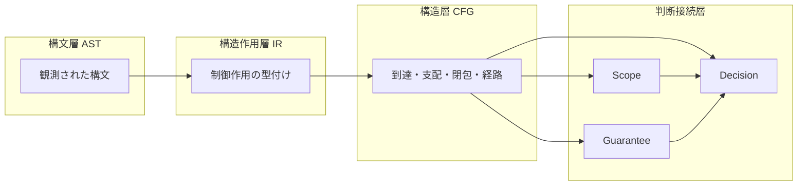

# CFG から Scope・Guarantee・Decision への接続（CFG to Scope, Guarantee, and Decision）

## 1. 目的
本稿は、`30_cfg` で与えられた CFG を **制御到達と経路閉包の構造層** として確立したうえで、**判断接続層** における **Scope（境界）・Guarantee（保証）・Decision（移行判断）** へ、どのような **射影規則と限界** で接続するかを明文化する。CFG を単独理論で終わらせず、研究全体の **根拠の流通** を可能にすることが目的である。

## 2. 定義対象のスコープ
対象とするのは、CFG が供給しうる **境界候補・保証単位候補・判断材料** の理論的対応である。データ依存、例外契約、業務意味の完全な固定は、`40_dfg`、`50_guarantee` の詳細、`70_cases` に一部委ねる。

## 3. コア概念の定義
### 3.1 ノード保証・領域保証・経路保証
**ノード保証** は、特定の CFG ノードまたは基本ブロックの実行に関する主張である。**領域保証** は、制御閉包に近い領域に対する主張である。**経路保証** は、分岐選択の組合せに依存する主張であり、**同一ノード集合でも経路により真偽が変わりうる** 点が本研究の要点である。

### 3.2 制御閉包と保証閉包
**制御閉包** は CFG 上の説明可能性である。**保証閉包** は、主張が意味的に閉じている範囲であり、データ・外部境界・例外を含みうる。二者は一致しない。

### 3.3 保証不能経路（unguaranteeable path）
**保証不能経路** とは、与えられた証拠・契約・観測の下で、主張の真偽または適用条件を **十分に説明できない経路** である。原因は、CFG 外の情報欠落である場合もあれば、CFG 上の **多入口・多出口・未閉包・非構造辺** による説明の分裂である場合もある。

### 3.4 判断閉包（decision closure）
**判断閉包** とは、Decision が結論を下すために **最小限そろえるべき根拠束** である。CFG はその一部（制御経路・閉包・危険パターン）を供給し、IR・DFG・Guarantee 契約で補完される。

## 4. 接続マップ
| 判断接続層 | CFG が供給する主な読み |
|------------|-------------------------|
| Scope | 制御閉包、SESE 近似、merge／exit の配置、領域横断辺の有無 |
| Guarantee | 経路集合の分解、必達／条件付き到達、合流前後の説明単位 |
| Decision | 分割容易性、非構造度、ループ・分岐複雑性、未閉包・保証不能の手掛かり |

## 5. COBOL 特有の構造論点
- **paragraph 参照と制御閉包のズレ**：Scope の自然言語境界が、CFG 閉包と一致しない
- **PERFORM THRU と範囲保障**：領域保証を語るとき、手続境界と実効経路の差が問題になる
- **EXIT と GO TO の混在**：経路保証の説明が分岐し、Guarantee の単位選択が難しくなる

## 6. 他モデルとの接続

- **AST**：境界記号・制御記法の根拠
- **IR**：CFG 構築の手掛かり
- **DFG**：制御閉包が閉じても保証閉包が開く典型原因
- **`10`**：CFG 由来リスクを Decision 入力へ集約

## 7. 移行判断への意味
- **migration decision** は、CFG だけでは完結しない。しかし **「どこを切ると制御説明が壊れるか」** は CFG が最も強い
- **経路保証** が必要な主張ほど、`05`〜`08` の概念が Decision の前提になる
- **保証不能経路** の顕在化は、移行の段階計画や追加証拠獲得を要求する

## 8. まとめ
本稿は、CFG を判断接続層へ接続する際の **射影規則** を、Scope／Guarantee／Decision の三軸で整理し、ノード・領域・経路の三層保証の違い、制御閉包と保証閉包の不一致、保証不能経路の概念を固定した。CFG は **根拠の中枢** であり、**結論の全部** ではない。

## 9. 用語簡易表
| 用語 | 意味 |
|------|------|
| 経路保証 | 分岐選択に依存する主張 |
| 保証閉包 | 主張が意味的に閉じる範囲 |
| 保証不能経路 | 説明・証拠不足で主張が付かない経路 |
| 判断閉包 | Decision に必要な根拠束 |

## 10. 他文書との参照関係
- 前提：`01`〜`08`
- 双方向：`50_guarantee`、`60_scope`、`60_decision`
- 続接：`10`

## 11. Mermaid 図の説明
上図は、AST→IR→CFG の上流と、CFG から三つの判断概念への下流、および Scope／Guarantee から Decision への合流を示す。

## 12. 未解決論点
- Guarantee 契約言語と CFG 射影の **形式整合**
- Scope の最終定義が業務辞書・モジュール境界に依存する場合の運用規則
