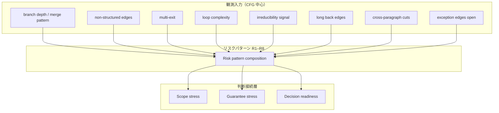

# CFG リスクパターンと移行準備度（CFG Risk Patterns and Migration Readiness）

## 1. 目的
本稿は、`30_cfg` 群で整備した **制御到達と経路閉包の構造層（CFG）** の概念を、**判断接続層** における **移行準備度（migration readiness）** 評価へ接続する。危険の列挙ではなく、各パターンについて **なぜ構造的にリスクとなりうるか** を示し、**観測可能な CFG 特徴** として読み替えることが目的である。後続の事例分析へ展開可能な **入力観測の辞書** を与える。

## 2. 定義対象のスコープ
対象は、CFG 上で識別しうる **高リスク制御パターン** と、それが Scope／Guarantee／Decision に与える **典型的影響** である。実装の検出閾値やスコアリング式は本稿では与えない。

## 3. コア概念の定義
### 3.1 CFG リスクパターン
**CFG リスクパターン** とは、移行・検証・構造回復のいずれかにおいて **コスト上界を押し上げうる制御構造の再帰的に現れる形** である。パターンは独立ではなく、合成により強化されうる。

### 3.2 分割困難領域（hard-to-partition region）
**分割困難領域** とは、単一入口単一出口に近い合成が崩れ、**意味保存のもとでのモジュール化** が難しい領域である。非構造辺、多出口、遠距離 merge が典型因となる。

### 3.3 未閉包経路（non-closed paths）
**未閉包経路** とは、制御閉包の説明下で **入口から出口まで一貫して束ねられない経路族** である。例外処理、動的制御、外部呼出の非局所出口が関与しうる。

### 3.4 移行準備度（migration readiness）
**移行準備度** は単一指標ではなく、**根拠束の充足度** である。CFG はその主要因を供給し、DFG・契約・テスト資産で補完される。

## 4. リスクパターン一覧
| ID | パターン名 | 構造要因（CFG） | 典型的判断影響 |
|----|------------|-----------------|----------------|
| R1 | 深い分岐ネスト | 連鎖 branch、複数 merge | 経路説明・テスト設計の複雑化 |
| R2 | 非構造辺の高密度 | 非構造辺比率、遠距離短絡 | 構造回復コスト、Scope ズレ |
| R3 | 多出口領域 | 出口辺の分散、ポスト支配の曖昧化 | 領域保証の困難、段階移行の障害 |
| R4 | 複雑反復 | 分散した終了条件、本体非連結 | 経路保証・不変条件の説明困難 |
| R5 | 還元不能な絡み | irreducible な後退構造 | 人間理解・工具支援の両難 |
| R6 | 長距離 back edge | ループ頭と本体の地理的分離 | 影響分析・リファクタリングの難度増 |
| R7 | paragraph 横断の複雑化 | 領域横断辺と業務単位の不一致 | 業務スコープと制御スコープの断裂 |
| R8 | 例外・I/O 絡みの分岐 | 異常経路の合流不全 | 未閉包経路、保証不能 |

## 5. 構造要因と判断影響の対応
| 判断接続層 | R1–R8 が効きやすい論点 |
|------------|-------------------------|
| Scope | R2, R3, R7 |
| Guarantee | R1, R4, R8 |
| Decision | R2, R3, R5, R6 |

## 6. COBOL 特有の構造論点
- **PERFORM THRU** は R4／R7 と合成されやすい
- **GO TO** は R2 の主要因である
- **EXIT** 系は R3／R8 を誘発しうる

## 7. 他モデルとの接続
- **先行各稿**：`05`（path）、`06`（loop）、`07`（non-structured）、`08`（dominance／closure）、`09`（判断接続）
- **DFG**：R8 の多くは制御だけでは閉じない
- **事例**：パターンは `70_cases` で **再現条件** として検証されるべきである

## 8. 移行判断への意味
- **準備度評価** は、「R パターンの有無と合成」＋「補助根拠（データ・契約・テスト）」で構成される
- **高リスク CFG** は、移行不可を意味しない。**追加証拠と段階計画** を Decision が要求する記号である

## 9. まとめ
本稿は、CFG 上の構造特徴から R1–R8 のリスクパターンを定義し、Scope／Guarantee／Decision への典型的負荷として整理した。migration readiness は、これら **観測入力** と判断閉包の充足度として理解される。Phase9 はここで、**構造層から判断層への輸送** が可能な状態に至る。

## 10. 用語簡易表
| 用語 | 意味 |
|------|------|
| リスクパターン | コスト上界を押し上げうる再帰的構造形 |
| 分割困難領域 | SESE 的合成が崩れた領域 |
| 未閉包経路 | 制御閉包で束ねきれない経路族 |
| 移行準備度 | 根拠束の充足度 |

## 11. 他文書との参照関係
- 総括的に `01`〜`09` に依存
- `60_decision` への入力辞書として利用

## 12. Mermaid 図の説明
上図は、CFG から得られる観測特徴がリスクパターンへ合成され、三つの判断概念にストレスを与える流れを示す。

## 13. 未解決論点
- パターン間の **重み付けと合成規則**
- 静的 CFG と実効経路の差が準備度を過大／過小評価しうる点
