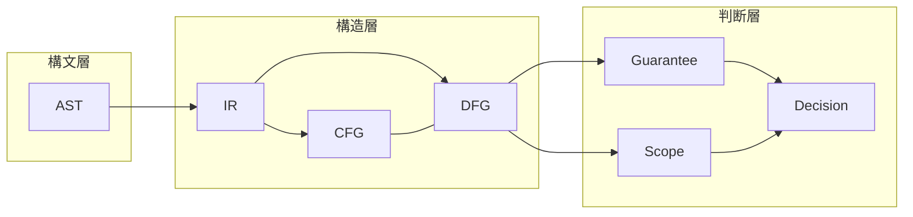

# DFG Core Definition

## 1. Background

本研究では、`10_ast` で構文構造を観測し、`20_ir` で構造作用を再編成し、`30_cfg` で制御到達と経路閉包を固定してきた。しかし移行可否判断・変更影響分析・保証範囲の評価では、**値がどこで生成され、どこへ伝播し、どこで参照・上書きされるか** を構造的に把握できなければ、CFG 単体では説明しきれない依存関係が残る。

本稿で扱う DFG（Data Flow Graph）は、コンパイラ最適化向けの低レベルなデータフロー解析の写しではない。**移行判断・影響分析・保証可能性評価に耐える、データ依存の構造モデル** として定義する。

## 2. Objective

- COBOL 資産における **値の生成・伝播・参照・上書き・集約** を、グラフとして外在化する。
- 「変数名が同じ」ことと「意味的に同一の値が流れている」ことを区別しうる抽象レベルを固定する。
- AST / IR / CFG / Guarantee / Scope と **責務が重ならない接続点** を明示する。

## 3. Formal Definition

### 3.1 DFG の定義（本研究）

**DFG** は、プログラム断片において観測される **データ要素（値の担い手）** をノードとし、  
**定義（define）・利用（use）・派生・集約・分解・境界横断** といった関係をエッジとして表した **有向グラフ** である。

- **ノード**：データ項目、リテラル、式・文の結果、ファイルレコード、外部入出力の端点、条件に関与するデータなど、**依存関係の端点となりうる観測単位**。
- **エッジ**：値の流れ・依存の向きを表す。**define edge**（あるノードの値が別ノードを定義する）、**use edge**（あるノードの値が別ノードの計算・判定に使われる）、**propagation / derived-from**、**aggregation / decomposition**、**条件依存**、**スコープ横断** など、分類は別稿で体系化する。

### 3.2 定義・使用・再定義・伝播

- **define**：ある時点以降、そのデータ要素が **新たな値を持つ** とみなされる操作（代入、算術結果の格納、READ によるレコード取得、INITIALIZE など）。
- **use**：式・条件・出力・引数などで **参照される** こと。
- **再定義 / overwrite**：同一の論理ストレージ上に **後続の define が重なる** こと。COBOL ではグループと従属項目、REDEFINES により **同名・同領域でも意味が衝突** しうるため、**変数名の同一性だけでは同一性を断定しない**。
- **伝播**：define から use へ、または中間結果を経由した **依存の連鎖**。
- **集約・分岐合流**：複数 use から一つの define、または一つの値が複数の経路で合流する **merge** は、CFG 上の合流点と対応する。

### 3.3 値の同一性と名前の同一性

本研究の DFG では、**データ記述名の一致** と **データ依存として追跡すべき同一性** を分離する。  
階層項目、REDEFINES、OCCURS、COPY 由来の同一物理配置の別名など、**意味境界（`06` で詳述）** に基づきノードを割り当てる。

### 3.4 文・段落・手続きのどこまでを「一つの流れ」にするか

- **既定の抽象**：文レベルで define/use を発生点として記録し、**段落・セクション・プログラム境界** は「境界ノード・横断エッジ」として扱う。
- **集約**：移行判断の単位が段落や CALL 単位である場合、**同一 DFG 上で層を持たせる**（文内の細粒度と、手続き間の粗粒度の両方を扱う）ことを許容し、過剰な SSA 分解は必須としない。

## 4. Structural Role

DFG は **構造層** として、次を担う。

- CFG が **制御到達** を与えるのに対し、DFG は **データ到達・依存閉包の素材** を与える。
- IR が **構造作用の単位化** を与えるのに対し、DFG は **値の依存関係** を明示する。
- 単なる「変数参照一覧」ではなく、**依存の種類と境界** を区別できる表現であること。

## 5. Relation to Other Models

| モデル | 役割 | DFG との関係 |
|--------|------|----------------|
| AST | 構文木・出現位置 | DFG ノード・エッジの **起源**（どの文・式から来たか） |
| IR | 構造作用の単位 | **統一された中間表現** から DFG を生成しやすくする |
| CFG | 制御フロー | **経路依存** により define の reach が変わる。DFG は CFG と独立ではない |
| Guarantee | 保証単位 | データの前提・結果を **依存として** 補助 |
| Scope | 影響境界 | **依存閉包** の根拠として接続 |

## 6. Value for Migration Decision

- **変更影響分析**：変更起点からの **依存伝播**（正方向）と **必要なテスト・検証範囲**（閉包）の根拠。
- **未保証領域の検出**：外部境界・ファイル・CALL 越しに **依存が張り出している** 箇所の特定。
- **移行単位の補助**：依存が密な部分は **一括移行** が現実的、などの **材料**（唯一の決定因子ではない）。
- **CFG では見えない依存**：条件分岐の両側で共有されるデータ、ループ内更新とループ外参照の関係。
- **Scope 閉包**：「どこまでを含めれば影響が閉じるか」の **データ側の根拠**。
- **Guarantee Unit**：入力前提・出力結果を **データ依存** で記述する際の補助。

## 7. Abstraction Levels

| 層 | 内容 |
|----|------|
| **構文層** | MOVE / COMPUTE / READ / WRITE 等の **構文上の出現**。構文の列挙は DFG の定義入力であり、終着点ではない。 |
| **構造層** | define-use、kill、reach、依存の種類、CFG との **制御敏感** 関係。 |
| **判断層** | 「この項目変更はどこまで波及するか」「保証対象に含めるべき範囲はどこか」「移行困難度の高い依存の塊はどこか」。 |

## 8. Open Issues

- REDEFINES や可変長とポインタの **意味境界** の粒度は、プロジェクト方針で揺れうる。
- path-sensitive な完全な reach と、判断に十分な **path-insensitive 近似** のバランス。
- 実行時フォーマットや外部システム仕様の **未記述部分** は DFG だけでは閉じない残余不確実性を残す。

## 9. Summary

本研究における DFG は、**値の依存構造を移行判断に接続するための中核モデル** である。  
AST / IR / CFG と混同せず、**名前と値の同一性を分離**し、**Guarantee / Scope** への接続を前提とする。以降の文書（`02`〜`10`）では、分類、define/use/reach、文単位規則、CFG 統合、境界、閉包、検証、リスク、全体接続を順に固定する。
