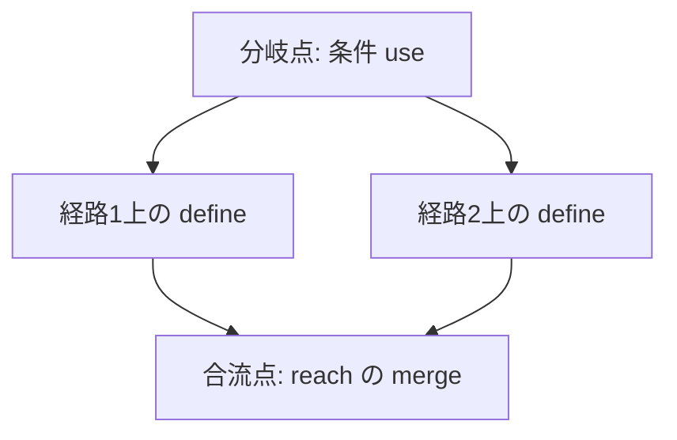

# DFG and CFG Integration

## 1. Background

CFG は制御の流れを、DFG は値の依存を表す。移行判断では **「どの制御経路において、どの値依存が成立するか」** を扱う必要があり、両者を独立したままでは不十分である。

## 2. Distinct Roles of CFG and DFG

| | CFG | DFG |
|---|-----|-----|
| 主対象 | 分岐・合流・反復・到達 | define / use / 伝播 |
| 辺の意味 | 制御が次へ進む | 値が依存する |
| 典型用途 | 経路・網羅・非構造制御 | 変更影響・データテスト |

**片方だけでは足りない理由**：CFG だけでは **同じ経路でもデータの出所** が分からない。DFG だけでは **条件が偽のときに無効な依存** を区別しにくい。

## 3. Integration Points

- **CFG 上の各制御点** に、そこで **有効な reaching definitions** を対応づける（概念上の **プロダクト**）。
- **分岐条件** は DFG 上では **条件 use** とし、CFG の **出辺** と対応させる。
- **合流点** では、各前驱からの **データ依存集合を merge** する。

## 4. Branching, Loop, and Merge

### 4.1 分岐（IF / EVALUATE）

- **定義が分岐する**場合：各 arm に **局所的な define** が付き、合流後の use は **両方の定義に依存しうる**（path-insensitive では保守的に結線）。
- **条件 use と値 use**：条件は **制御敏感**、代入の右辺は **データ依存**。保証は **経路別** に分けて記述しうる。

### 4.2 ループ（PERFORM VARYING / UNTIL）

- **反復的再定義**：ループ変数・集計項目は **複数回の define** が同一 CFG サイクル上にある。
- **ループ不変項目**：更新がなければ reach は **エントリの定義** を維持しうる（不変解析は任意）。
- **PERFORM UNTIL**：条件の use が **各反復** で評価される。

### 4.3 合流

- **複数定義の merge**：不確実性（どの定義が有効か）が **移行テストの分岐** に直結。
- **条件付き定義**：合流点で **φ 的な未決** を明示するか、保守的に **両方から辺** を張るかは方針。

### 4.4 GO TO / EXIT / NEXT SENTENCE

- CFG 上の **非構造遷移** は、データ依存の **到達可能性** を変える。`30_cfg` の非構造モデルと **同一の CFG** を前提に DFG を重ねる。

## 5. Control-Dependent Data Relations

- **Control-dependent use**：条件が真のときだけ意味を持つ use（例：THEN 内のみの代入の前提）。
- **CFG edge と DFG edge**：制御の辺は **実行順**、データの辺は **値依存**。同一プログラム点に **両方が接続** される。
- **control predicate を DFG に載せるか**：本研究では **条件を読むデータ** をノード化し **condition-dependency** として表す（PDG 実装までは踏み込まない）。

## 6. Implications for Scope and Guarantee

- **分岐ごとに保証範囲が変わる**場合、Guarantee Unit を **経路別** に分割する根拠が CFG+DFG で与えられる。
- **Scope**：合流点以降の **大きな reach 集合** は、Scope を広げる必要の **シグナル**。
- **可能依存と必須依存**：全経路で成立する依存（必須）と、一部経路のみ（可能）を区別すると **移行リスク説明** が鋭くなる。

## 7. Migration Decision Value

- **条件依存の多層化** は、テストケース数と **仕様の分岐** を増やす。
- **ループ内更新** は回帰テストの **反復観測** が必要。
- **単純 DFG**（CFG を無視）との差は、**「実際には実行されない経路の依存」** の混入・欠落の差として説明できる。

## 8. Summary

DFG は CFG から **完全には独立しない**。分岐・合流・ループ・非構造遷移は **reach と merge** を通じてデータ依存の意味を変える。  
`07` の影響伝播は、本稿の **統合視点** を前提とする。
