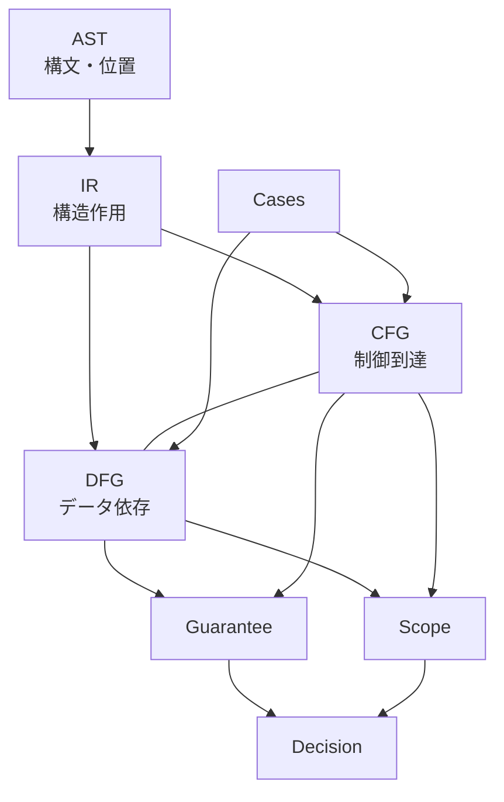

# DFG Connection to AST IR CFG Guarantee Scope Cases

## 1. Purpose

`40_dfg` を研究全体に位置づけ、**AST / IR / CFG / Guarantee / Scope / Cases** への接続マップを完成させる。単独の要約ではなく、**DFG が追加する見え方** を中心に述べる。

## 2. DFG in the Overall Research Architecture

- **構文層（AST）** → **構造作用（IR）** → **制御（CFG）** と **データ（DFG）** → **判断（Guarantee / Scope / Decision）** と **検証（Cases）**。
- DFG は **値の依存** を担う **構造層** であり、CFG と **双方向に参照** される（reach・条件伝播）。

## 3. Connection to AST

- **DFG が AST から受け取るもの**：文種、オペランド、データ記述への参照、式の構造。
- **AST だけでは足りないもの**：**同一物理領域の別名**、**実行経路**、**ファイル境界**の意味。  
→ IR・CFG・境界モデルで補う。

## 4. Connection to IR

- IR を介して **構文差異を吸収** し、**データ効果** を統一表現に近づけられる。
- **利点**：複数方言・前処理・マクロに依存するソースでも、**IR 上の作用** から DFG 生成規則を適用しやすい。

## 5. Connection to CFG

- **reaching definition**、**条件付き伝播**、**ループ内の再定義** は CFG の経路に依存。
- **統合モデル**：制御とデータの **二層** を同一プログラム点で対応づける（`05`）。

## 6. Connection to Guarantee

- **Guarantee Unit** の **入力前提**（どのデータが何を満たすか）と **結果**（何が保証されるか）を **データ依存** で記述する。
- **未保証領域**：境界外への依存が **保証の外に出る** 場合を検出。

## 7. Connection to Scope

- **影響閉包** の **データ側根拠**。
- **Scope 境界** が DFG 上で **辺を切断** できるか、または **意図的な未追跡** として説明できるか。

## 8. Connection to Cases

- `70_cases` で **代表パターン**（高リスク構文、境界、複合）を照合し、DFG 規則の **妥当性** を補強。
- **ケース**が「この依存が説明できるか」を **反証** する役割も持つ。

## 9. Integrated Research View

## 10. Summary

DFG は **AST/IR の効果** と **CFG の経路** を結び、**Guarantee / Scope** に **データ面の根拠** を与え、**Cases** で **検証** される。  
これにより **構文層 → 構造層 → 判断層** がデータ面で貫通し、変更影響・移行判断・保証設計へ **橋渡し** できる状態になる。
