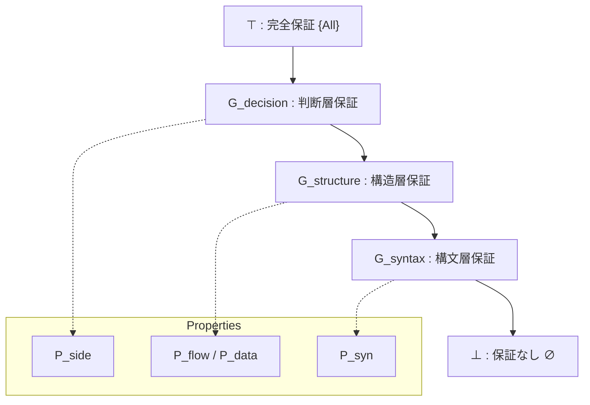

# 03_Guarantee-Space-Definition

# 1. 動機と問題設定

従来の移行プロジェクトでは、保証（Guarantee）は「保証されている（True）」か「保証されていない（False）」かの二値論理として扱われてきた。しかし、実際の大規模システム移行においては、この二値的区分は機能しない。

- 一部の構文は保証できるが、副作用のタイミングは保証できない
- 制御フローは同一だが、浮動小数点の精度が異なるためデータ値は近似保証に留まる

このように、保証は「部分的（Partial）」であり、かつ「階層的（Hierarchical）」な性質を持つ。二値保証の限界を超え、どの観点がどの程度保存されているかを厳密に扱うために、保証を「真偽」ではなく「空間（Space）」として再定義する必要がある。

本定義書では、保証対象の性質を集合として捉え、その順序構造（包含関係）に基づいた数理的な空間モデル「Guarantee Space」を構築する。

# 2. Guarantee Space の基本定義

ある変換対象 $GU$（Guarantee Unit）に対して、変換関数 $\Phi$ を適用した際に、保存される性質の集合を「保証」と定義する。

まず、保存観点全体の集合（全宇宙）を $\mathbb{P}$ とする。

$$
\mathbb{P} = \{ P_{syn}, P_{flow}, P_{data}, P_{side}, P_{bound} \}
$$

変換 $\Phi$ における $GU$ の保証集合 $G_{\Phi}(GU)$ は以下のように定義される。

$$
G_{\Phi}(GU) = \{ P \in \mathbb{P} \mid P(GU) \equiv P(\Phi(GU)) \}
$$

そして、**Guarantee Space（保証空間）$\mathcal{G}$** を、$\mathbb{P}$ の冪集合（Power Set）として定義する。

$$
\mathcal{G} = \mathcal{P}(\mathbb{P}) = \{ S \mid S \subseteq \mathbb{P} \}
$$

つまり、保証空間とは、考えうる全ての「保存された性質の組み合わせ」の集合である。

# 3. 順序関係の定義

保証空間 $\mathcal{G}$ 上の任意の2つの保証状態 $G_a, G_b \in \mathcal{G}$ に対して、順序関係「強度」を以下のように定義する。

$$
G_a \leq G_b \iff G_a \subseteq G_b
$$

この関係「$\leq$」は、集合の包含関係に基づく半順序（Partial Order）であり、以下の性質を満たす。

1.  **反射律**: $G_a \subseteq G_a$ （自分自身と同じ強度を持つ）
2.  **反対称律**: $G_a \subseteq G_b \land G_b \subseteq G_a \implies G_a = G_b$
3.  **推移律**: $G_a \subseteq G_b \land G_b \subseteq G_c \implies G_a \subseteq G_c$

これにより、「$G_b$ は $G_a$ よりも強い（あるいは等しい）保証である」と数学的に表現できる。

# 4. 最小元と最大元

この順序構造における最小元（Bottom）と最大元（Top）を定義する。

### 最小元：虚無の保証 ($\bot$)

$$
\bot = \emptyset
$$
- 何も保証されていない状態。
- 構文エラーでコンパイルすら通らない状態、あるいは全く別のプログラムに書き換えられた状態。

### 最大元：完全保証 ($\top$)

$$
\top = \mathbb{P} = \{ P_{syn}, P_{flow}, P_{data}, P_{side}, P_{bound} \}
$$
- 全ての観点が完全に保存されている状態。
- 理想的な移行成功状態。

# 5. 束構造（Lattice Structure）

保証空間 $(\mathcal{G}, \subseteq)$ は、任意の2つの元に対して上限（Supremum）と下限（Infimum）が存在する「束（Lattice）」をなす。

### Join（結び）：合併保証

$$
G_a \lor G_b = G_a \cup G_b
$$
- $G_a$ または $G_b$ のいずれかで保証されている性質の集合。
- 複数の検証手法を組み合わせた際の「総合的な保証範囲」を表す。

### Meet（交わり）：共通保証

$$
G_a \land G_b = G_a \cap G_b
$$
- $G_a$ と $G_b$ の両方で保証されている性質の集合。
- 複数の変換ツール間で共通して維持される「確実な核（Core）」を表す。

### 変換合成との関係

2つの変換 $\Phi_1, \Phi_2$ を連続して適用（合成）した場合の保証は、個々の保証の共通部分（Intersection）となる。

$$
G_{\Phi_2 \circ \Phi_1} = G_{\Phi_1} \cap G_{\Phi_2}
$$
- 変換を重ねるごとに、保証される性質は減少するか、維持される（単調減少性）。
- $G_{syntax}$ が維持されなければ、次の変換の前提が崩れる。

# 6. 保証空間の視覚化

※ 上記は簡略化したハッセ図（Hasse Diagram）である。実際には $\mathbb{P}$ の要素数に応じた多次元の超立方体構造となる。

# 7. 意味論的解釈

保証空間の導入により、移行プロジェクトの品質管理は以下のように再解釈される。

### 1. 部分保証の位置づけ
「まだ動かない（$G_{decision}$ 未達）」状態であっても、「構造は正しい（$G_{structure}$ 成立）」状態であれば、それは $\bot$ ではなく、ゴールへ向かう中間点として正当に評価できる。これにより、進捗率を「本数」ではなく「到達した空間レベル」で計測可能になる。

### 2. 保証強度の比較
ツールAとツールBの比較において、「ツールAは $P_{flow}$ を保存するが $P_{data}$ を崩す」「ツールBは $P_{syn}$ しか保証しない」といった定性的な議論を、集合の包含関係として定量的に比較できる。

### 3. 保証不能の扱い
$G_{\Phi}(GU) = \bot$ となる箇所は、「移行不能」ではなく「再設計（Re-engineering）が必要な特異点」として扱う。保証空間の外にある事象として識別する。

### 4. 移行難易度との接続
$\top$ と現状の保証状態 $G_{current}$ との距離（集合差 $| \top \setminus G_{current} |$）が、残されたテスト工数および修正コストに比例する。これを指標化することで、移行コストの精緻な見積もりが可能となる。
