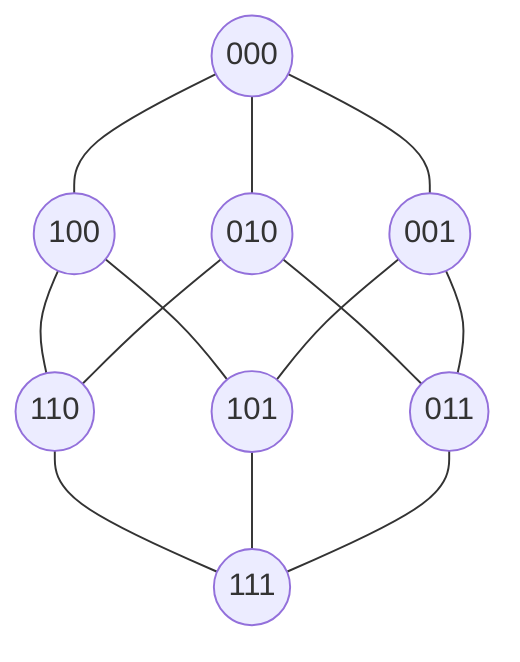

# 05_Weighted-Guarantee-Space

# 1. 背景と目的

これまでの理論により、保証空間（Guarantee Space）は依存構造を持つイデアル束 $\mathcal{G}_{dep}$ として定義された。これにより、保証の「有無」や「包含関係」は厳密に扱えるようになった。

しかし、実際の移行プロジェクトでは、すべての保証が等価ではない。例えば、構文解析（Syntax）のコストと、副作用検証（Side-effect）のコストは桁違いである。また、それらが崩れた際のリスク（影響度）も異なる。

本定義書では、保証空間に**「測度（Measure）」**としての重み構造を導入し、保証空間を**Hypercube幾何**および**Hypercube Graph**として解釈することで、移行パス最適化（Shortest Path Problem）への接続を理論的に確立する。

# 2. 保証強度の測度化（Measure Theoretic Definition）

これまで単なる総和として定義していた「強度（Strength）」を、集合上の測度として再定義する。

## 2.1 有限加法測度としての定義

保存性質集合 $\mathbb{P}$ の冪集合 $\mathcal{P}(\mathbb{P})$ 上の関数 $\mu: \mathcal{P}(\mathbb{P}) \to \mathbb{R}_{\geq 0}$ を以下のように定義する。

$$
\mu(S) = \sum_{p \in S} w(p)
$$

ここで $w(p) > 0$ は各性質の重みである。この $\mu$ は以下の性質を満たすため、**有限加法測度（Finitely Additive Measure）** である。

1.  $\mu(\emptyset) = 0$
2.  $S \cap T = \emptyset \implies \mu(S \cup T) = \mu(S) + \mu(T)$

## 2.2 強度（Strength）との等価性

保証強度 $Strength(S)$ は、この測度 $\mu$ そのものである。

$$
Strength(S) \equiv \mu(S)
$$

これにより、保証強度は集合論的な操作（和、差、共通部分）に対して整合的な挙動を示すことが数学的に保証される。

# 3. Hypercube 幾何としての解釈

保証空間 $\mathcal{G} = \mathcal{P}(\mathbb{P})$ は、幾何学的には $N=|\mathbb{P}|$ 次元の超立方体（Hypercube）と同型である。

## 3.1 Hypercube Graph の定義

保証空間をグラフ理論的に定義する。

$$
Graph G = (V, E)
$$

- $V = \{0, 1\}^N \cong \mathcal{P}(\mathbb{P})$ （各保証状態は $N$次元ビットベクトル）
- $E = \{(u, v) \mid d_H(u, v) = 1\}$ （ハミング距離が1の状態間にエッジが存在）

これは、ある保証状態から、単一の性質 $p$ を追加または削除する操作がエッジに対応することを意味する。

## 3.2 幾何学的意味

- **頂点**: 各保証状態（$2^N$ 個）
- **辺**: 単一の性質 $p_i$ の追加/削除
- **原点**: $\bot = \emptyset$ （全成分0）
- **対角点**: $\top = \mathbb{P}$ （全成分1）

# 4. Dependent Guarantee Space の幾何

依存付き保証空間 $\mathcal{G}_{dep}$ は、この Hypercube の部分集合（部分グラフ）である。

## 4.1 依存関係の形式定義

依存関係を二項関係 $D \subseteq \mathbb{P} \times \mathbb{P}$ として定義する。
$p_i$ が $p_j$ に依存することを $p_j \leq_D p_i$ と表記する。

## 4.2 依存閉包（Dependency Closure）

依存関係に基づく閉包演算 $Cl_D: \mathcal{P}(\mathbb{P}) \to \mathcal{P}(\mathbb{P})$ を定義する。

$$
Cl_D(S) = S \cup \{ p_j \in \mathbb{P} \mid \exists p_i \in S : p_j \leq_D p_i \}
$$

## 4.3 有効領域（Valid Region）

$\mathcal{G}_{dep}$ は、依存閉包について閉じている集合のみからなる部分空間である。

$$
\mathcal{G}_{dep} = \{ S \in \mathcal{P}(\mathbb{P}) \mid S = Cl_D(S) \}
$$

これは Hypercube 上の **Ideal Lattice（イデアル束）** を形成する。

## 4.4 Unreachable State

制約を満たさない頂点は「到達不能（Unreachable）」として空間から除外される。幾何学的には、Hypercube の特定の部分領域が「欠損（Hollow）」した形となる。

# 5. 移行パスの定式化（Migration Path）

保証空間を状態空間と見なすことで、移行プロセスを数学的に定式化できる。

## 5.1 定義

移行パス（Migration Path）とは、保証空間上の状態の列である。

$$
Path = (S_0, S_1, \dots, S_n)
$$

ここで $S_0 = \emptyset$（開始）、$S_n = \top$（完了）である。

## 5.2 依存制約付き遷移（Migration Step）

各ステップ $S_i \to S_{i+1}$ は、単一の性質 $p$ の追加に対応するが、依存制約により閉包を取る必要がある。

$$
S_{i+1} = Cl_D(S_i \cup \{p\})
$$

かつ、遷移先は有効な状態空間内でなければならない。

$$
S_{i+1} \in \mathcal{G}_{dep}
$$

これにより、ある性質を追加する際に、その前提条件も同時に（強制的に）追加される挙動が定式化される。

## 5.3 コスト関数

パスのコストは、各ステップ間の距離の総和で定義される（次章詳述）。

$$
Cost(Path) = \sum_{i=0}^{n-1} d_w(S_i, S_{i+1})
$$

# 6. 最短経路問題（Shortest Path Problem）

移行戦略の立案は、以下の最適化問題に帰着される。

**問題**: 依存制約を満たす部分グラフ $\mathcal{G}_{dep}$ 上において、始点 $\bot$ から終点 $\top$ への最短経路（最小コストパス）を求めよ。

- **ノード**: 保証状態 $S \in \mathcal{G}_{dep}$
- **エッジ**: 状態遷移 $S \to S'$ （ここで $S' = Cl_D(S \cup \{p\})$）
- **エッジ重み**: $d_w(S, S') = \mu(S' \setminus S)$

# 7. 結論

本改訂により、Weighted Guarantee Space は単なる「重み付き集合」から「測度を持つ幾何空間」へと昇華された。
これにより、移行プロジェクトは「Hypercube 上の Unreachable 領域を避けながら、原点から対角点へ向かう最短経路探索問題」として数学的に完全に記述されることとなった。
これは、動的計画法（DP）やA*探索などのアルゴリズムを移行計画に応用する道を開くものである。
