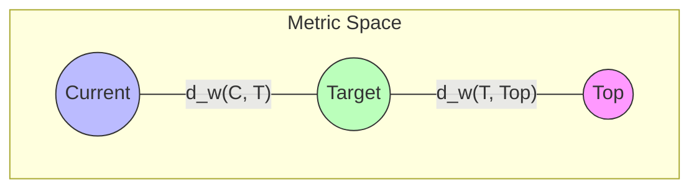

# 06_Metric-on-Guarantee-Space

# 1. 背景と目的

これまでの研究で、保証空間（Guarantee Space）はイデアル束構造と重み付き構造（Weighted Guarantee Space）を持つことが示された。これにより、保証の「順序」と「強度」は定量化された。

しかし、移行プロジェクトの進捗管理において重要なのは「現状と目標の差分」や「ツール間の乖離」といった**距離（Metric）**の概念である。
本定義書では、Guarantee Space 上に距離関数を定義し、それを距離空間（Metric Space）として定式化することで、移行進捗の数理モデルを確立する。

# 2. 距離関数の定義

保証空間 $\mathcal{G} = \mathcal{P}(\mathbb{P})$ 上の任意の2つの保証集合 $G_1, G_2 \in \mathcal{G}$ に対して、距離 $d(G_1, G_2)$ を定義する。

## 2.1 対称差による距離

もっとも基本的な距離は、対称差（Symmetric Difference）の濃度（Cardinality）として定義される。

$$
d(G_1, G_2) = |G_1 \triangle G_2|
$$

ここで、対称差 $G_1 \triangle G_2$ は以下のように定義される。

$$
G_1 \triangle G_2 = (G_1 \setminus G_2) \cup (G_2 \setminus G_1)
$$

これは「片方には含まれるが、両方には含まれない要素の数」を表す。

## 2.2 意味論的解釈
この距離 $d(G_1, G_2)$ は、**「$G_1$ を $G_2$ に変換するために追加・削除が必要な性質の数」** を意味する（ハミング距離に相当）。

# 3. メトリック公理の検証

定義した距離関数 $d: \mathcal{G} \times \mathcal{G} \to \mathbb{R}_{\geq 0}$ が、距離空間の公理を満たすことを検証する。

1.  **非負性**: $|G_1 \triangle G_2| \geq 0$ は自明。
2.  **同一性**: $d(G_1, G_2) = 0 \iff G_1 \triangle G_2 = \emptyset \iff G_1 = G_2$。
3.  **対称性**: $G_1 \triangle G_2 = G_2 \triangle G_1$ より $d(G_1, G_2) = d(G_2, G_1)$。
4.  **三角不等式**:
    $$
    |G_1 \triangle G_3| \leq |G_1 \triangle G_2| + |G_2 \triangle G_3|
    $$
    証明: 集合の対称差は三角不等式を満たす性質を持つ（$x \in G_1 \triangle G_3$ ならば、$x$ は $G_1, G_2, G_3$ のうち奇数個に含まれるため、$G_1 \triangle G_2$ か $G_2 \triangle G_3$ の少なくとも一方に含まれる）。

よって、$(\mathcal{G}, d)$ は**距離空間（Metric Space）**である。

# 4. Dependent Guarantee Space への制限

距離関数を Dependent Guarantee Space $\mathcal{G}_{dep} \subset \mathcal{G}$ 上に制限した場合を考察する。

$$
d_{dep} = d|_{\mathcal{G}_{dep} \times \mathcal{G}_{dep}}
$$

部分空間上の距離は依然として距離公理を満たす。
しかし、$\mathcal{G}_{dep}$ 内での移動（状態遷移）においては、依存閉包 $Cl_D$ の制約を受けるため、最短経路での移動が常に可能とは限らない。

- **幾何学的解釈**: $\mathcal{G}_{dep}$ は、全空間 $\mathcal{G}$ の中の「離散的な点群」であり、点と点の間には距離が定義されるが、その中間地点（Unreachable State）は存在しない。

# 5. Weighted Metric（重み付き距離）

前章で定義した重み関数 $w: \mathbb{P} \to \mathbb{R}_{\geq 0}$ を用いて、距離を一般化する。

## 5.1 定義

$$
d_w(G_1, G_2) = \sum_{p \in G_1 \triangle G_2} w(p)
$$

## 5.2 性質
この重み付き距離 $d_w$ もまた、距離空間の公理を満たす。
証明は単純な濃度の場合と同様であり、重み $w(p) > 0$ である限り、同一性も保たれる。

## 5.3 意味
$d_w(G_1, G_2)$ は、**「$G_1$ と $G_2$ の間の機能的乖離コスト」** を表す。
例えば、現状 $G_{current}$ と目標 $G_{target}$ の距離は、残された作業のコストと等価である（$G_{current} \subseteq G_{target}$ の場合）。

# 6. 移行進捗の数理モデル

この距離構造を用いて、移行プロジェクトの進捗を定量的にモデル化する。

## 6.1 Progress Distance

現状 $G_c$ から目標 $G_t$ までの「残り距離」を定義する。

$$
Remains(G_c, G_t) = d_w(G_c \cap G_t, G_t)
$$

※ $G_c \setminus G_t$ （目標に含まれない過剰な保証）は進捗に寄与しないため、共通部分からの距離を測る。

## 6.2 Normalized Progress（進捗率）

$$
Progress(G_c, G_t) = 1 - \frac{d_w(G_c \cap G_t, G_t)}{Strength(G_t)}
$$

- 開始時 ($G_c = \emptyset$): $1 - \frac{Strength(G_t)}{Strength(G_t)} = 0$
- 完了時 ($G_c \supseteq G_t$): $1 - \frac{0}{Strength(G_t)} = 1$

# 7. 幾何学的解釈と図式化

Guarantee Space を離散幾何空間として解釈し、状態間の距離を可視化する。

## 空間構造の視点
- **近傍**: 距離が小さい状態群は、互いに移行しやすい（小さな改修で到達可能）。
- **最短経路**: 依存制約を満たしながら、重み付き距離の総和を最小にする遷移パスが、最適な移行戦略（Migration Path）となる。

# 8. 結論

Guarantee Space に距離構造（Metric）を導入したことで、以下のことが可能になった。

1.  **状態差分の定量化**: 「現状」と「あるべき姿」の乖離を、単なる項目の羅列ではなく、数値（距離）として表現できる。
2.  **進捗の客観的測定**: 重みを考慮した進捗率を定義し、タスク数ベースよりも実態に即した管理が可能になる。
3.  **最適化問題への接続**: 最短経路問題として移行計画を定式化するための基礎が得られた。

本モデルにより、COBOL移行プロジェクトは「地図のない航海」から「距離と座標を持つ空間内の移動」へとパラダイムシフトする。
