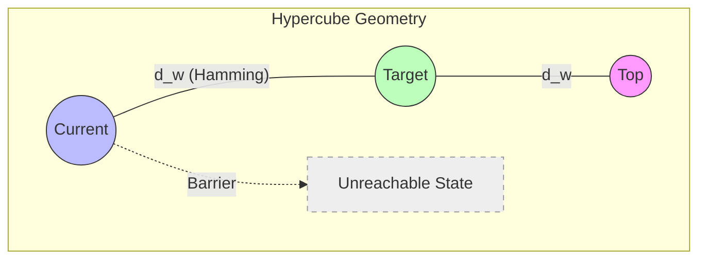
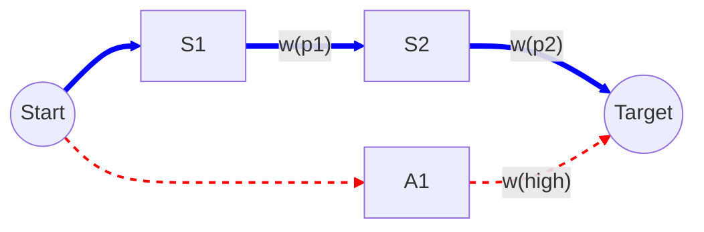

# 06_Metric-on-Guarantee-Space

# 1. 背景と目的

前章にて Guarantee Space は Hypercube 幾何構造と測度 $\mu$ を持つことが示された。
本章では、この空間上に距離構造（Metric）を導入し、移行の「乖離」や「進捗」を幾何学的に定義する。
特に、Weighted Guarantee Space 上の距離が **Weighted Hamming Metric** であることを示し、依存空間における商距離（Quotient Metric）の概念を導入する。

# 2. Metric Structure

保証空間 $\mathcal{G} = \mathcal{P}(\mathbb{P})$ 上の距離を定義する。

## 2.1 Hypercube 上の Hamming Metric

単純な集合間の距離 $d(G_1, G_2) = |G_1 \triangle G_2|$ は、Hypercube $\{0,1\}^N$ 上の **Hamming Metric** と等価である。

$$
d(G_1, G_2) = \sum_{i=1}^{N} |v_1[i] - v_2[i]|
$$

これは、一方の状態から他方の状態へ遷移するために反転（Flip）させる必要のあるビット数に相当する。

# 3. Weighted Metric

## 3.1 Weighted Hamming Metric

重み関数 $w$ を考慮した距離 $d_w$ は、**Weighted Hamming Metric** である。

$$
d_w(G_1, G_2) = \sum_{p \in G_1 \triangle G_2} w(p)
$$

## 3.2 コスト解釈（Cost Interpretation）

この距離は、「ある状態から別の状態へ移行するための最小コスト」と解釈できる（ただし、依存制約を無視した場合）。
移行ギャップ（Migration Gap）は、この距離によって定量化される。

$$
Gap(Current, Target) = d_w(Current, Target)
$$

# 4. Closure Metric（商距離）

Dependent Guarantee Space では、依存閉包 $Cl_D$ が作用する。
理論的には、依存関係によって「同一視」される状態間の距離を考える必要がある。

## 4.1 定義

依存閉包を通した距離 $d_{closure}$ を以下のように定義する。

$$
d_{closure}(S_1, S_2) = d_w(Cl_D(S_1), Cl_D(S_2))
$$

これは、空間 $\mathcal{G}$ を閉包演算で割った商空間（Quotient Space）上の距離（Quotient Metric）と見なすことができる。
実務上は、「見かけ上の差分」ではなく「依存関係を含めた本質的な差分」を測るためにこの距離が重要となる。

# 5. Migration Geometry（移行の幾何学）

最終的に、Guarantee Space は以下の数学的構造を併せ持つ**Migration Geometry**として整理される。

| 数学構造 | 移行プロジェクトにおける意味 |
| :--- | :--- |
| **Hypercube** | 全体像。可能なすべての機能の組み合わせ（$2^N$通り）。 |
| **Partial Order** | 依存関係。手順の前後関係制約。 |
| **Ideal Lattice** | 有効領域。工学的に妥当なマイルストーン群。 |
| **Measure ($\mu$)** | 強度。プロジェクトの達成価値（Earned Value）。 |
| **Metric ($d_w$)** | 距離。残作業コストや乖離度。 |

# 6. 幾何学的解釈と図式化

## 6.1 Guarantee Landscape

重み付き距離空間上の地形図。

## 6.2 Migration Path Optimization

最短経路問題としての移行パス。

（青：依存制約を満たすValid Path、赤：Unreachableを通る無効なパス）

# 7. 結論

本改訂により、Guarantee Space 上の距離構造は、単なる「差分」から**「Hypercube 上の Weighted Hamming Metric」**へと厳密化された。
また、依存閉包を考慮した商距離の概念導入により、工学的な「手戻り」や「強制修正」を含んだリアルな距離測定が可能となった。
これにより、移行プロジェクトは幾何学的な空間内での「最適軌道制御問題」として完全にモデル化された。
