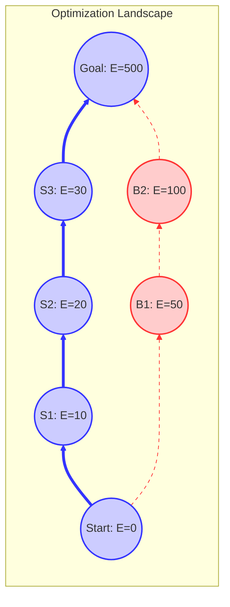

# 13_Optimization-Landscape

# 1. 目的

本稿では、Guarantee Space をコスト関数上の **Optimization Landscape（最適化地形）** として解釈し、移行プロジェクトにおける「最適な軌道」を見つけ出すための幾何学的・解析的な枠組みを提供する。
これにより、移行の難所（障壁）や効率的なルート（谷）を視覚的かつ直感的に理解可能にする。

# 2. State Cost（状態コスト）

Guarantee Space 上の各状態 $S \in G_{dep}$ に対して、その状態を「維持」または「到達」するために必要なコスト、あるいはその状態が持つ「エネルギー（リスクポテンシャル）」を定義する。

## 2.1 Energy Function（エネルギー関数）

状態 $S$ のエネルギー $E(S)$ を以下のように定義する。

$$
E(S) = \sum_{p \in S} w(p)
$$

ここで $w(p)$ は保証性質 $p$ の重みである。
一般に、保証が増えるほどエネルギー（維持コストや複雑さ）は増大するが、一方で「未解決リスク」という観点ではエネルギーは減少すると考えることもできる。
本稿では、**Migration Effort（移行労力）** の観点から、累積コストとしてのエネルギーを扱う。

# 3. Landscape Geometry（地形幾何学）

Guarantee Space $G_{dep}$ とエネルギー関数 $E(S)$ の組み合わせは、高次元空間上の **Landscape（地形）** を形成する。

- **高度（Altitude）**: $E(S)$。状態のコストを表す。
- **隣接関係（Adjacency）**: Cover Relation $S \lessdot T$。地形上の移動可能な経路を表す。

この Landscape 上において、移行プロセスは「低い場所（$\bot$）から高い場所（$\top$）への登山」として表現される。
（※リスクを高さとする場合は「下山」となるが、ここでは積み上げモデルを採用する）

# 4. Migration Valley（移行の谷）

実際のプロジェクトでは、コスト関数は単純な総和ではなく、相互作用項を含む場合が多い（例：$p$ と $q$ を同時に持つとコストが下がる、など）。
このような非線形性を考慮すると、Landscape には「登りやすいルート」と「登りにくいルート」が出現する。

## 4.1 Definition

**Migration Valley** とは、周囲の状態よりも相対的にコスト効率が良い（またはリスクが低い）状態の連なりで構成されるパス領域を指す。

$$
Valley = \{ S \in G_{dep} \mid \exists Path \ni S, \ Cost(Path) \approx MinCost \}
$$

移行戦略の核心は、この「谷」を見つけ出し、険しい「峰（High Cost Barrier）」を避けて進むことにある。

# 5. Local Minima and Barriers

## 5.1 Barriers（障壁）

ある状態 $S$ から次の状態へ進むためのすべての遷移 $S \to T$ が、許容限界を超えるコスト増分（急激な勾配）を要求する場合、その状態は **Barrier** に直面していると言える。

$$
Barrier(S) \iff \forall T \text{ s.t. } S \lessdot T, \ \Delta E(S, T) > Threshold
$$

これは「技術的負債の壁」や「リファクタリングの壁」に相当する。

## 5.2 Local Optima（局所最適）

（※通常、単調増加する累積コストモデルでは局所最小は存在しないが、単位ステップあたりのコスト効率（限界費用）を考えると、局所的な最適点が存在し得る）

「最も効率が良い」と思われる局所的な選択を繰り返した結果、最終的な総コストが悪化する場合、それは **Greedy Trap（貪欲法の罠）** と呼ばれる。

# 6. Global Optimal Path

移行計画のゴールは、Landscape 上の **Global Minimum Path（大域的最小コストパス）** を特定することである。

$$
Path_{opt} = \arg \min_{Path} \int_{\bot}^{\top} Cost(dS)
$$

これは、Guarantee Transition Graph 上の最短経路問題（Shortest Path Problem）と等価である。

# 7. Visualization（概念図）

Optimization Landscape の概念図を以下に示す。

（青線：Migration Valley に沿った最適パス、赤点線：高コストな障壁ルート）

# 8. 結論

Guarantee Space を Optimization Landscape として捉えることで、移行計画は単なるスケジューリングではなく、「地形を読み、最適なルートを選び取る」幾何学的な問題となる。
この視点は、プロジェクトの難所（Barrier）を事前に予測し、回避するための理論的根拠を与える。
