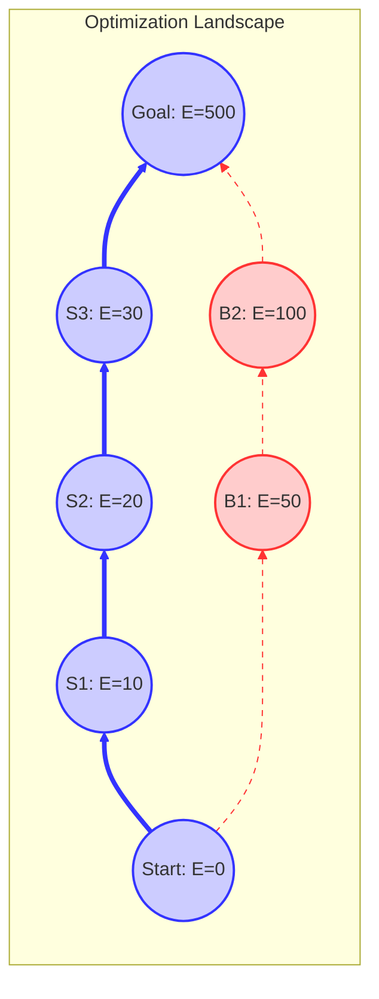

# 13_Optimization-Landscape

# 1. Purpose

本稿では、Guarantee Space をコスト関数上の **Optimization Landscape（最適化地形）** として解釈し、移行プロジェクトにおける「最適な軌道」を見つけ出すための幾何学的・解析的な枠組みを提供する。
従来の物理的なアナロジー（Landscape）と、離散最適化理論（Graph Theory）を厳密に接続し、移行の難所（Barrier）や効率的なルート（Valley）を数学的に定義する。

# 2. State Cost

Guarantee Space 上の各状態 $S \in G_{dep}$ に対して、その状態を「維持」または「到達」するために必要なコストを定義する。

## 2.1 State Dependent Weight

各保証性質 $p \in \mathbb{P}$ のコストは、その導入時点の状態 $S$ に依存する場合がある（例：ある保証が既に存在すると、次の保証導入が容易になる）。
これを状態依存重み $w(p \mid S)$ として定義する。

$$
w : \mathbb{P} \times G_{dep} \to \mathbb{R}_{\geq 0}
$$

最も単純なモデル（状態非依存）では、$w(p \mid S) = w(p)$ である。

# 3. Energy Function

状態 $S$ のエネルギー $E(S)$ を、原点 $\bot$ から $S$ へ至る最短経路のコストとして定義する。

$$
E(S) = \min_{Path_{\bot \to S}} \sum_{i=1}^{k} w(p_i \mid S_{i-1})
$$

## 3.1 Energy and Path Cost

この定義により、状態のエネルギーは「原点からの最短距離（Shortest Path Distance）」と一致する。

$$
E(S) = d_{min}(\bot, S)
$$

定数重みモデル（$w(p \mid S) = w(p)$）の場合、エネルギーは単純な重み付き和となる。

$$
E(S) = \sum_{p \in S} w(p)
$$

この性質により、Optimization Landscape は **Shortest Path Geometry** と数学的に等価であることが保証される。

# 4. Landscape Geometry

Guarantee Space $G_{dep}$ とエネルギー関数 $E(S)$ の組み合わせは、高次元空間上の **Landscape（地形）** を形成する。

- **高度（Altitude）**: $E(S)$。状態の累積最小コストを表す。
- **隣接関係（Adjacency）**: Cover Relation $S \lessdot T$。地形上の移動可能な経路を表す。

この Landscape 上において、移行プロセスは「低い場所（$\bot$）から高い場所（$\top$）への登山」として表現される。

# 5. Energy Gradient

ある状態 $S$ から、次の保証性質 $p$ を追加する際のエネルギーの変化率（勾配）を定義する。

$$
\Delta E(S, p) = E(S \cup \{p\}) - E(S)
$$

基本モデル（定数重み）では $\Delta E(S, p) = w(p)$ となるが、状態依存モデルでは次のように表される。

$$
\Delta E(S, p) \approx w(p \mid S)
$$

勾配が小さい方向へ進むことは、局所的にコスト効率の良い選択をすることを意味する（Greedy Strategy）。

# 6. Migration Valley

実際のプロジェクトでは、コスト関数は非線形であり、効率的な経路と非効率な経路が存在する。
これを「谷（Valley）」の概念として数学的に定義する。

## 6.1 Definition

**Migration Valley** とは、大域的な最適パス（Optimal Path）に近い状態の集合である。

$$
Valley_{\epsilon} = \{ S \in G_{dep} \mid E(S) - d_{min}(\bot, S) \leq \epsilon \}
$$

ここで、$E(S)$ は定義上 $d_{min}(\bot, S)$ と一致するため、上記の定義は常に $0 \leq \epsilon$ で成立する。
より直感的には、ゴール $\top$ への最短経路距離 $d_{min}(S, \top)$ を考慮し、以下のように再定義する。

$$
Valley_{\epsilon} = \{ S \in G_{dep} \mid (d_{min}(\bot, S) + d_{min}(S, \top)) - d_{min}(\bot, \top) \leq \epsilon \}
$$

すなわち、**「その状態を経由しても、全体最適解から $\epsilon$ 以内のコストロスでゴールに到達できる状態の集合」** が Migration Valley である。
$\epsilon=0$ の場合、Valley は厳密な最適経路（の集合）となる。

# 7. Barriers and Local Optima

## 7.1 Barriers（障壁）

ある状態 $S$ から次の状態へ進むためのすべての遷移 $S \to T$ が、許容限界を超えるエネルギー勾配（コスト増分）を要求する場合、その状態は **Barrier** に直面している。

$$
Barrier(S) \iff \forall T \text{ s.t. } S \lessdot T, \ \Delta E(S, T) > Threshold
$$

## 7.2 Local Optima (Greedy Trap)

局所的な勾配 $\Delta E$ が最小となる方向を選び続けた結果、トータルコストが最適解よりも悪化する場合、その経路は **Greedy Trap（貪欲法の罠）** に陥っている。
これは、局所最適（Local Optima）が大域最適（Global Optima）と一致しない場合に発生する。

# 8. Global Optimal Path

移行計画のゴールは、Guarantee Space という離散構造上での **Global Optimal Path（大域的最適パス）** を特定することである。

$$
Path_{opt} = \arg \min_{Path \in \mathcal{P}_{\bot \to \top}} \sum_{(S, S') \in Path} w(S' \setminus S \mid S)
$$

これは、Guarantee Transition Graph 上の **Shortest Path Problem（最短経路問題）** と完全に等価である。
グラフは DAG であるため、動的計画法（DP）やダイクストラ法を用いて、この大域的最適解を効率的に求めることができる。

# 9. Visualization

Optimization Landscape の概念図を以下に示す。

# 10. Conclusion

Guarantee Space を Optimization Landscape として捉えることで、移行計画は「地形を読み、最適なルートを選び取る」幾何学的な問題として再定義された。
特に、Migration Valley を「全体最適解からの乖離が少ない領域」として数学的に定義したことで、プロジェクトの健全性を定量的に評価する指標が得られた。
この理論的枠組みは、複雑な依存関係を持つ大規模移行プロジェクトにおいて、迷走を防ぎ、最短ルートを維持するための羅針盤となる。
