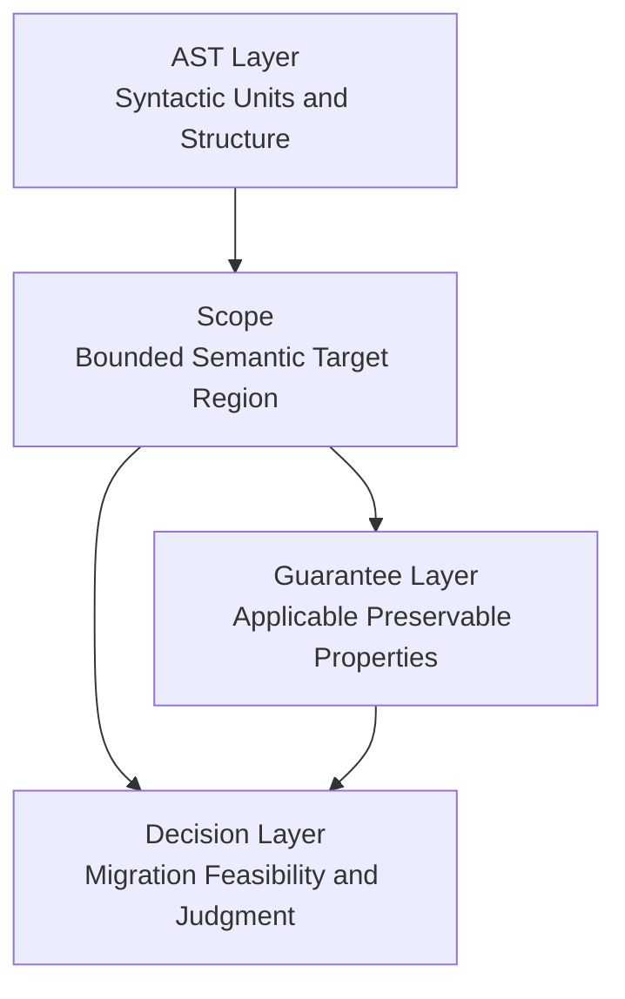

# Scope Core Definition

## 1. Problem
本研究の先行フェーズでは、重要でありながらも未だ不完全な三つの基盤が整備された。AST フェーズでは、構文単位、ノード分類、粒度方針が定義された。Guarantee フェーズでは、Guarantee Unit、Guarantee Space、および保存主張を評価するための代数的構造が定義された。Decision フェーズでは、Decision Space、Structural Risk、Migration Feasibility、そして検証志向の判断基準が定義された。しかし、これらのフェーズだけでは、次の問いに対する単一の形式的解答はまだ与えられていない。すなわち、**解析・保証評価・移行判断が正確にはどの意味対象に適用されるのか**、という問いである。

この欠落は、研究モデルの中に構造的な空隙を生む。ある構文単位は AST 上で識別できても、それがそのまま保証評価の正しい対象であるとは限らない。ある保証は形式的に表現できても、その有効適用範囲が固定されていなければ意味が定まらない。ある移行判断は数学的に定義できても、その判断がどの意味的広がりに対して下されるのかが明示されなければ厳密性を欠く。`Scope` の形式概念がなければ、研究モデルは構造・保証・判断を記述できても、それらが適用される有界な対象を厳密には定義できない。

したがって問題は、構造要素や判断基準が不足していることではない。問題は、**構造解釈・保証適用・検証十分性・移行可能性評価の対象として採用される意味領域を定める第一級の概念が欠けていること**にある。

## 2. Why Scope Becomes Necessary at This Stage
AST フェーズによって、本研究モデルは構文分解に関する規律ある記述を獲得した。AST ノードは、文、分岐、ループ、呼び出しなどの構造形式を、トレーサブルな粒度で表現できる。しかし、構文分解だけでは意味対象の実効的な広がりは定まらない。単一の AST ノードが、その直接的な構文境界を越えて、制御上の責務、データ依存、インタフェース上の拘束に関与していることがありうる。

Guarantee フェーズでは、保存される性質を記述し、それらを Guarantee Space の中に整理する能力が得られた。それでもなお、保証は抽象的に単独で意味を持つものではない。すべての保証は、何らかの対象範囲に適用される。もしその範囲が未定義であれば、保証の主張は形式的に未確定なままである。ある保証が段落に適用されるのか、呼び出し連鎖に適用されるのか、依存閉包に適用されるのか、あるいは移行スライス全体に適用されるのかを述べることができない。

Decision フェーズでは、移行可能性とリスク判断の枠組みが与えられた。しかし、判断はその対象が明示されて初めて健全になる。過度に狭い対象に対する可能性判断は依存関係とリスクを過小評価し、過度に広い対象に対する判断は実用的精度を失わせる。ゆえに Decision 理論は、判断対象の意味的射程を固定する形式機構を必要とする。

この意味で、`Scope` は AST、Guarantee、Decision がすべて成立した後にこそ必要となる。`Scope` は、構造記述、保証適用、移行判断を、共通の有界な意味対象へと結びつける欠落概念である。

## 3. Core Idea
本稿の中心命題は、**Scope とは、構造解析・保証適用・移行判断のために採用される有界な意味的対象領域である**、というものである。`Scope` はソースコード上で目に見える範囲にすぎないものでもなく、単なる技術的コンテナでもない。研究モデルが、構造観測・保証主張・移行判断を有効だと主張するために、形式的に選定された対象領域である。

したがって `Scope` は、すでに整備された次の三層の媒介概念として機能する。

- **AST layer**: 構文単位とトレーサブルな構造分解を与える層
- **Guarantee layer**: 保存される意味特性とその評価構造を与える層
- **Decision layer**: 移行の可否、安全性、検証可能性を判断する層

ゆえに `Scope` は、これら三層を同一の推論対象へ適用可能にする概念である。

## 4. Formal Definition of Scope
\( U \) を、意味的に関連するプログラム成果物と関係の全体集合とする。この集合には、構文要素、制御フロー断片、データ依存、インタフェース上の責務、保証関連の構造関係などが含まれうる。

**Scope** \( \sigma \) を、次の三つ組として定義する。

\[
\sigma = \langle T_\sigma, B_\sigma, P_\sigma \rangle
\]

ここで、

- \( T_\sigma \subseteq U \) は、解析対象として選択された空でない成果物・関係の集合である。
- \( B_\sigma \) は、\( T_\sigma \) に何が含まれ何が除外されるかを定める境界条件の集合である。
- \( P_\sigma \) は、\( T_\sigma \) を研究モデルに必要な構造・保証・判断の各ビューへ写像する許容射影族である。

この定義の解釈は次のとおりである。\( T_\sigma \) は**何を対象として論じているか**を定め、\( B_\sigma \) は**対象がどこからどこまでか**を定め、\( P_\sigma \) は**同一対象を AST・Guarantee・Decision の各観点でどのように読むか**を定める。

ある Scope が **well-formed** であるための条件は、次の通りである。

\[
T_\sigma \neq \varnothing
\]
\[
\text{Bounded}(T_\sigma, B_\sigma)
\]
\[
P_\sigma = \{ \pi_{ast}, \pi_{g}, \pi_{d} \} \text{ is defined for } T_\sigma
\]

ここで、

- \( \pi_{ast}(T_\sigma) \) は対象の構文的または構造的射影を与える。
- \( \pi_{g}(T_\sigma) \) は対象の保証関連射影を与える。
- \( \pi_{d}(T_\sigma) \) は対象の判断関連射影を与える。

この定義の下で、`Scope` は恣意的な部分集合でも純粋な観測区間でもない。`Scope` は、**境界条件とモデル横断的解釈可能性を備えた、有界な意味的対象**である。

## 5. Distinctions

### 5.1 Scope vs Boundary
`Boundary` は `Scope` そのものではない。`Boundary` は包含と除外を定める条件であり、`Scope` はその条件によって区切られた意味的対象領域である。`Boundary` は「対象はどこで終わるか」に答えるのに対し、`Scope` は「推論のためにどの有界な意味対象を採用するのか」に答える。

したがって `Boundary` は `Scope` を構成するために必要だが、`Scope` と同値ではない。境界を変えれば `Scope` は変化しうるが、境界それ自体はあくまで区切りの条件であり、解析対象そのものではない。

### 5.2 Scope vs Unit
`Unit` は通常、構文解析、評価、変換、実行などのための原子的あるいは操作可能な項目である。これに対して `Scope` は、それらの unit 群がまとめて解釈・評価・判断される広がりである。AST ノードは構文 unit でありうる。Guarantee Unit は評価 unit でありうる。Migration package は実行 unit でありうる。しかし、それらは自動的に形式推論上の意味対象領域と一致するわけではない。

`Scope` は複数の unit を含みうるし、unit の一部だけを含むこともありうるし、複数 unit にまたがる依存閉包を含むこともありうる。したがって `Scope` は原子性の概念ではなく、適用可能性の概念である。

**Scope は Guarantee Unit と同一ではなく、Migration Unit とも同一ではない。これらの差異は後続文書で形式化する。**

### 5.3 Scope vs Region
`Region` は、一般に何らかの領域・区間・ドメインを指す広い語である。`Scope` はそれよりも厳密である。ある region が `Scope` になるのは、それが明示的に有界な意味対象として採用され、かつ研究モデルへの有効な解釈射影を備えた場合に限られる。言い換えれば、`Region` は記述的概念であり、`Scope` は記述的であると同時に規範的で判断関連的な概念である。

### 5.4 Scope vs Context
`Context` は、解釈に影響を与える周辺条件、前提、依存、環境拘束を指す。`Scope` は、その一方で、推論の対象となる領域そのものを指す。`Context` は `Scope` の理解に影響しうるが、判断が適用される有界対象そのものではない。`Scope` は何が判断されるかを定め、`Context` はその判断を条件づける周辺条件を与える。

## 6. Structural Role of Scope
`Scope` は、構文構造・保証適用・移行判断のあいだを媒介する構造的役割を果たす。

AST の観点から見れば、`Scope` は研究モデルが構文的可視性を意味的十分性と取り違えることを防ぐ。目に見えるコード片は構造的には識別できても、データ依存、制御責務、検証範囲について有意味な推論を支えるには狭すぎる場合がある。したがって `Scope` は、単なる構文分割から、意味的に有界な対象選定へとモデルを引き上げる。

Guarantee の観点から見れば、`Scope` は保存主張がどの広がりに対してなされるかを定める。保証は真空中では評価できない。保証は、関連依存と構造責務が明示された有界対象へ結びつけられなければならない。`Scope` は保証評価における適用可能性の担体である。

Decision の観点から見れば、`Scope` は移行可能性、リスク、証拠十分性、検証妥当性が何に対して判断されるかを固定する。`Scope` がなければ、ある判断が孤立した構文片を対象としているのか、依存閉包を持つ構成要素を対象としているのか、インタフェーススライスを対象としているのか、移行パッケージ候補を対象としているのかを定めることができない。

この意味で `Scope` は、AST 構造・Guarantee 推論・Decision 理論を、同一の形式対象へ収束させる接続層である。

## 7. Initial Formal Properties of Scope
`Scope` の初期形式的性質は次のとおりである。

### 7.1 Boundedness
すべての `Scope` は有界でなければならない。これは必ずしも小さいことを意味しないが、少なくとも区切られていなければならないことを意味する。対象の所属可否を決める明示的または暗黙的基準が存在しなければならない。無界な対象は `Scope` ではなく、未解決の関連可能性の場にすぎない。

### 7.2 Containment
`Scope` には包含関係を定義できる。二つの `Scope` \( \sigma_1 \) と \( \sigma_2 \) に対して、次を定義できる。

\[
\sigma_1 \preceq \sigma_2 \iff T_{\sigma_1} \subseteq T_{\sigma_2}
\]

ただし、境界条件と解釈射影が互換であることを前提とする。これにより、局所対象、構成要素、サブシステム、システム全体といった多層の推論を入れ子的に扱える。

### 7.3 Traceability
`Scope` は構造成果物へトレース可能でなければならない。その対象は識別可能な構文要素または意味要素へ写像できなければならず、保証、証拠、移行判断に関する主張が実際のプログラム構造に照らして監査可能でなければならない。

### 7.4 Applicability
Phase 6 および接続フェーズにおけるすべての形式主張は、明示的または暗黙的に scope-indexed でなければならない。実践的に言えば、構造解析、保証主張、移行判断は、その有効域として識別可能な \( \sigma \) を必要とする。

### 7.5 Composability
`Scope` は、その相互作用がよく定義される場合に合成可能である。合成は境界を消し去るのではなく、構造・保証・判断の整合性を保てるかどうかに応じて、新たな候補対象を生成する。この性質は、後続文書で扱う containment、overlap、union、partition の基礎となる。

### 7.6 Closure Relevance
`Scope` の妥当性は、可視メンバシップだけでなく、意味的に必要な関係に対する閉包性にも依存する。もし本質的依存が選択された対象の外にあるなら、その `Scope` は構造的には識別可能であっても、理論的には不十分である。したがって `Scope` は、後続文書で閉包が形式化される以前から、すでに closure と本質的に関係している。

## 8. Migration Relevance
`Scope` の明確化が移行分析に不可欠なのは、移行が抽象的なプログラム全体に対して評価されるのではなく、変更・保存・検証・切替判断の対象として選ばれた特定の対象領域に対して評価されるからである。

第一に、Migration Feasibility は、選択された対象が意味的に十分かどうかに依存する。`Scope` が狭すぎれば、隠れた依存関係が評価対象の外に残り、可能性判断は過大評価される。`Scope` が広すぎれば、分析は実務的精度を失い、コストやリスクを過大に見積もるおそれがある。

第二に、影響分析は、どの対象から伝播を測るかを前提とする。`Scope` がなければ、変更の起点と、その結果を追跡すべき領域を区別できない。したがって `Scope` は、後続で定式化される impact propagation と reachable influence の前提条件である。

第三に、検証は `Scope` に依存する。証拠収集範囲、十分性主張、受け入れ基準はすべて、有界な対象を必要とするからである。関連する `Scope` が固定されない限り、Verification を complete と宣言することはできない。ゆえに `Scope` は移行作業における補助概念ではなく、可能性評価・影響分析・検証十分性を成立させる条件そのものである。

## 9. Risks of Ambiguity
`Scope` が曖昧なままであれば、理論も実践も不安定になる。

理論レベルでは、`Scope` の曖昧さは構造解析と保証評価の対応関係を破壊する。評価対象が、その保証を偽にする依存を除外しているだけなのに、保証が保存されているように見えてしまう可能性がある。同様に、判断が実際に解析された対象とは異なる広さの対象を暗黙に前提していても、見かけ上は妥当に見えてしまう。

実務レベルでは、曖昧な `Scope` は boundary drift、hidden dependency omission、invalid local optimization、misleading verification evidence を引き起こす。あるチームはモジュールを移行しているつもりでも、実際にはその構文的外殻しか移していないかもしれない。ある保証が確立したと考えていても、実際には関連する意味対象の断片しか確認していないかもしれない。ある testing が十分だと考えていても、その証拠範囲が実際の判断対象と一致していないかもしれない。

移行理論の観点では、`Scope` の曖昧さは target mismatch を生む。ひとたび対象不一致が導入されると、feasibility、risk、coverage、boundary reasoning はすべて信頼できなくなる。したがって `Scope` の曖昧さは、単なる用語上の瑕疵ではなく、構造理論および移行判断理論の破綻源である。

## 10. Mermaid Diagram

## 11. Provisional Conclusion
本稿は、`Scope` を第一級の形式概念として確立した。すなわち、`Scope` とは、境界条件とモデル横断的解釈可能性を備えた有界な意味的対象領域である。この定義に基づき、`Scope` は `Boundary`、`Unit`、`Region`、`Context` から区別され、AST 構造・Guarantee 適用・Decision 判断を接続する層として位置づけられる。

この結果、Phase 6 の後続文書は、基礎定義を再構築することなく、分類、境界形式化、Guarantee Unit / Migration Unit との差異、閉包、検証十分性、影響伝播、モデル横断写像を順次精緻化できる。そうした意味で、本稿は `60_scope/` ディレクトリ全体が依拠する最小基盤を固定する文書である。
