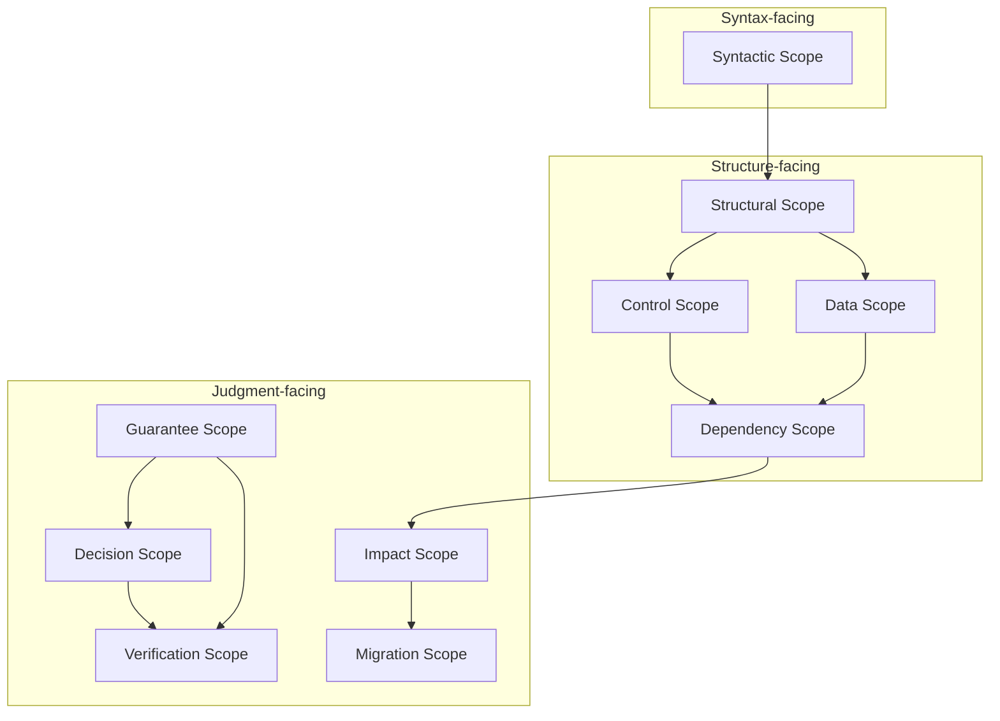

# Scope Taxonomy

## 1. 問題設定

`01_Scope-Core-Definition.md` では、`Scope` を **有界な意味的対象領域** として定義した。しかし、この定義だけでは研究モデルはまだ十分に運用できない。理由は、`Scope` が単一の未分化な概念のままでは、**どの種類の解析・保証・判断に対して** その領域を採用しているのかが区別できないからである。

たとえば、構文上の可視範囲を `Scope` と呼ぶことも、データ依存の閉包を `Scope` と呼ぶことも、移行パッケージの候補範囲を `Scope` と呼ぶことも、いずれも日常語としては自然である。しかし研究モデルでは、これらは **異なる分析目的** と **異なる妥当性条件** を伴う。同一のラベルで混在させると、保証評価の対象と移行判断の対象が入れ替わり、境界・包含・影響・検証・完全性の各議論が互いにすり替わる。

したがって `Scope` は、**分類体系を備えた概念族** として扱わなければならない。分類は装飾ではなく、研究モデルが複数の抽象層（構文・構造・保証・判断）を横断するために不可欠である。

## 2. 分類原理

本稿の分類原理は次の三つからなる。

**第一に、分析目的の原理である。**  
`Scope` は常に「何のために切り出すか」に応じて意味が定まる。構文トレースのため、制御構造の保存のため、データ整合のため、依存閉包のため、移行可否のため、といった目的が異なれば、採用すべき対象領域の形も異なる。

**第二に、抽象層の原理である。**  
`Scope` は構文層にのみ存在するのではなく、**構造層**（制御・データ・依存）および **判断層**（保証・検証・移行）にまたがる。同一のソース断片に対しても、層ごとに異なる `Scope` が定義されうる。

**第三に、射影と境界の原理である。**  
`Scope` は三つ組 \( \langle T, B, P \rangle \) として与えられる。類型分類の本質は、**どの射影 \(P\)**（構文的・構造的・保証的・判断的）を主に固定するか、および **どの境界条件 \(B\)** を主に課すかの違いとして整理できる。

以上より、本稿は `Scope` を「単一の集合」ではなく、**類型ごとに主目的と主たる抽象層が異なる概念** の族として整理する。

## 3. 主要な Scope 類型

研究モデルに必要な主要な `Scope` 類型は、少なくとも次の十種を含む。

- **Syntactic Scope**：構文表現上の可視範囲とトレース可能性を主に固定する。
- **Structural Scope**：構文を超えた構造的まとまり（モジュール・段落・サブシステム等）を主に固定する。
- **Control Scope**：制御到達・分岐・ループ・呼び出しの責務を主に固定する。
- **Data Scope**：データフロー・変数・レコード・ファイルの整合を主に固定する。
- **Dependency Scope**：依存関係の閉包・影響伝播の前提を主に固定する。
- **Guarantee Scope**：保証の適用・評価・合成の対象を主に固定する。
- **Decision Scope**：移行可否・リスク・境界判断の対象を主に固定する。
- **Verification Scope**：検証・証拠・ゲートの射程を主に固定する。
- **Impact Scope**：変更起点からの影響到達・伝播範囲を主に固定する。
- **Migration Scope**：移行計画・段階・パッケージングの実行単位に近い対象を主に固定する。

### 3.1 面向性の整理（syntax-facing / structure-facing / judgment-facing）

各 Scope 類型は、研究モデルにおける **主な向き** を次のように整理できる。

- **syntax-facing**（構文に面する）：**Syntactic Scope**。AST 粒度・構文単位のトレースに直結する。
- **structure-facing**（構造に面する）：**Structural、Control、Data、Dependency** の各 Scope。CFG / DFG / 依存グラフ等の構造解釈に直結する。
- **judgment-facing**（判断に面する）：**Guarantee、Decision、Verification、Impact、Migration** の各 Scope。保証評価・移行判断・検証十分性・影響分析・移行計画に直結する。

注意：面向性は排他的ではない。たとえば **Dependency Scope** は `structure-facing` であると同時に、後続の **Impact Scope** や **Guarantee Scope** と強く結びつく。

## 4. 各 Scope 類型の記述

### 4.1 Syntactic Scope

- **定義**：ソースコード上の構文要素として識別可能な範囲。通常は AST ノード列、文、段落境界などに対応する。
- **主目的**：構文解析・トレース・構文変換の正しさを議論する対象を固定する。
- **抽象層**：主に **Syntax / Structure** の入口層。
- **他の Scope との代表的関係**：Structural Scope より狭いことが多い。Control / Data Scope は Syntactic Scope を越えて再解釈される。

### 4.2 Structural Scope

- **定義**：構文単位の寄せ集めではなく、設計上・モジュール上・責務上のまとまりとして採用される範囲。
- **主目的**：責務境界・分解・再構成の議論を可能にする。
- **抽象層**：**Structure**。
- **他の Scope との代表的関係**：Syntactic Scope を包含しうる。Migration Scope と重なりやすいが、後者は実行計画に寄る。

### 4.3 Control Scope

- **定義**：制御フロー上の到達可能性・分岐・ループ・例外ハンドラに関わる範囲。
- **主目的**：制御の保存・改変・検証の対象を固定する。
- **抽象層**：**Structure**（CFG 中心）。
- **他の Scope との代表的関係**：Data Scope と交差する。依存関係は Dependency Scope 側で補完される。

### 4.4 Data Scope

- **定義**：変数・データ項目・レコード・ファイル・API 等のデータ整合とライフサイクルに関わる範囲。
- **主目的**：データ整合性・不変条件・移行後のデータ意味の保存を議論する。
- **抽象層**：**Structure**（DFG / データモデル中心）。
- **他の Scope との代表的関係**：Guarantee Scope と強く結びつく。Impact Scope の入力としても使われる。

### 4.5 Dependency Scope

- **定義**：依存関係（呼び出し・参照・共有状態・外部 I/O）に基づいて閉じた、または閉じたとみなす範囲。
- **主目的**：影響伝播・閉包・分割可能性の前提を固定する。
- **抽象層**：**Structure**（グラフ閉包）。
- **他の Scope との代表的関係**：Impact Scope の基礎。Verification Scope の「十分な範囲」議論にも接続する。

### 4.6 Guarantee Scope

- **定義**：保証の主張・評価・合成が有効な範囲。Guarantee Space 上の議論が適用される対象領域。
- **主目的**：何が保存され、何が失われるかを論じる。
- **抽象層**：**Guarantee**（論理・束構造の上）。
- **他の Scope との代表的関係**：Data / Control Scope と交差する。Decision Scope は「安全領域」への接続を担う。

### 4.7 Decision Scope

- **定義**：移行可否・リスク・境界・戦略的トレードオフの判断が下される範囲。
- **主目的**：判断の対象と根拠の射程を固定する。
- **抽象層**：**Decision**。
- **他の Scope との代表的関係**：Verification Scope とセットで語られる。Migration Scope と混同しやすいが、Decision は「判断」、Migration は「計画・実行単位」に寄る。

### 4.8 Verification Scope

- **定義**：検証・証拠収集・テスト・レビュー・ゲートが及ぶ範囲。
- **主目的**：十分性・網羅性・再現性の議論を可能にする。
- **抽象層**：**Decision / Meta**（証拠とプロセス）。
- **他の Scope との代表的関係**：Guarantee Scope と強く結びつく。Dependency Scope とずれると誤った十分性判断になる。

### 4.9 Impact Scope

- **定義**：変更起点からの影響が到達しうる範囲。伝播解析の対象。
- **主目的**：影響過大・過小見積もりを防ぐ。
- **抽象層**：**Structure / Decision** の境界。
- **他の Scope との代表的関係**：Dependency Scope と深く重なる。Migration Scope の「切り出し」に影響する。

### 4.10 Migration Scope

- **定義**：移行計画・段階・パッケージング・カットオーバーに関わる範囲。実行単位に近いが、**Migration Unit と同一ではない**。
- **主目的**：移行実施可能性と運用上のまとまりを議論する。
- **抽象層**：**Decision**（実行計画）と **Structure**（対象の切り出し）の合成。
- **他の Scope との代表的関係**：Structural / Dependency / Verification / Impact と衝突しうる。後続文書で `Scope` と `Migration Unit` の差を形式化する。

## 5. 層横断的解釈

`Scope` は単一層に閉じない。同一のソース領域に対して、次のような **層横断** が起きる。

- **構文層**：Syntactic Scope が「どこに書かれているか」を与える。
- **構造層**：Control / Data / Dependency Scope が「どう動き、何に依存するか」を与える。
- **判断層**：Guarantee / Decision / Verification / Migration Scope が「何を保証し、何を判断し、どこまで検証するか」を与える。

研究モデルでは、これらは **同一の `Scope` 記号** で一括化してはならない。むしろ、同一対象に対して **複数の射影** を明示し、どの類型の `Scope` が主であるかを宣言する必要がある。

## 6. Scope の重なりと緊張関係

異なる `Scope` 類型は、次のように **重なり**、**乖離**、**部分衝突** しうる。

- **重なり**：たとえば Data Scope と Guarantee Scope は同一領域を共有しつつ、評価基準が異なる。
- **乖離**：Syntactic Scope の境界は小さく、Dependency Scope の閉包は大きくなりうる。この乖離は「局所は安全だが全体は危険」という誤りを生む。
- **部分衝突**：Migration Scope は運用上のまとまりを優先し、Verification Scope は証拠の十分性を要求する。両者の最適化は一致しない。

この緊張は欠陥ではなく、**モデルが現実の制約を表現している証拠**である。分類体系の役割は、この緊張を言語化し、後続の境界・包含・閉包の文書で扱える形に落とすことにある。

## 7. 移行判断上の意義

分類体系は移行設計に次の効果を与える。

- **見積もりの精度**：Impact Scope と Dependency Scope を明示しないと、影響範囲が過小評価される。
- **検証計画の妥当性**：Verification Scope が Guarantee Scope とずれると、テストは通るが移行は危険、という状態が成立する。
- **段階移行の設計**：Migration Scope と Structural Scope の関係を誤ると、カットオーバー単位が破綻する。

この意味で、分類は「用語整理」ではなく、**移行判断の入力を正規化する** ための理論装置である。

## 8. Mermaid 図

## 9. 暫定結論

本稿は、`Scope` を単一概念として扱うことの限界を示し、**研究モデルに必要な主要類型** を十種に整理した。分類原理は、分析目的・抽象層・射影と境界の三つに基づく。

この分類は、後続の `03_Scope-Boundary-Model.md`（境界）、`04_Scope-Composition-and-Containment.md`（包含・合成）、`07_Impact-Scope-and-Propagation.md`（影響）、`08_Verification-Scope.md`（検証）、`09_Scope-Closure-and-Completeness.md`（閉包・完全性）など、**各文書が扱う論点の座標系** を与えるための基礎である。

次のステップでは、各類型に対して境界条件をどのように定式化するか、また類型間の写像をどう整合させるかを、後続文書で精緻化する。
