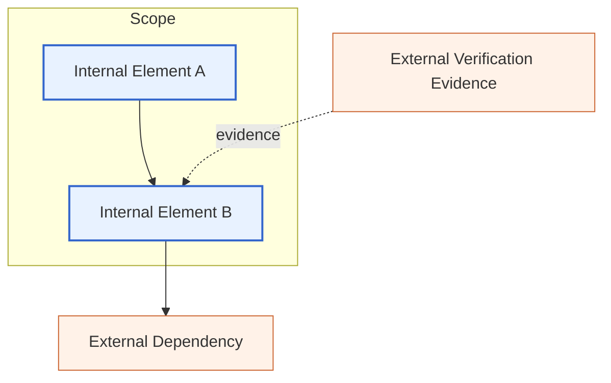

# Scope Boundary Model

## 1. 問題設定

`01_Scope-Core-Definition.md` では、`Scope` を **有界な意味的対象領域** として定義した。だが、`Scope` が有界であるという主張だけでは、なお一つの重要な問いが残る。すなわち、**何がその有界性を与えているのか**、という問いである。

この問いに答えるためには、`Boundary` を `Scope` とは別概念として導入しなければならない。`Scope` は対象領域であるが、`Boundary` はその対象領域を制約し、露出させ、区切り、時には危険にする条件の体系である。両者を混同すると、対象の切り出しと、その切り出しを正当化する条件が一体化してしまい、解析・保証・判断の各レイヤで不安定性が生じる。

特に移行研究では、境界が曖昧なまま「この範囲を移行対象とする」と宣言することが多い。しかしそのとき曖昧なのは、対象そのものではなく、**何を内部とみなし、何を外部とみなし、何を横断とみなすか** という境界条件である。したがって、`Scope Theory` においては `Boundary` の形式化が不可欠である。

## 2. 中心命題

本稿の中心命題は次の通りである。

> **Scope は有界な意味的対象領域であるが、Boundary はその有界性を与える条件体系であり、Scope と同一ではない。**

この命題には三つの含意がある。

1. `Scope` は対象であり、`Boundary` は対象の所属・非所属を決める条件である。
2. 一つの `Scope` は単一の境界線ではなく、複数の境界条件によって定義されうる。
3. 境界の曖昧さは単なる記述上の不明瞭さではなく、影響分析・保証帰属・検証十分性・移行可否判断を不安定化させる構造的原因である。

## 3. Boundary の形式的定義

意味的に関連する成果物と関係の宇宙を \( U \) とする。ある `Scope` \( \sigma \) に対して、`Boundary` \( B_\sigma \) を次のように定義する。

\[
B_\sigma = \{ b_1, b_2, \dots, b_n \}
\]

ここで各 \( b_i \) は、対象 \( x \in U \) に対して所属可否または横断可否を判定する **境界条件** である。すなわち、各 \( b_i \) は述語または制約として働く。

\[
b_i : U \to \{0,1\}
\]

このとき、`Scope` の対象集合 \( T_\sigma \) は、境界条件群 \( B_\sigma \) によって許容される要素の集合として与えられる。

\[
T_\sigma = \{ x \in U \mid \forall b \in B_\sigma,\; b(x)=1 \}
\]

ただし、この式は `Boundary` を単純なフィルタとみなした最小形である。実際には、境界条件には次のような多様な役割がある。

- **所属条件**：対象を内部に含めるか除外するかを決める。
- **接続条件**：どの依存・制御・データ経路を正当な接続とみなすかを決める。
- **露出条件**：外部へ公開されるインタフェースや副作用面を決める。
- **判断条件**：どこまでを検証・保証・意思決定の責任範囲に含めるかを決める。

したがって `Boundary` は単なる幾何学的な「線」ではなく、**所属・接続・露出・責任を決める分析的条件体系** である。

## 4. Scope と Boundary

### 4.1 Boundary がどのように Scope を区切るか

`Boundary` は `Scope` を **contain** するのではなく、**delimit** する。ここで containment は対象集合間の包含関係を指し、delimitation はどこまでを内部とみなすかを定める条件を指す。すなわち、

- **containment**：\( T_{\sigma_1} \subseteq T_{\sigma_2} \) のような対象集合の関係
- **delimitation**：どの条件により \( T_\sigma \) が成立するかという境界条件の関係

同じ対象集合に対しても、異なる境界記述がありうる。たとえば「同一段落に属する」ことを境界にする場合と、「同一責務モジュールに属する」ことを境界にする場合では、結果として近い対象集合が得られても、その分析意味は異なる。

### 4.2 なぜ Boundary は Scope と同一でないのか

`Scope` は「何が対象か」に答える。`Boundary` は「なぜそこまでを対象とみなすのか」に答える。前者は対象領域、後者は対象領域を成立させる条件体系である。

もし `Boundary` と `Scope` を同一視すると、次の問題が起きる。

- 解析対象と所属基準が区別できなくなる。
- 対象の境界変更が、対象そのものの変更と混同される。
- 影響分析で「外部依存を無視しただけ」の切り出しが、正当な `Scope` であるかのように扱われる。

### 4.3 1つの Scope を複数の Boundary が定めうること

一つの `Scope` は、複数の境界条件の組で定義されうる。たとえば `Verification Scope` では、次のような複合境界が同時に作用する。

- 構文的境界：どのルーチン群を対象にするか
- 依存境界：どの依存閉包までを含めるか
- 証拠境界：どのテスト・レビュー・証跡を十分とみなすか

この意味で `Boundary` は単数よりも複数で語られるべきことが多い。`Scope` は一つでも、それを定める `Boundary` は多層的でありうる。

## 5. Boundary の類型

### 5.1 Explicit Boundary

明示的に記述される境界である。モジュール境界、ファイル境界、API 境界、明示的なインタフェース、宣言された責務境界などがこれに当たる。利点はトレース可能性が高いことである。

### 5.2 Implicit Boundary

記法上は明示されないが、依存、慣習、共有状態、運用ルールなどによって事実上成立している境界である。暗黙境界は、移行時に最も見落とされやすい。

### 5.3 Internal Boundary

一つの `Scope` の内部をさらに分節する境界である。段落間、処理段階間、責務分割間、サブモジュール間の境界がこれに当たる。内部境界は、`Scope` の内部構造と再構成可能性に関わる。

### 5.4 External Boundary

`Scope` と外部環境の接面を定める境界である。入出力、外部呼び出し、共有データ、DB、ファイル、メッセージングなどがここに含まれる。外部境界は保証帰属と副作用責任に直結する。

### 5.5 Structural Boundary

構文・制御・データ・依存といった構造解釈に基づく境界である。CFG の分岐境界、DFG の定義使用閉包、呼び出しグラフ上の切断点などが該当する。

### 5.6 Judgment Boundary

保証適用、検証十分性、移行可否、リスク判断といった判断行為の責任範囲を定める境界である。`Decision Boundary` や `Verification Gate` は、この judgment-facing な境界の具体例である。

## 6. Boundary Crossing

`Boundary Crossing` とは、ある対象、作用、または主張が、ある `Scope` を定める境界条件をまたいで有効化されることを指す。

### 6.1 制御の境界横断

制御フローがあるモジュール、段落、責務領域の外へ到達する場合、制御は境界を横断している。典型例は、想定されたローカル処理を越える分岐、`PERFORM THRU`、非局所的ジャンプ、例外ハンドラ経由の脱出である。

### 6.2 データの境界横断

データ定義・更新・参照が、ある対象領域の外にある共有状態、外部 I/O、グローバル変数へ波及する場合、データは境界を横断している。これは `Data Scope` と `External Boundary` の接面で特に重要である。

### 6.3 依存の境界横断

呼び出し関係、参照関係、共有リソース、暗黙的前提が `Scope` 外へつながる場合、依存が境界を横断している。この横断が見落とされると、`Dependency Scope` は閉じていないのに閉じているかのように扱われる。

### 6.4 保証適用の境界横断

ある保証主張が、その `Scope` 内部ではなく、外部境界をまたぐ依存や副作用に依拠して成立している場合、保証適用は境界横断を伴っている。たとえば局所関数の正しさが外部状態の不変性に依存しているなら、保証は局所 `Scope` に閉じていない。

## 7. Boundary Violation

`Boundary Violation` とは、ある `Scope` に対して採用された境界条件が、解析、保証、検証、判断の前提と整合しない状態を指す。これは単に境界をまたぐことではなく、**またぎ方が前提と衝突すること** を意味する。

### 7.1 境界違反の基本形

境界違反は少なくとも次のような場合に起きる。

- 内部とみなした対象が、実際には外部依存に決定的に支配されている。
- 外部とみなして除外した対象が、実際には保証や検証に必須である。
- judgment boundary が structural boundary より狭く、判断が必要条件を欠く。
- verification boundary が dependency boundary より狭く、証拠が十分でない。

### 7.2 Boundary ambiguity as a precursor of migration failure

移行失敗は、しばしばコード変換そのものの難しさよりも、**境界の曖昧さ** に先行される。どこまでを内部とみなし、どこからを外部依存とみなすかが曖昧なまま進むと、次の連鎖が起きる。

1. `Scope` が過小に切り出される。  
2. 依存横断や副作用横断が見落とされる。  
3. Guarantee の帰属先が誤る。  
4. Verification の証拠範囲が不足する。  
5. 移行判断が楽観的に歪む。  

したがって境界曖昧性は、移行失敗の結果ではなく、**その前駆状態** とみなされるべきである。

## 8. 移行判断上の意義

正しい `scope-boundary alignment` は、移行実現性に次の形で効く。

- **Impact 分析の妥当性**：境界が正しくなければ、影響到達範囲は過小評価または過大評価される。
- **Verification の十分性**：境界が正しくなければ、何を検証すべきかが定まらず、証拠の完備性を主張できない。
- **Guarantee の帰属**：境界が正しくなければ、どの保証が局所に属し、どの保証が外部条件に依存するかを区別できない。
- **Migration feasibility**：境界が正しくなければ、移行単位の切り出しは実行可能性よりも先に破綻する。

このため `Boundary Model` は、後続の `07_Impact-Scope-and-Propagation.md` と `08_Verification-Scope.md` の前提であり、さらに `09_Scope-Closure-and-Completeness.md` で問われる「十分に閉じた `Scope` か」という判断の基礎になる。

## 9. Mermaid 図

## 10. 暫定結論

本稿は、`Boundary` を `Scope` の内部に含まれる対象そのものではなく、**Scope を成立させる条件体系** として定式化した。これにより、`Scope` の有界性は単なる線引きではなく、所属・接続・露出・責任の条件として理解される。

また、明示境界 / 暗黙境界、内部境界 / 外部境界、構造境界 / 判断境界を区別し、境界横断と境界違反を定義した。特に、境界曖昧性が影響分析の誤り、保証帰属の誤り、検証十分性の誤り、ひいては移行失敗の前駆状態になることを明確にした。

次の文書では、`04_Scope-Composition-and-Containment.md` で境界により区切られた複数の `Scope` の包含・合成・交差を扱い、`07_Impact-Scope-and-Propagation.md` と `08_Verification-Scope.md` で境界横断が影響と証拠射程にどう現れるかを精緻化する。
