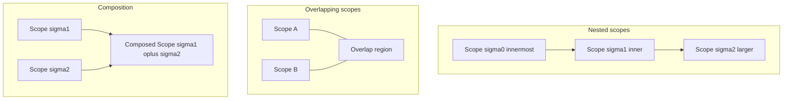

# Scope Composition and Containment

## 1. 問題設定

`01_Scope-Core-Definition.md` は `Scope` を三つ組 \( \sigma = \langle T_\sigma, B_\sigma, P_\sigma \rangle \) として定義した。`02_Scope-Taxonomy.md` は `Scope` の類型を与えた。`03_Scope-Boundary-Model.md` は `Boundary` を対象を成立させる条件体系として定義した。

しかし、これらだけではまだ不十分である。理由は、実際の解析・移行・検証では **`Scope` は単体で現れない** からである。局所 `Scope` と全体 `Scope`、依存閉包 `Scope` と構文可視 `Scope`、検証 `Scope` と影響 `Scope` は、包含・重なり・合成・分割という形で常に関係する。もしこれらの関係を形式化しなければ、次の誤りが再び日常語に戻る。

- 「この範囲に含まれるから同じ分析対象だ」という誤り
- 「重なっているから統合できる」という誤り
- 「分割したから影響も分割される」という誤り

したがって本稿の目的は、`Scope` 同士の **構造関係** と **構造操作** を、研究モデル上の関係として定義することである。

## 2. 中心命題

本稿の中心命題は次の通りである。

> **`Scope` は孤立した対象領域ではない。`Scope` は包含・階層化・重なり・交差・合成・分割という関係構造の中に置かれたとき初めて、解析・保証・判断の対象として安定する。**

この命題は、`Scope` を集合の要素として扱うことと矛盾しない。ただし集合論は補助であり、本稿が主に扱うのは **境界条件と射影の整合** を伴う関係である。

## 3. Containment

二つの `Scope` \( \sigma_1, \sigma_2 \) について、**containment**（包含）を次のように定義する。

\[
\sigma_1 \preceq_{\mathrm{ct}} \sigma_2
\]

であるとは、次を満たすことである。

1. **対象集合の包含**：\( T_{\sigma_1} \subseteq T_{\sigma_2} \)
2. **境界の整合**：\( B_{\sigma_2} \) により許容される対象は、\( B_{\sigma_1} \) により過度に狭められない（内部境界の追加はよいが、外部依存の隠蔽は不可）。
3. **射影の整合**：\( P_{\sigma_1} \) は \( P_{\sigma_2} \) の制限として解釈できる（同一対象に対し、より局所的な分析目的を追加してよいが、矛盾する読み替えは不可）。

直感として、\( \sigma_1 \preceq_{\mathrm{ct}} \sigma_2 \) は「\( \sigma_1 \) は \( \sigma_2 \) の内部に局所化された `Scope` である」ことを意味する。

## 4. Nesting

**Nesting**（入れ子）は、包含関係の有限鎖として定義される。

\[
\sigma_0 \preceq_{\mathrm{ct}} \sigma_1 \preceq_{\mathrm{ct}} \cdots \preceq_{\mathrm{ct}} \sigma_k
\]

階層的な `Scope` は、たとえば次に現れる。

- 文レベル \( \to \) ルーチンレベル \( \to \) サブシステムレベル
- 局所変更対象 \( \to \) 依存閉包 \( \to \) システム境界

Nesting が重要なのは、**上位 `Scope` の判断が下位 `Scope` の局所最適と衝突しうる** からである。Nesting は「分割可能性」を与える一方で、「責務の階層化」を要求する。

## 5. Overlap

二つの `Scope` \( \sigma_1, \sigma_2 \) が **overlap**（部分重複）するとは、次を満たすことである。

\[
T_{\sigma_1} \cap T_{\sigma_2} \neq \varnothing
\]

かつ、

\[
\neg(\sigma_1 \preceq_{\mathrm{ct}} \sigma_2) \land \neg(\sigma_2 \preceq_{\mathrm{ct}} \sigma_1)
\]

Overlap は分析上不可避である。たとえば、データ依存はある `Data Scope` に属し、制御構造は別の `Control Scope` に属し、両者は部分重複しうる。

Overlap が重要なのは、**同一成果物が複数の分析目的に同時に属する** とき、保証帰属と検証責任が衝突しうるからである。

## 6. Intersection

二つの `Scope` の **intersection**（交差）は、単なる集合の交差では足りない。最小の定義として、

\[
T_{\sigma_1 \cap \sigma_2} = T_{\sigma_1} \cap T_{\sigma_2}
\]

を考えるが、これを `Scope` として正当化するには、

\[
B_{\sigma_1 \cap \sigma_2} = \mathrm{Merge}(B_{\sigma_1}, B_{\sigma_2})
\]

\[
P_{\sigma_1 \cap \sigma_2} = \mathrm{Align}(P_{\sigma_1}, P_{\sigma_2})
\]

が必要である。ここで `Merge` と `Align` は、境界条件と射影を矛盾なく合成する操作を指す（詳細は実装・体系依存であり、本稿では **整合合成が可能な場合に限り交差が well-formed** とする）。

交差の意味は、「両方の分析目的が同時に課す制約を受ける最小区分」を表す。典型例は、局所変更点と依存閉包の交差が **実効的な変更コア** を与える場合である。

## 7. Union / Composition

二つの `Scope` を結合する操作として、**union** と **composition** を区別する。

### 7.1 Union（和）

集合としての和を

\[
T_{\sigma_1 \cup \sigma_2} = T_{\sigma_1} \cup T_{\sigma_2}
\]

と定義しうるが、これ単体では `Scope` として well-formed とは限らない。和が `Scope` になるには、結合後の境界 \( B_{\sigma_1 \cup \sigma_2} \) が、外部依存の欠落や検証責任の空白を生まないことが必要である。

### 7.2 Composition（合成）

**composition** は、単なる和集合より強い。composition は、二つの `Scope` を **同一の移行判断・検証計画・保証評価の枠** に収める意図を伴う。形式的には、

\[
\sigma_3 = \sigma_1 \oplus \sigma_2
\]

は、\( T_{\sigma_3} \) と \( B_{\sigma_3}, P_{\sigma_3} \) を、移行パッケージングや検証ゲート設計に整合するよう再構成する操作である。

composition が正当化される典型条件は次のとおりである。

- 依存閉包が合成後も説明可能である
- 外部境界の責務が重複・欠落しない
- Verification / Guarantee の射程が矛盾しない

### 7.3 結合された Scope が分析的一貫性を失うのはどのような場合か

**結合された `Scope` が分析的一貫性を失う** のは、集合としては結べたが、境界条件と射影が整合しない場合である。代表的には次の通りである。

1. **依存閉包の欠落**：和集合は取れたが、外部依存が `Boundary` から落ち、影響分析が偽になる。
2. **検証射程の断裂**：合成後に `Verification Scope` が不連続になり、証拠が途中で途切れる。
3. **保証の帰属衝突**：一方の `Guarantee Scope` に属する性質と、他方の前提が両立しない。
4. **判断単位の混線**：`Decision Scope` が「一つの Go/No-Go」として整合しない複数の実行単位を束ねる。
5. **暗黙境界の再出現**：明示的に合成したつもりが、暗黙の共有状態や運用前提が境界外に残る。

この節の要点は、**一貫性の失敗はしばしば「大きさ」の問題ではなく「境界の合成可能性」の問題** であるということである。

## 8. Partition

`Scope` \( \sigma \) の **partition**（分割）は、索引集合 \( I \) 上の部分 `Scope` 族 \( \{\sigma_i\}_{i \in I} \) が次を満たすこととして定義される。

1. **被覆**：\( T_\sigma = \bigcup_{i \in I} T_{\sigma_i} \)
2. **非重複（通常の分割）**：\( i \neq j \Rightarrow T_{\sigma_i} \cap T_{\sigma_j} = \varnothing \)

実務上は非重複が厳しすぎる場合がある。その場合は **重複を許容する分割**（overlap あり）を区別し、重複部に対して追加の調停条件を課す。

分割が重要なのは、大きな移行対象を **並列化可能な単位** に落とすためである。ただし分割は、依存と検証を同時に分割できることを意味しない。

## 9. 構造的解釈

包含・重なり・交差・合成・分割を、次の構造に接続する。

### 9.1 Control structure

制御構造では、`Scope` の包含はしばしば **到達可能性の包含** と衝突しうる。局所 `Scope` が小さくても、制御の出口が外部へ飛ぶなら、包含関係は誤った安全感を与える。

### 9.2 Data structure

データ構造では、分割は **定義使用関係** を切断しうる。変数・レコード・ファイル境界で分割したつもりが、暗黙の共有や別名参照で再び重なることがある。

### 9.3 Dependency structure

依存構造では、合成と分割は **グラフ上の切断** と同型の問題を持つ。切断は並列化を可能にするが、カットエッジが外部契約や副作用を隠すと、合成 `Scope` は一貫性を失う。

## 10. 移行判断上の意義

包含と合成は、移行判断に次の形で効く。

- **migration packaging**：複数モジュールを一つの移行単位に束ねることは、composition の典型である。束ね方が誤ると、依存がパッケージ外に漏れる。
- **cutover design**：カットオーバー境界は、しばしば `Scope` の合成点である。境界が曖昧だと、切替時点で責務が分裂する。
- **verification planning**：検証は分割可能に見えて、証拠の連続性を要求する。partition が検証ゲートを壊す典型例は、テストが局所成功するが系統としては失敗するケースである。

careless composition は、**無効な migration grouping** を生む。すなわち、運用上のまとまりとして見えるが、依存・検証・保証のいずれかが合成後に破綻するグルーピングである。

## 11. Mermaid 図

## 12. 暫定結論

本稿は、`Scope` を孤立した対象ではなく、包含・階層化・重なり・交差・合成・分割という **関係構造** の中で扱うための基礎を与えた。特に、合成は集合の和よりも強く、**境界条件と射影の整合**が分析的一貫性の核心であることを示した。

この結果、後続の `07_Impact-Scope-and-Propagation.md` では伝播が分割と合成をどう跨ぐか、`08_Verification-Scope.md` では検証射程が合成後にどう連続するか、`09_Scope-Closure-and-Completeness.md` では分割が閉包を壊さない条件を問うことができる。
