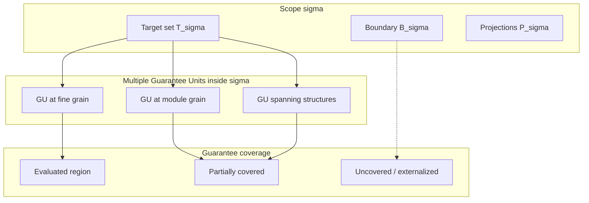

# Scope vs Guarantee Unit

## 1. 問題設定

`50_guarantee` では **Guarantee Unit** と **Guarantee Space** が定義され、保存される性質を評価するための代数的枠組みが与えられた。`01_Scope-Core-Definition.md` では **Scope** を \( \sigma = \langle T_\sigma, B_\sigma, P_\sigma \rangle \) として定義した。両者は移行研究の語彙の中で頻繁に隣接するが、**同一の概念ではない**。

この区別を曖昧にすると、次の誤りが再び日常語へ戻る。

- 「この範囲を移行対象としたから、その範囲に対する保証が一つにまとまる」という誤り
- 「保証単位の階層を決めたから、解析・判断の対象としての Scope も同じ階層に揃う」という誤り
- 「ある性質が保証されたから、その Scope の同一性は保証された」という誤り

本稿の目的は、**Scope** と **Guarantee Unit** を、研究モデル上で**厳密に区別**し、その接続を **構造中心** に固定することである。数値メトリクスや格子の細部だけに流れず、**適用範囲**と**評価単位**の差異を核に据える。

## 2. Scope の再確認

**Scope** \( \sigma \) は、構造解析・保証適用・移行判断のために採用される **有界な意味的対象領域** である。形式的には三つ組

\[
\sigma = \langle T_\sigma, B_\sigma, P_\sigma \rangle
\]

として与えられる。ここで \( T_\sigma \) は対象成果物・関係の集合、\( B_\sigma \) は境界条件、\( P_\sigma \) は AST・Guarantee・Decision 各ビューへの射影族である。

`Scope` の本質は **「何を、どの境界で、どの読み方で対象とするか」** を固定する **target range**（適用範囲の記述）である。`Scope` はそれ自体、**保証の真偽や強度を与える評価器ではない**。

## 3. Guarantee Unit の再確認

**Guarantee Unit**（保証単位）は、`50_guarantee` において、**変換・移行に対して何を保存し、どの粒度で検証・主張するか**を束ねる **評価単位** として定義された。抽象レベル L1（文）から L5（業務機能）までの階層を持ち、**同一の単位に対して** Guarantee Space 上の保存状態や合成ルールが論じられる。

Guarantee Space 理論において、ある単位 \( GU \) に対して保存観点の集合や順序関係は **評価の対象** として定まる。すなわち Guarantee Unit は **「どの保証がどの単位に帰属し、どう合成されるか」** の **evaluative unit**（評価単位）である。

## 4. 中核的差異

本稿の中核的差異は次のとおりである。

| 観点 | Scope | Guarantee Unit |
|------|--------|----------------|
| 役割 | **target range**：解析・保証適用・判断の **対象領域** を固定する | **evaluative unit**：保存主張を **評価・帰属する単位** を固定する |
| 主な問い | 何が含まれ、何が外か、どの境界で読むか | どの粒度で、どの性質が、どの手続で評価されるか |
| 同一視の危険 | **保証されるものそのもの** と混同される | **意味領域全体** と混同される |

- **Scope は target range である**：対象の広がりと境界と射影を規定する。
- **Guarantee Unit は evaluative unit である**：保証の主張が **どの単位に帰属し、どう検証されるか** を規定する。

両者は移行研究で往々にして一緒に語られるが、**前者は論じる対象の枠**であり、**後者は主張の評価の枠**である。

## 5. 構造的関係

### 5.1 1つの Scope が複数の Guarantee Unit を含む

一つの `Scope` \( \sigma \) の内部に、**複数の Guarantee Unit** が存在しうる。例えば、同一の \( T_\sigma \) は、文単位の保存主張、ルーチン単位の合成主張、業務シナリオ単位の検証主張に、**それぞれ別の \( GU \)** として割り当てられる。

このとき、**Scope の境界は一つでも、Guarantee の帰属単位は複数**である。逆に、**単一の \( GU \)** が、複数の構造断片（モジュール、コピーブック、データ定義）にまたがることもある。すなわち **1つの Guarantee Unit が複数の内部構造にまたがる** 関係もありうる。

### 5.2 Scope に対して部分的な Guarantee coverage しかない場合

**Guarantee coverage**（保証被覆）は、ある `Scope` \( \sigma \) に対して、選択された観点の集合のうち **実際に評価・主張が及ぶ部分** を指す。\( T_\sigma \) 全体が均一に保証されるとは限らない。局所の \( GU \) では主張できても、依存の外部や副作用面では **未評価** のまま残ることがある。

この場合、**Scope は「全体の対象」として定義されているが、Guarantee はその一部にしか乗っていない**。不均一な被覆は欠陥というより、**構造的事実**として記述される。

## 6. Guarantee Coverage と Scope

Guarantee の適用と `Scope` の区切りは、次のように相互作用する。

- **適用（applicability）**：ある保証主張が、どの \( GU \) に対して形式的に述べられるか。
- **射程（coverage）**：その主張が、どの \( T_\sigma \) のどの部分にまで及ぶとみなすか。
- **境界との整合**：\( B_\sigma \) が外部に依存を隠すと、Guarantee が **Scope 内だけ**で完結したと見せかけ、被覆が過大評価される。

### 6.1 Guarantee applicability は Scope identity を定義しない

**Guarantee applicability**（保証の適用可否）が、ある `Scope` に対して成立したからといって、**その Scope の同一性（何を対象とするかの固定）が定義されたことにはならない**。

例えば、文レベルの \( GU \) に対して構文保存の主張が適用可能でも、**\( \sigma \) の境界がどこまでか**、**どの依存が含まれるか**は別問題である。逆に、**同一の \( T_\sigma \)** に対しても、選ぶ \( GU \) の階層によって **評価可能な主張の集合** は変わる。

したがって、**「Guarantee applicability は Scope identity を定義しない」**。これは、保証理論と Scope 理論を接続するときの **排中律に誤った対応をしない** ための制約である。

## 7. 混同のリスク

Scope と Guarantee Unit を **conflation**（同一視）すると、保証理論は次のように不安定化する。

1. **帰属の誤り**：保証が評価された単位と、解析対象としての `Scope` がずれているのに、**同一のまとまり**として扱われる。
2. **被覆の過大評価**：`Scope` のラベルが「保証された領域」であるかのように読まれ、**未評価の外部依存**が見えなくなる。
3. **合成の誤り**：Guarantee の合成（例：小さい \( GU \) の主張の結合）を、**Scope の合成**と同一視し、境界整合なしにパッケージングが進む。
4. **Decision の錯誤**：移行可否の判断が、**評価単位の都合**で切り出され、**対象範囲の実効的な広がり**と乖離する。

**Scope は「保証されるものそのもの」と同じではない**。保証は常に **ある単位と観点に対する主張**であり、`Scope` は **主張が適用される前の対象領域の記述**である。

## 8. 移行判断上の意義

この区別は、**guarantee attribution**（どの保証がどの単位に帰属するか）と **migration decision**（どの範囲をいつ移行するか）を分離して接続するために必要である。

- **Migration feasibility**：可否は、対象の実効的な依存と境界（`Scope`）と、評価可能な主張の集合（`GU` と Guarantee Space）の **両方**に依存する。単に「保証がある」ことでは十分条件にならない。
- **Guarantee-based reasoning**：推論の鎖は **評価単位** 上で動く。しかし、**検証の十分性**や **影響の到達** を問うときは、**Scope** 上の境界と被覆を明示しなければ、推論の対象がずれる。

## 9. Mermaid 図

## 10. 暫定結論

本稿は、**Scope** を **target range**、**Guarantee Unit** を **evaluative unit** として区別した。両者は密接に関係するが同一ではなく、**一つの Scope 内に複数の Guarantee Unit** が立ち、**被覆は部分的・不均一**でありうる。さらに、**Guarantee applicability は Scope identity を定義しない**。

この区別を固定することで、`06_Scope-vs-Migration-Unit.md` 以降で、移行単位・検証範囲・影響伝播と **保証帰属** を混線しない議論が可能になる。
