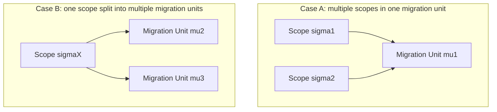

# Scope vs Migration Unit

## 1. 問題設定

`01_Scope-Core-Definition.md` は、解析・保証適用・判断の対象としての `Scope` を定義した。`05_Scope-vs-Guarantee-Unit.md` は、`Scope` と `Guarantee Unit` を区別し、対象範囲と評価単位が同一ではないことを示した。しかし移行研究では、なお一つの混同が残る。すなわち、**分析対象として切り出された `Scope`** と、**実際に移行実行・パッケージング・カットオーバーに載せられる単位** を同一視する混同である。

この混同が危険なのは、構造的に一貫した分析対象が、そのままでは運用上・実行上の単位にならないことがあるからである。依存閉包としては安定した `Scope` であっても、リリース境界、共有データ、運用時間窓、外部インタフェース、責務分割の都合により、単一の実行単位としては成立しないことがある。逆に、運用上ひとまとめに切り替えるしかない単位が、分析上は複数の異質な `Scope` を束ねてしまうこともある。

したがって本稿の目的は、**analysis unit** と **execution unit** を明示的に分離し、`Scope` と `Migration Unit` の不一致を、移行リスクの偶然的副作用ではなく **構造的源** として定義することである。

## 2. Scope の再確認

`Scope` \( \sigma \) は、構造解析・保証適用・移行判断のために採用される **有界な意味的対象領域** であり、

\[
\sigma = \langle T_\sigma, B_\sigma, P_\sigma \rangle
\]

として与えられる。ここで \( T_\sigma \) は対象集合、\( B_\sigma \) は境界条件、\( P_\sigma \) は AST / CFG / DFG / Guarantee / Decision などの各ビューへの射影族である。

`Scope` の役割は、**何を分析対象とみなし、どこまでを内部とし、どの観点で読むか** を固定することである。ゆえに `Scope` は本質的に **analytical scope** であり、対象の構造的一貫性を与えるが、それ自体は実行計画やリリース順序を直接には定めない。

## 3. Migration Unit の形式的定義

`Migration Unit` \( \mu \) を、移行における **実務的・運用的な実行単位** として定義する。これは、単にコード片の集合ではなく、**一つの移行ステップとして実行・切替・検証・回復手順を束ねられる単位** である。

最小の形式として、

\[
\mu = \langle E_\mu, C_\mu, O_\mu \rangle
\]

と置く。ここで、

- \( E_\mu \) は、その単位として一括実行される成果物・変換操作・配備対象の集合
- \( C_\mu \) は、同時実行・順序・依存・切替窓を規定する **packaging constraints**
- \( O_\mu \) は、切替、ロールバック、観測、運用責任を含む **operational commitments**

を表す。

この定義の要点は、`Migration Unit` が **「何を対象として理解するか」** ではなく、**「何を一つの実行単位として動かせるか」** を定める点にある。したがって `Migration Unit` は **migration execution unit** である。

## 4. 中核的差異

`Scope` と `Migration Unit` の差異は次のように要約できる。

| 観点 | Scope | Migration Unit |
|------|-------|----------------|
| 基本役割 | **analytical scope**：対象領域の意味的・構造的境界を固定する | **migration execution unit**：移行の実行・切替・運用の単位を固定する |
| 主な問い | 何を同一の分析対象として扱うべきか | 何を一括して安全に実行・配備・切替できるか |
| 整合条件 | 境界・射影・依存の説明可能性 | packaging constraints・切替条件・運用責務の実行可能性 |
| 失敗の典型 | 境界曖昧、依存閉包欠落、分析的一貫性の崩壊 | 配備不能、切替不能、ロールバック不能、運用窓超過 |

- **analysis unit** は、対象を理解し、評価し、判断するための単位である。
- **execution unit** は、その判断を実際の移行ステップに落とすための単位である。

両者は関係するが、前者の整合がそのまま後者の実行可能性を保証するわけではない。

## 5. Scope Mismatch

`Scope mismatch` とは、分析上採用された `Scope` と、実行上必要となる `Migration Unit` の境界・粒度・束ね方が一致しないことである。この不一致は両方向に起こりうる。

### 5.1 分析スコープの方が小さい場合

分析上は局所 `Scope` \( \sigma \) が十分に見えても、実際の移行ではそれを単独で切り出せない場合がある。典型例は、共有データ、切替時点の整合性、共通ジョブ制御、外部契約が局所 `Scope` の外にある場合である。このとき必要な `Migration Unit` \( \mu \) は、\( \sigma \) より広くならざるをえない。

すなわち、**分析単位は局所化できても、実行単位は原子的に大きくなる**。

### 5.2 分析スコープの方が大きい場合

逆に、分析上は一つの大きな `Scope` として扱うのが自然でも、実行ではそれを複数の `Migration Unit` に分割しなければならないことがある。理由は、停止時間制約、段階導入、平行稼働、運用責務の分離、テストゲートの段階化などである。

このとき、**構造的には一体の対象** が、実行上は複数ステップに裂かれる。

### 5.3 mismatch の意味

重要なのは、mismatch が設計ミスの徴候に限られないことである。むしろそれは、**意味的境界** と **運用的境界** が異なる原理で決まることの表現である。したがって mismatch は、移行リスクの偶発事象ではなく、**planning logic が扱うべき一次構造**である。

## 6. Packaging と Cutover への含意

`Migration Unit` は、移行グルーピング、リリースパッケージング、カットオーバー設計に直接関わる。このとき packaging は単なる業務計画ではなく、**どの境界で原子的操作を要求されるか** を決める構造操作である。

- **migration grouping**：複数の `Scope` を一つの `Migration Unit` に束ねると、分析的には異質な対象が同時切替を要求される。
- **release packaging**：一つの `Scope` を複数のパッケージに分けると、境界内の依存と保証が時間差で露出する。
- **cutover design**：切替境界は `Scope` の境界と一致するとは限らない。むしろ切替可能性は、`C_\mu` と `O_\mu` の整合で決まる。

cutover feasibility は、単にコードが変換可能かどうかではなく、**一時的な混在状態・ロールバック可能性・外部契約維持** を含めて判定される。したがって `Scope` が well-formed であっても、それが直ちに **cutover-feasible** とはいえない。

## 7. 構造と運用の緊張関係

構造的整合と運用的実行可能性のあいだには、しばしば緊張がある。分析では依存閉包がきれいにまとまり、保証適用の境界も説明できる `Scope` が見つかることがある。しかし、その `Scope` を一括で配備・切替しようとすると、停止時間、外部調整、共有状態同期、運用監視の準備が追いつかないことがある。

### 7.1 Analytical coherence does not guarantee migration executability

**Analytical coherence does not guarantee migration executability.**

これは、`Scope` が分析理論の観点で一貫していることと、`Migration Unit` が運用理論の観点で実行可能であることが、**別の成立条件** に従うことを意味する。

- `Scope` の coherence は、境界・依存・射影の整合に依存する。
- `Migration Unit` の executability は、同時切替可能性、ロールバック可能性、責務分担、時間窓、外部契約維持に依存する。

ゆえに、**structural coherence** と **operational feasibility** は乖離しうる。構造上よい切り方が、運用上よい切り方である保証はない。

## 8. 移行判断上の意義

この区別を無視すると、feasibility judgment は二重に崩れる。

1. **過小評価**：局所 `Scope` をそのまま `Migration Unit` とみなし、実行時に必要な外部依存・切替条件・運用負荷を落とす。
2. **過大評価**：運用都合で大きく束ねた単位を、そのまま分析対象とみなし、構造的異質性を見逃す。

したがって migration planning logic は、少なくとも次の二段階を区別しなければならない。

1. **analytical scoping**：何を一つの意味的対象として評価するかを定める。
2. **execution packaging**：それをどの単位で配備・切替・回復するかを定める。

両者の対応は自明ではなく、mismatch を明示的に記述すること自体が、移行判断の健全性条件になる。

## 9. Mermaid 図

## 10. 暫定結論

本稿は、`Scope` を **analytical scope**、`Migration Unit` を **migration execution unit** として区別した。前者は対象の意味的・構造的境界を与え、後者は移行の実行・配備・切替・回復の単位を与える。両者はしばしば一致しない。とりわけ `Scope mismatch` は、analysis と execution の間にある偶然的なズレではなく、**migration planning logic が明示的に扱うべき構造差** である。

この区別により、後続の impact、verification、closure の議論においても、**何を分析しているのか** と **何を一括実行できるのか** を混線させずに接続できる。
