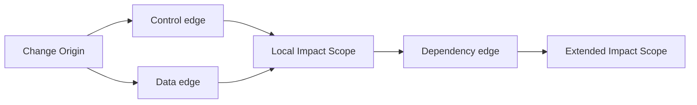

# Impact Scope and Propagation

## 1. 問題設定

変更影響分析は、しばしば「どのノードが影響を受けるか」という列挙問題として記述される。しかし、`Scope Theory` の観点から見るならば、この記述は不十分である。理由は、影響が単独ノードに静止して存在するのではなく、**構造関係を通じて伝播し、その到達範囲が一つの意味的領域を成す** からである。

`03_Scope-Boundary-Model.md` は境界条件を、`04_Scope-Composition-and-Containment.md` は `Scope` 間の構造関係を定義した。これに続く本稿では、変更の起点から始まる伝播が、どのように control / data / dependency 構造を横断し、結果として **Impact Scope** を形成するかを定義する。

この形式化が必要なのは、影響分析を単なる参照数やテキスト一致に還元すると、伝播の意味が失われるからである。変更が影響を及ぼすのは、文字列が似ているからではなく、**構造的に到達可能であり、かつ意味的に依存している** からである。したがって impact analysis には、`Scope` の語彙が必要である。

## 2. 中心命題

本稿の中心命題は次の通りである。

> **影響とは、変更起点から構造的に伝播して形成される到達領域であり、単なる影響ノードの平坦な一覧ではなく、一つの `Scope` を持つ現象である。**

この命題の要点は二つある。

1. 影響は、起点と無関係なノードの集まりではなく、**propagation path** によって結ばれた領域である。
2. その領域は境界を持ち、局所影響・拡張影響・閉包条件を伴うため、`Scope` として表現されるべきである。

### 2.1 Impact は平坦な影響物一覧ではなく、Scope を持つ現象である

影響を「変更に関係しそうな要素の集合」とだけみなすと、なぜその要素が含まれるのか、どこまでを境界とみなすのか、どの経路を通って到達したのかが消える。`Impact` は、**起点・経路・到達・境界** を備えた構造現象であり、したがって `Scope` として記述されなければならない。

## 3. Change Origin

**Change Origin** \( o \) とは、変更影響が出発する最小の構造起点である。これは単なる編集箇所の文字位置ではなく、意味的に識別可能な構造要素でなければならない。たとえば文、条件分岐、データ定義、呼出点、インタフェース境界、共有状態更新点などが `Change Origin` になりうる。

最小形として、`Change Origin` を

\[
o \in U
\]

と置く。ただし \( U \) は意味的に関連する成果物・関係の宇宙である。`Change Origin` が妥当であるためには、少なくとも次の条件が必要である。

- **構造的同定可能性**：AST / CFG / DFG / dependency graph のいずれかにおいて節点または関係として識別できる。
- **意味的有効性**：その変更が下流の振る舞い・依存・保証に差を生みうる。
- **境界帰属可能性**：どの `Scope` の内部で生じた変更かを記述できる。

ゆえに `Change Origin` は、編集座標ではなく、**伝播を開始しうる意味的な出発点** である。

## 4. Propagation Path

**Propagation Path** とは、`Change Origin` から他の構造要素へ影響が伝わるとみなされる構造経路である。任意の二要素 \( x, y \in U \) に対し、

\[
x \leadsto y
\]

を、\( x \) の変更が構造関係を通じて \( y \) に影響を及ぼしうることを表す基本伝播関係とする。

このとき propagation path は、

\[
o = v_0 \leadsto v_1 \leadsto \cdots \leadsto v_n = x
\]

のような有限列として与えられる。

伝播を駆動する主要な構造関係は次の三つである。

- **control propagation**：分岐条件、到達可能性、反復、呼出連鎖を通じて制御挙動が変化する。
- **data propagation**：定義使用関係、共有状態、レコード構造、値依存を通じてデータ意味が変化する。
- **dependency propagation**：モジュール依存、外部契約、インタフェース責務、共有資源依存を通じて影響が広がる。

重要なのは、propagation path が単なる辺の接続ではなく、**意味的に有効な structural reachability** を表すことである。すなわち、経路が存在しても、その経路が影響の媒体として解釈不能ならば、影響伝播とはみなさない。

## 5. Reachability

影響における **reachability** は、起点からの単純なグラフ到達ではなく、影響媒体として妥当な経路に制限された **structural reachability** である。

`Change Origin` \( o \) から到達可能な要素全体を、

\[
\mathcal{R}_{imp}(o) = \{ x \in U \mid \exists \text{ propagation path } o \leadsto^* x \}
\]

として定義する。ただし \( \leadsto^* \) は、control / data / dependency 関係に基づく伝播の推移閉包である。

この定義で重要なのは、到達可能性が次の二重条件を持つことである。

1. **構造的条件**：何らかの有効な path が存在すること
2. **意味的条件**：その path が振る舞い・値・依存責務の差を媒介しうること

したがって、reachability は「参照があるか」より強く、「変更差分がどこまで伝わりうるか」を述べる。

## 6. Impact Scope

**Impact Scope** \( \sigma_{imp}(o) \) を、`Change Origin` \( o \) から意味的に有効な伝播によって到達された領域として定義する。形式的には、

\[
\sigma_{imp}(o) = \langle T_{imp}(o), B_{imp}(o), P_{imp}(o) \rangle
\]

と置く。

ここで、

- \( T_{imp}(o) \subseteq \mathcal{R}_{imp}(o) \) は、影響対象として採用される要素集合
- \( B_{imp}(o) \) は、どこまでを影響内とみなし、どこからを外部露出・未閉包・未確定領域とみなすかを定める境界条件
- \( P_{imp}(o) \) は、影響を control / data / dependency / decision の各観点から読むための射影族

を表す。

`Impact Scope` は、単なる reachable set ではない。reachable set のうち、**意味的に関連し、境界づけられ、分析可能な領域** が `Impact Scope` である。ゆえに `Impact Scope` は、影響の計数結果ではなく、**変更差分が占有する分析領域** を表す。

### 6.1 control、data、dependency が Impact Scope をどう駆動するか

- **control** は、経路の可達性や分岐結果の変化を通じて影響を広げる。条件変更は、局所文を超えて実行経路全体を変える。
- **data** は、値の生成・変換・参照を通じて影響を広げる。データ定義やレコード構造の変更は、使用点へと連鎖する。
- **dependency** は、呼出・共有資源・契約面を通じて影響を広げる。局所実装の変更が、外部モジュールや運用前提まで到達することを可能にする。

この三者は独立ではなく、相互に重なりながら `Impact Scope` の境界を押し広げる。

## 7. Local vs Extended Impact Scope

影響範囲は一様ではない。少なくとも次の二層を区別する必要がある。

### 7.1 Local Impact Scope

**Local Impact Scope** \( \sigma_{loc}(o) \) は、`Change Origin` の近傍にある即時影響領域である。典型的には、

- 同一構文単位
- 直接の制御分岐先
- 直接の def-use 接続
- 同一モジュール内の直近依存

など、1 ステップまたは低深度の伝播で到達する領域を含む。

最小形として、

\[
\sigma_{loc}(o) = \langle T_{loc}(o), B_{loc}(o), P_{loc}(o) \rangle
\]

と置き、\( T_{loc}(o) \) は低深度の propagation path によって到達される要素集合とする。ここで local とは「近い」という印象語ではなく、**伝播深度と媒介関係が限定された影響領域** を指す。

### 7.2 Extended Impact Scope

**Extended Impact Scope** \( \sigma_{ext}(o) \) は、推移的伝播を含めた拡張影響領域であり、

\[
T_{loc}(o) \subseteq T_{ext}(o)
\]

を満たす。ここでは局所変更が、呼出連鎖、共有データ、外部契約、検証責務、移行パッケージ境界へと波及する。

同様に、

\[
\sigma_{ext}(o) = \langle T_{ext}(o), B_{ext}(o), P_{ext}(o) \rangle
\]

と置くことができる。`extended` は、単に広いという意味ではなく、**推移閉包により意味的責務が押し広げられた領域** を表す。

局所影響だけを見ると安全に見える変更でも、拡張影響まで追うと **Migration Unit** や verification planning に効くことがある。したがって extended impact を無視した分析は、局所的には正しいが移行判断としては不十分である。

local と extended の区別は、影響分析の粒度制御にも対応する。前者は即時検討・差分理解に向き、後者は packaging・verification・feasibility judgment に向く。

## 8. Impact Closure

**Impact Closure** とは、`Impact Scope` がそれ以上の有意な伝播先を残さず、影響領域として閉じたとみなせる条件である。

`Impact Scope` が閉じたとみなせるためには、少なくとも次が必要である。

1. **伝播飽和**：既知の control / data / dependency 関係に基づく到達が安定している。
2. **境界明示**：外部へ露出する依存、契約、観測点が `B_{imp}` に記述されている。
3. **未確定領域の隔離**：追跡不能・情報不足・外部ブラックボックスがある場合、それが閉包外として明示されている。

影響閉包は、「すべてを含んだ」という意味ではない。むしろ、**どこまでを含み、どこから先は未確定または外部か** が安定して記述された状態を指す。

## 9. 移行判断上の意義

`Impact Scope` は、risk、packaging、verification、feasibility に直接関わる。

- **risk**：`Impact Scope` が広いほど、変更が到達しうる責務面と失敗面が増え、構造的リスクは上がる。
- **packaging**：拡張影響が複数 `Scope` や複数 `Migration Unit` を跨ぐなら、変更は単独パッケージとして切れない可能性がある。
- **verification**：検証対象は local impact ではなく、少なくとも必要な extended impact まで届かなければならない。
- **feasibility**：局所変更に見えても、`Impact Scope` が大きく閉じないなら、実行コストや cutover complexity が上がり、移行実現可能性は下がる。

この意味で `Impact Scope` は、単なる変更後確認の範囲ではない。**どこまでの変更を一つの判断対象とみなすか** を与えるため、`60_decision` における structural risk や feasibility reasoning への橋渡し概念になる。

## 10. Mermaid 図

## 11. 暫定結論

本稿は、変更影響を `Change Origin` から始まる構造的伝播として定義し、その到達領域を **Impact Scope** として形式化した。影響は単なる参照一覧ではなく、control / data / dependency によって駆動される **structural reachability** の結果であり、局所影響と拡張影響、さらに閉包条件を持つ。

この基盤により、後続の verification、closure、AST / CFG / DFG への写像において、**変更がどこまで広がるか** を `Scope` の語彙で安定して論じることができる。
