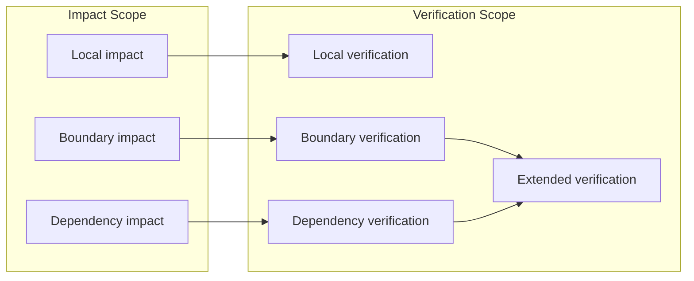

# Verification Scope

## 1. 問題設定

検証は、しばしば「どれだけテストを実行したか」や「いくつのケースを通したか」という活動量で語られる。しかし `Scope Theory` の観点では、この記述は不十分である。なぜなら、検証の妥当性は件数ではなく、**どの対象領域に対して証拠を集め、どの境界までを確認したか** に依存するからである。

`50_guarantee` は保証主張の観点集合と強度を定義し、`60_decision` は検証を判断正当化の手続として扱った。さらに `07_Impact-Scope-and-Propagation.md` は、変更影響が `Impact Scope` を形成することを示した。これに続く本稿では、**どの範囲に対して検証証拠が必要または十分とされるのか** を `Verification Scope` として形式化する。

ここで扱う verification は、一般的な testing coverage とは異なる。問題は「何件試験したか」ではなく、**保証支援と移行判断の妥当性を支えるために、どこまでを確認すべきか** である。したがって verification には独自の `Scope` 概念が必要である。

## 2. 中心命題

本稿の中心命題は次の通りである。

> **検証は、適切に定義された target scope に対してのみ妥当であり、検証信頼は絶対的な性質ではなく、常にその scope に束縛される。**

この命題には三つの含意がある。

1. 同一の証拠でも、適用される `Verification Scope` が変われば意味が変わる。
2. 十分な検証とは、活動量ではなく、必要な境界と依存を含む対象領域に対して証拠が整っていることである。
3. したがって verification confidence は「高い / 低い」という絶対値ではなく、**どの `Scope` に対して成立しているか** で述べられる。

### 2.1 Verification confidence is scoped, not absolute

**Verification confidence is scoped, not absolute.**

ある局所変更に対して十分な証拠が揃っていても、それは局所 `Verification Scope` における confidence を意味するにすぎない。依存境界や外部契約まで含む拡張領域に対して同じ confidence が成立するとは限らない。

## 3. Verification Scope の形式的定義

**Verification Scope** \( \sigma_{ver} \) を、証拠収集と妥当性確認の対象として採用される検証領域として定義する。`Scope Theory` と整合させて、

\[
\sigma_{ver} = \langle T_{ver}, B_{ver}, P_{ver} \rangle
\]

と置く。

ここで、

- \( T_{ver} \) は、検証対象として扱われる成果物・関係・振る舞い観測点の集合
- \( B_{ver} \) は、どこまでを検証内とし、どこからを前提・外部・未検証領域とみなすかを定める境界条件
- \( P_{ver} \) は、同一対象を機能・構造・依存・判断証拠の各観点で読むための射影族

を表す。

`Verification Scope` の役割は、「どこで証拠を集め、どこまでを確認済みとみなし、どこから先を未確認または外部前提とみなすか」を固定することである。ゆえに `Verification Scope` は、テストケースの集合ではなく、**証拠が意味を持つ対象領域** を記述する。

## 4. Verification Scope の類型

検証範囲は一様ではない。少なくとも次の四類型を区別する必要がある。

### 4.1 Local Verification Scope

**Local Verification Scope** \( \sigma_{ver}^{loc} \) は、変更点や対象単位の近傍に限定された検証領域である。典型的には、同一文、同一ルーチン、同一局所制御分岐、同一データ変換単位が含まれる。

この類型は、局所変換の整合、単位レベルの回帰、直近の def-use 整合確認に向く。ただし局所で十分に見えても、境界横断や依存伝播を捉えきれないことがある。

### 4.2 Boundary Verification Scope

**Boundary Verification Scope** \( \sigma_{ver}^{bnd} \) は、`Scope` の境界で露出・横断・契約維持を確認する検証領域である。ここでは、内部実装の正しさよりも、

- 何が外部へ露出するか
- どのインタフェース前提が保たれるか
- どこで責務が切り替わるか

が中心になる。

Boundary verification は、局所ロジックが正しくても、境界で意味が壊れる事態を検出するために必要である。

### 4.3 Dependency Verification Scope

**Dependency Verification Scope** \( \sigma_{ver}^{dep} \) は、依存関係を通じて妥当性を確認する検証領域である。対象は、呼出先、共有状態、外部サービス、共通データ定義、横断的副作用などを含む。

この類型は、局所対象そのものではなく、**その対象が依存する構造が変化後も整合するか** を問う。したがって dependency verification は、変更箇所から少し離れた領域に証拠収集を要求する。

### 4.4 Extended Verification Scope

**Extended Verification Scope** \( \sigma_{ver}^{ext} \) は、local / boundary / dependency verification を必要に応じて含む拡張検証領域である。これは、単一の局所単位では妥当性が言い切れない場合に、判断や保証支援のために必要な範囲まで押し広げられた `Verification Scope` を表す。

拡張検証は「広くやること」自体が目的ではない。目的は、必要な保証主張や移行判断に対して **証拠不足が残らない範囲** まで検証領域を定めることである。

## 5. Impact Scope との関係

`Verification Scope` と `Impact Scope` は密接に関係するが、同一ではない。少なくとも次の三つの関係がある。

### 5.1 一致する場合

`Verification Scope` が `Impact Scope` と一致するのは、影響伝播で到達した領域そのものが、検証上も必要十分な対象である場合である。これは、変更影響と証拠要求がほぼ同じ境界を持つ比較的整ったケースである。

### 5.2 超える場合

`Verification Scope` は `Impact Scope` を超えることがある。典型例は、境界検証や依存検証により、直接影響を受けた領域の外にも妥当性確認が必要な場合である。たとえば、影響そのものは局所でも、意思決定の正当化には外部契約維持の証拠が必要になる。

### 5.3 遅れる場合

`Verification Scope` が `Impact Scope` に遅れるとは、影響が到達しているのに、その全域に対して証拠収集が届いていない状態を指す。これは under-verification の典型形であり、局所的な成功が全体の妥当性と誤読される原因になる。

## 6. Evidence Adequacy

**Evidence Adequacy** とは、選定された `Verification Scope` に対して、保証支援または判断正当化に必要な証拠が十分であることをいう。十分性は活動量ではなく、少なくとも次の三条件で評価される。

1. **領域十分性**：必要な \( T_{ver} \) を実際に覆っていること
2. **境界十分性**：\( B_{ver} \) で規定された露出・横断・外部前提が確認されていること
3. **主張整合性**：集めた証拠が、支えたい guarantee support や decision evidence の型に対応していること

### 6.1 Verification Evidence Collection Region

証拠は、検証対象そのものと完全に一致する場所からだけ集まるとは限らない。そこで **Verification Evidence Collection Region** \( E_{ver}(\sigma_{ver}) \) を、`Verification Scope` を支える証拠を実際に収集する領域として定義する。

\[
E_{ver}(\sigma_{ver}) \supseteq T_{ver}
\]

が成り立つことがある。たとえば、対象は局所ルーチンでも、証拠は外部契約テスト、依存先観測、移行前後比較、運用ログなどから集められる。このとき重要なのは、収集領域が広いこと自体ではなく、**必要な主張を支えるように構成されていること** である。

## 7. Under-Verification のリスク

`Under-Verification` とは、選ばれた `Verification Scope` が、実際に支えようとする guarantee や decision を正当化するには狭すぎる状態をいう。これは、単に「まだ試験が足りない」という意味ではなく、**検証対象の境界設定そのものが不足している** 状態である。

このとき次のリスクが生じる。

1. **invalid guarantees**：局所証拠を全体保証へ不当に拡張し、保証主張が無効になる。
2. **weak decision evidence**：意思決定を支えるには範囲が足りず、判断根拠が弱いままになる。
3. **false confidence**：確認済み領域の confidence が、未確認領域にも及ぶかのように誤読される。

false confidence が危険なのは、検証が失敗していないために、むしろ成功したように見える点にある。問題は証拠の有無ではなく、**証拠が支えている scope を誤って広く読んでしまうこと** である。

## 8. 移行判断上の意義

`Verification Scope` は、feasibility、confidence、decision support に直接関わる。

- **feasibility**：必要な `Verification Scope` が極端に広い場合、検証コストと切替複雑性が増し、移行実現可能性は下がる。
- **confidence**：confidence は収集した証拠量ではなく、どの `Verification Scope` に対して adequacy が成立したかで述べられる。
- **decision support**：移行判断は、`Justify(D)` を支える証拠がどの範囲を覆っているかに依存するため、`Verification Scope` は decision evidence の境界を与える。

また、`Verification Scope` は `Guarantee Unit` とも接続する。保証主張がどの単位に帰属するかを `Guarantee Unit` が定めるのに対し、**その主張を支える証拠がどこまで必要か** を `Verification Scope` が定める。したがって verification は、guarantee theory に対する外的補助手続ではなく、**guarantee support の成立範囲を規定する構造概念** である。

## 9. Mermaid 図

## 10. 暫定結論

本稿は、検証証拠が妥当であるための対象領域を **Verification Scope** として形式化した。verification は活動量ではなく、**どの範囲に対して、どの境界まで、どの主張を支える証拠が揃っているか** によって評価される。さらに `Verification Scope` は、local / boundary / dependency / extended という類型を持ち、`Impact Scope` と一致する場合もあれば、超える場合、遅れる場合もある。

この結果、verification confidence は絶対値ではなく scope に束縛された性質であり、under-verification は invalid guarantees と weak decision evidence、そして false confidence を生む構造的原因であることが明確になった。
