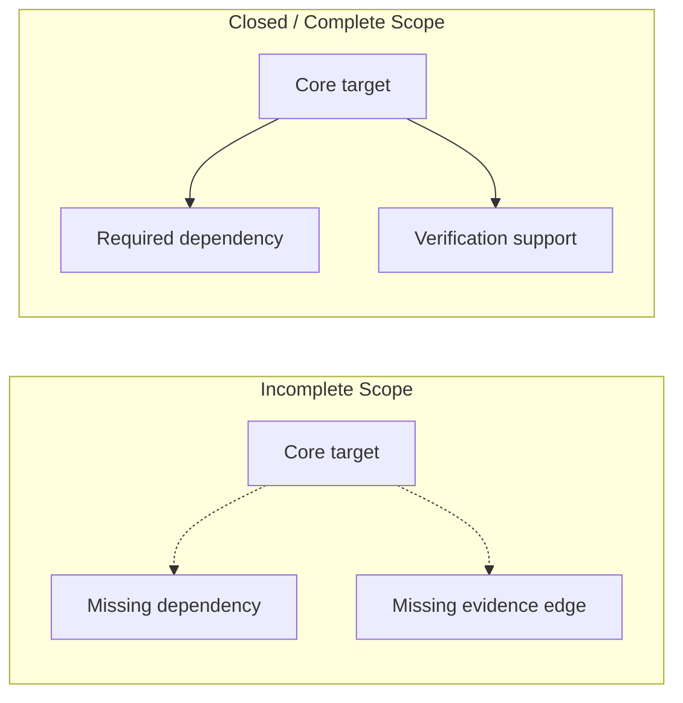

# Scope Closure and Completeness

## 1. 問題設定

`Scope` を定義することは、対象領域を切り出すための必要条件ではあるが、十分条件ではない。`01_Scope-Core-Definition.md` は `Scope` を有界な意味的対象領域として定義し、`03_Scope-Boundary-Model.md` は境界条件を、`04_Scope-Composition-and-Containment.md` は `Scope` 間の構造関係を、`07_Impact-Scope-and-Propagation.md` は影響伝播領域を、`08_Verification-Scope.md` は検証証拠領域を定義した。しかし、なお残る問いは、**その `Scope` が intended analytical use に対して十分か** という問いである。

対象が bounded であることは、単に「どこまでを内側とみなすか」が書かれていることを意味するにすぎない。だが分析・保証帰属・検証・移行判断が健全に成立するためには、その `Scope` が関連構造に対して閉じており、必要な内容を十分に含んでいなければならない。そうでなければ、境界は引かれていても、判断の前提は欠けたままになる。

したがって本稿の目的は、`closure` と `completeness` を `Scope` に対する **adequacy condition** として定義し、bounded な `Scope` がいつ十分であり、いつ不十分であるかを形式化することである。

## 2. 中心命題

本稿の中心命題は次の通りである。

> **`Scope` は、その intended analytical use に対して adequate、closed、かつ sufficiently complete でなければならない。bounded であることだけでは十分ではない。**

この命題には三つの含意がある。

1. `Scope` の adequacy は、サイズではなく **目的に対する十分性** によって決まる。
2. `closure` は、関連する依存・伝播・境界関係に対して、対象が安定して閉じていることを要求する。
3. `completeness` は単一概念ではなく、structural / dependency / guarantee / verification の各目的に対して相対的に定まる。

### 2.1 Scope は bounded であっても inadequate でありうる

**Scope は bounded であっても inadequate でありうる。**

すなわち、境界が明示されていても、その内部に判断に必要な構造や依存や証拠が欠けていれば、その `Scope` は分析対象としては不十分である。boundedness は存在条件であり、adequacy は利用条件である。

## 3. Scope Closure

**Scope Closure** とは、ある `Scope` が、その目的に関連する構造関係および依存関係に対して、意味的に開いた端を残さず閉じている性質である。

`Scope` \( \sigma = \langle T_\sigma, B_\sigma, P_\sigma \rangle \) に対して、closure を目的依存の述語

\[
Closed(\sigma \mid \Pi)
\]

として置く。ここで \( \Pi \) は intended analytical use を表す。`Closed(\sigma \mid \Pi)` が成り立つとは、\( \Pi \) に関係する構造関係 \( R_\Pi \) に対して、`Scope` 内の要素から有意に到達される必要要素が、`Boundary` により明示的に外部化されていない限り、適切に内部へ含まれていることである。

直感的には、closure とは「この `Scope` だけを見れば、その目的に必要な関係の開放端が説明可能である」ことを意味する。

### 3.1 dependency と propagation に対する closure

closure は特に dependency と propagation に明示的に接続される必要がある。`07` で定義した `Impact Scope` は、変更起点からの伝播閉包を扱った。ここでの closure はそれを一般化し、変更影響だけでなく、判断対象として必要な依存関係の切れ目が適切に記述されていることを要求する。

- **dependency closure**：内部要素が依存する重要外部が未記述のまま残っていないこと
- **propagation closure**：有意な伝播経路が境界外へ漏れている場合、それが未考慮ではなく、明示的な外部前提または未完了領域として記述されていること

したがって closure は、単なるグラフ閉包ではなく、**境界を伴う relation-sensitive な閉包** である。

## 4. Structural Completeness

**Structural Completeness** とは、対象 `Scope` が、その intended use に必要な構造内容を十分に含んでいる性質である。

\[
Complete_{struct}(\sigma \mid \Pi)
\]

が成り立つとは、制御構造、主要データ構造、境界露出点、責務単位など、\( \Pi \) に必要な構造要素が欠落なく含まれていることをいう。

重要なのは、structural completeness が「要素数が多い」ことを意味しない点である。必要なのは、**関係解釈に必要な構造差分が欠けていないこと** である。たとえば、局所文だけを抜き出しても、その文を支える制御分岐やデータ定義が欠けていれば、bounded ではあっても structurally complete ではない。

## 5. Dependency Completeness

**Dependency Completeness** とは、対象 `Scope` が、依存関係上重要な要素を十分に含んでいる性質である。

\[
Complete_{dep}(\sigma \mid \Pi)
\]

が成り立つとは、直接依存だけでなく、判断に有意な共有状態、外部契約、共通定義、呼出連鎖が、未説明のまま境界外に漏れていないことをいう。

dependency completeness は、単に「全部の依存を含む」ことではない。目的 \( \Pi \) に無関係な依存まで無制限に含める必要はない。必要なのは、**その目的に対して実質的に依存しているものが落ちていないこと** である。ゆえに dependency completeness も purpose-sensitive である。

## 6. Guarantee Completeness

**Guarantee Completeness** とは、その `Scope` が意味ある guarantee attribution を支えられるだけの内容を含んでいる性質である。

\[
Complete_{g}(\sigma \mid G)
\]

と置き、ここで \( G \) は支えたい保証主張の集合である。`Complete_g` が成り立つとは、ある guarantee を `Scope` に帰属させる際に必要な対象、境界、依存前提が、未説明の空白として残っていないことをいう。

`05_Scope-vs-Guarantee-Unit.md` で示したように、`Scope` は guarantee unit そのものではない。しかし、ある guarantee を「この `Scope` に対して意味を持つ」と言うためには、その主張を支える構造・依存・境界が十分に含まれていなければならない。そうでなければ guarantee attribution は形式上可能でも、実質的には空疎になる。

## 7. Verification Completeness

**Verification Completeness** とは、その `Scope` が十分な verification evidence を支えられるだけの対象領域を持っている性質である。

\[
Complete_{ver}(\sigma \mid \sigma_{ver})
\]

が成り立つとは、必要な `Verification Scope` を支持する対象・境界・依存が、当該 `Scope` 内または明示的外部前提として説明可能であることをいう。

`08_Verification-Scope.md` で定義した evidence adequacy と接続すると、verification completeness は、少なくとも次を要求する。

1. `Verification Scope` を導出するための影響領域が説明できること
2. 必要な boundary / dependency verification が切り落とされていないこと
3. verification evidence collection region がどこに広がるかを説明できること

この意味で verification completeness は、単にテストが存在することではなく、**十分な検証を支える対象領域が閉じていること** を意味する。

## 8. Decision Adequacy

**Decision Adequacy** とは、`closure` と各種 `completeness` が、migration feasibility judgment を支えるのに十分である状態をいう。

\[
Adequate_{dec}(\sigma) \Rightarrow Closed(\sigma \mid \Pi_{dec}) \land Complete_{struct} \land Complete_{dep} \land Complete_{g} \land Complete_{ver}
\]

ここで \( \Pi_{dec} \) は判断目的を表す。重要なのは、decision adequacy が最も要求水準の高い adequacy condition になりやすいことである。なぜなら、移行判断は構造理解、依存理解、保証支援、検証十分性を同時に必要とするからである。

false feasibility judgment が生まれるのは、bounded な `Scope` を、そのまま adequate な decision target と誤認したときである。構造や依存や検証範囲が欠けていれば、理論上「移行可能」に見えても、それは不完全な対象に対する過度に楽観的な判断である。

## 9. Incomplete Scope のリスク

不完全な `Scope` は、理論的にも実務的にも危険である。少なくとも次のリスクがある。

1. **分析錯誤**：structural completeness が不足し、対象の意味解釈そのものが歪む。
2. **依存漏れ**：dependency completeness が不足し、影響伝播や cutover 条件を過小評価する。
3. **保証の空洞化**：guarantee completeness が不足し、保証帰属が見かけ上だけ成立する。
4. **検証の虚偽安定**：verification completeness が不足し、under-verification に基づく false confidence が生じる。
5. **false feasibility judgment**：closure や completeness が欠けた対象に対して、移行実現可能性を過大評価する。

### 9.1 どのような Scope が判断に不十分か

判断に不十分な `Scope` とは、bounded ではあっても、次のいずれかを満たす `Scope` である。

- 主要な依存が境界外に漏れたまま説明されていない
- 影響伝播が外部へ伸びているのに propagation closure が取れていない
- guarantee attribution を支える前提が対象内に含まれていない
- verification adequacy を支える範囲が対象内に収まらず、しかも外部前提としても明示されていない

このような `Scope` は、分析対象として存在はしても、判断対象としては inadequate である。

## 10. Mermaid 図

## 11. 暫定結論

本稿は、`Scope` の adequacy condition として `closure` と `completeness` を定義した。`Scope` は bounded であるだけでは不十分であり、用途に応じて closed であり、structural / dependency / guarantee / verification の各観点で sufficiently complete でなければならない。

この結果、`Scope` の adequacy はサイズや coverage percentage ではなく、**関係と目的に対する十分性** によって評価されることが明確になった。とくに不完全な `Scope` は false feasibility judgment を生み、保証・検証・判断のすべてを不安定化させる。
