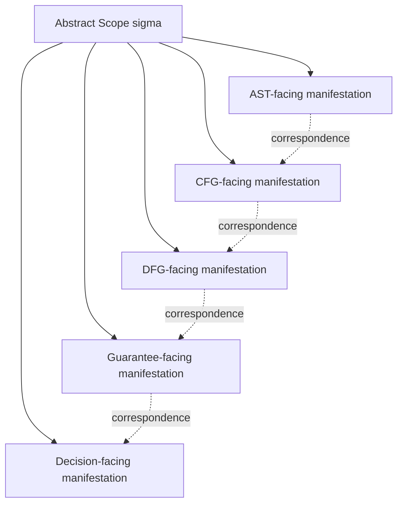

# Scope Mapping to AST CFG DFG

## 1. 問題設定

Phase 6 の `Scope Theory` は、`Scope` を有界な意味的対象領域として定義し、その境界、関係、影響、検証、adequacy condition を整備してきた。しかし、それだけではまだ不十分である。理由は、本研究プロジェクトが単一モデルの理論ではなく、AST、CFG、DFG、Guarantee、Decision という複数の構造モデルを横断して推論を行うからである。

もし `Scope` を各モデルへ写像しなければ、AST における対象範囲、CFG における到達範囲、DFG における依存範囲、Guarantee における適用範囲、Decision における判断範囲が、別々の局所概念として漂うことになる。その結果、同じ変更・同じ保証・同じ判断を論じているつもりでも、各層が実際には異なる対象を見ているという不整合が生じる。

したがって本稿の目的は、`Scope` を **theory-level** では一貫した概念として保ちつつ、AST / CFG / DFG / Guarantee / Decision の各層で **どのように異なって現れるか** を写像関係として定式化することである。

## 2. 中心命題

本稿の中心命題は次の通りである。

> **`Scope` は principle 上は model-invariant であるが、その manifestation は model-specific である。**

この命題は、すべてのモデルが同一の表現形式で `Scope` を持つことを意味しない。むしろ逆である。`Scope` は理論上は同一の対象領域の境界づけを表すが、

- AST では構文的包摂と粒度として現れ、
- CFG では制御到達と分岐構造として現れ、
- DFG では依存・値伝播構造として現れ、
- Guarantee では適用可能性と被覆として現れ、
- Decision では判断境界と証拠範囲として現れる。

### 2.1 Model-specific manifestation and theory-level invariance

**Model-specific manifestation and theory-level invariance** とは、`Scope` が理論レベルでは同一の意味的対象を保ちながら、各モデルの語彙に応じて異なる仕方で可視化されることをいう。

したがってここで重要なのは **equivalence** ではなく **correspondence** である。AST 上の `Scope` 表現、CFG 上の `Scope` 表現、DFG 上の `Scope` 表現は、同一形ではない。しかし、それらは一つの抽象 `Scope` を異なる観測モデルへ投影した結果として、相互に対応づけられる。

## 3. AST における Scope

AST-facing `Scope` は、syntax-oriented tree structure において、**どの構文部分木または部分森が対象として採用されるか** という形で現れる。ここで `Scope` は、単なるノード集合ではなく、構文粒度と包含関係の中で意味的に解釈される対象領域である。

AST における `Scope` の特徴は次のとおりである。

- **粒度可視性**：文、段落、節、ルーチンなど、どの単位で対象を区切るかが明示される。
- **containment 可視性**：`04` で定義した containment / nesting が、部分木包含として比較的直観的に観測できる。
- **境界の近似性**：AST 境界は可視だが、それがそのまま意味的境界とは限らない。

このため AST-facing `Scope` は、`Scope` の最も見えやすい manifestation ではあるが、最も十分な manifestation ではない。AST は **何が構文上まとまっているか** を示すが、**何が意味上十分か** を単独では保証しない。

## 4. CFG における Scope

CFG-facing `Scope` は、control reachability と branching structure において、**どの制御経路、到達領域、分岐責務が対象範囲に含まれるか** という形で現れる。

ここで `Scope` は、単なるノード列ではなく、**制御上の有意な閉包** として読まれる。ある対象が CFG-facing `Scope` として意味を持つためには、少なくとも次が必要である。

- 主要な到達経路が説明可能であること
- 分岐の入口と出口が境界条件に照らして解釈できること
- ループ、条件分岐、例外的脱出が責務面として整理されていること

AST では局所に見える対象でも、CFG ではその影響が広く開くことがある。したがって CFG-facing `Scope` は、`07` の `Impact Scope` や `09` の closure と特に強く結びつく。ここで `Scope` は、**どこまで制御上の影響と責務を追うべきか** の manifestation である。

## 5. DFG における Scope

DFG-facing `Scope` は、dependency と data propagation の構造において、**どの値依存、定義使用関係、共有状態、データ意味が対象範囲に含まれるか** という形で現れる。

DFG の観点では、`Scope` は空間的近さではなく、**依存連鎖の意味的近さ** によって現れる。ここで重要なのは次の点である。

- 局所構文境界を越えて、値の生成元と使用先がつながること
- レコード構造、共有状態、別名、外部 I/O が対象範囲を押し広げうること
- `07` の propagation と `09` の dependency completeness が、この層で最も強く現れること

したがって DFG-facing `Scope` は、`Scope` の dependence-sensitive manifestation である。AST や CFG で見える境界よりも、DFG ではしばしば広い意味的連鎖が対象になる。

## 6. Guarantee 理論における Scope

Guarantee-facing `Scope` は、guarantee applicability と coverage を枠づける manifestation である。`05_Scope-vs-Guarantee-Unit.md` で示したように、`Scope` は Guarantee Unit そのものではない。しかし、どの guarantee がどの対象範囲に意味を持つか、どこまでを被覆できているかは、`Scope` を介してしか安定に述べられない。

Guarantee 理論における `Scope` の働きは次のとおりである。

- **applicability framing**：ある guarantee 主張が、どの意味的対象に対して適用可能かを定める
- **coverage framing**：適用された guarantee が、対象のどの部分を支えているかを定める
- **attribution constraint**：guarantee attribution に必要な前提・依存・境界を固定する

この層での `Scope` は、対象を graph として見るよりも、**どの主張がどの広がりに対して成立するか** という評価射程として現れる。

## 7. Decision 理論における Scope

Decision-facing `Scope` は、feasibility、evidence、judgment boundary を枠づける manifestation である。`06_Scope-vs-Migration-Unit.md` は分析対象と実行単位を区別し、`08_Verification-Scope.md` は証拠範囲を、`09` は decision adequacy を定義した。これらを通じて、Decision 理論における `Scope` は、**何に対して判断が下され、どの証拠がその判断を支えるか** を定める。

Decision-facing `Scope` の特徴は次のとおりである。

- **judgment boundary**：どの対象を一つの判断単位として扱うかを定める
- **evidence sufficiency**：どの evidence scope が必要かを定める
- **feasibility framing**：移行可能性・リスク・cutover 条件を、どの広がりに対して問うかを定める

この層では `Scope` は、単なる構造観測対象ではなく、**判断の妥当性条件を支える対象範囲** として現れる。

## 8. Cross-Model Correspondence

各モデル間の写像は、同型や単純な等価ではなく correspondence として理解されるべきである。抽象 `Scope`

\[
\sigma = \langle T_\sigma, B_\sigma, P_\sigma \rangle
\]

に対して、各モデルへの manifestation を

\[
M_{ast}(\sigma),\; M_{cfg}(\sigma),\; M_{dfg}(\sigma),\; M_{g}(\sigma),\; M_{d}(\sigma)
\]

と書くことができる。ここで各 \( M_x \) は同一表現を返す必要はなく、むしろ各層の構造語彙に応じて **異なる可視化** を返す。

cross-model correspondence が成立するためには、少なくとも次が必要である。

1. **対象整合**：各 manifestation が同じ抽象対象 \( T_\sigma \) を別様に見ていること
2. **境界整合**：各層での境界読みが、互いに矛盾しないこと
3. **目的整合**：保証・検証・判断で使う manifestation が、意図した analytical use に対して整合していること

この correspondence は、AST -> CFG -> DFG -> Guarantee -> Decision の一方向射影ではなく、**相互制約的な整合関係** である。たとえば DFG で見える依存の開きが、AST で切られた局所 `Scope` の adequacy を再評価させることがある。

## 9. 移行判断上の意義

cross-model scope alignment は、reliable migration reasoning に不可欠である。理由は、移行判断が単一モデルに依存しないからである。

- AST だけに依拠すると、構文的にまとまって見える対象を過大評価する。
- CFG だけに依拠すると、制御責務は見えるが保証被覆や証拠要求が薄くなる。
- DFG だけに依拠すると、依存連鎖は見えるが判断単位としてのまとまりを失うことがある。
- Guarantee / Decision だけに依拠すると、主張と判断は述べられても、構造的基盤が空洞化する。

したがって reliable migration reasoning には、各モデルでの `Scope` manifestation を整列させ、**どのモデルで何が見えており、どこで境界がずれているか** を意識化する必要がある。この alignment が取れて初めて、feasibility、verification、packaging、guarantee attribution が互いに矛盾しない。

## 10. Mermaid 図

## 11. 暫定結論

本稿は、`Scope` を AST / CFG / DFG / Guarantee / Decision の各モデルへ写像し、`Scope` が principle 上は model-invariant でありながら、manifestation においては model-specific であることを示した。ここで重要なのは equivalence ではなく correspondence であり、各層は一つの抽象 `Scope` を異なる仕方で可視化している。

この統合により、Phase 6 は `Scope Theory` を単独理論として閉じるのではなく、後続の構造フェーズへ接続する橋を与えた。今後 AST / CFG / DFG 側を精緻化するときも、`Scope` はそれらを横断して対象整合を保つ基底概念として機能する。
