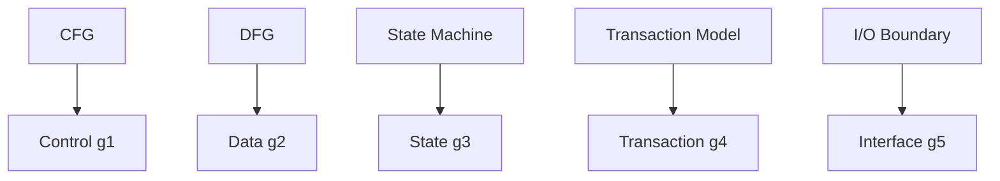

# 01. Guarantee Vector

**Phase 4: Migration Geometry**  
**Document ID:** `docs/80_geometry/01_Guarantee_Vector.md`  
**Date:** 2026-03-05

---

## 1. Introduction

Phase 4 elevates Guarantee theory to a Geometry Model. The first step is to represent guarantees as a **vector**—a numerical encoding of preservation degree across multiple dimensions.

---

## 2. Formal Definition

### 2.1 Guarantee Vector

For a Program Transformation T:

$$
G(T) = (g_1, g_2, g_3, g_4, g_5)
$$

Each $g_i \in [0, 1]$ represents the degree of preservation.

### 2.2 Dimension Semantics and Structural Origin (Guarantee Axis Theory)

| Axis | Meaning | Structural Origin |
| :--- | :--- | :--- |
| $g_1$ (Control) | Control Flow Preservation | CFG |
| $g_2$ (Data) | Data Flow Preservation | DFG |
| $g_3$ (State) | State Transition Preservation | State Machine |
| $g_4$ (Transaction) | Transaction Boundary Preservation | Transaction Model |
| $g_5$ (Interface) | External Interface Preservation | I/O Boundary |

Each axis has a **structural origin**—the program structure from which the guarantee is derived. See `09_Guarantee_Axis_Theory.md` for details.

### 2.3 Value Domain

$0 \le g_i \le 1$. Interpretation: 1 = fully preserved, 0 = destroyed.

---

## 3. Conclusion

The Guarantee Vector provides a numerical fingerprint of transformation preservation quality. It is the foundation for the continuous geometry model in Phase 4.
