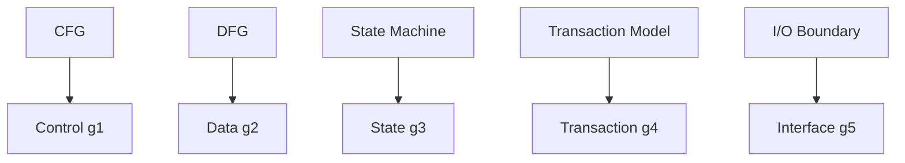

# 01. 保証ベクトル (Guarantee Vector)

**Phase 4: Migration Geometry**  
**Document ID:** `docs/80_geometry/01_Guarantee_Vector.md`  
**Date:** 2026-03-05

---

## 1. はじめに

Phase 4 では、保証理論を幾何学モデルへと昇華させる。最初のステップは、保証を **ベクトル** として表現することである。これは、複数の次元にわたる保存度を数値的にエンコードしたものである。

---

## 2. 形式的定義

### 2.1 保証ベクトル

プログラム変換 T に対して：

$$
G(T) = (g_1, g_2, g_3, g_4, g_5)
$$

各 $g_i \in [0, 1]$ は保存度を表す。

### 2.2 次元の意味論と構造的起源 (保証軸理論)

| 軸 | 意味 | 構造的起源 |
| :--- | :--- | :--- |
| $g_1$ (Control) | 制御フローの保存 | CFG |
| $g_2$ (Data) | データフローの保存 | DFG |
| $g_3$ (State) | 状態遷移の保存 | State Machine |
| $g_4$ (Transaction) | トランザクション境界の保存 | Transaction Model |
| $g_5$ (Interface) | 外部インターフェースの保存 | I/O Boundary |

各軸は **構造的起源** を持つ。すなわち、その保証が導出されるプログラム構造である。詳細は `09_Guarantee_Axis_Theory.md` を参照。

### 2.3 値域

$0 \le g_i \le 1$。解釈：1 = 完全に保存、0 = 破壊。

---

## 3. 結論

保証ベクトルは、変換の保存品質の数値的な指紋（フィンガープリント）を提供する。これは、Phase 4 における連続幾何学モデルの基礎となる。
