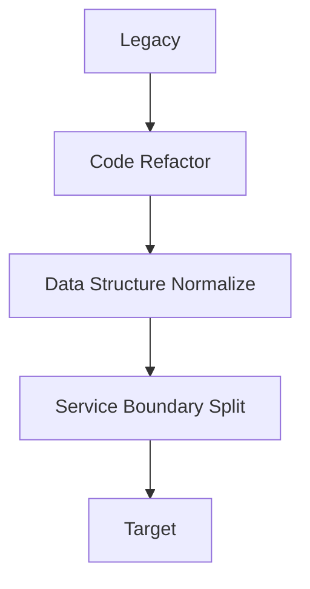

# 05. 移行経路 (Migration Path)

**Phase 4: Migration Geometry**  
**Document ID:** `docs/80_geometry/05_Migration_Path.md`  
**Date:** 2026-03-05

---

## 1. はじめに

移行は **レガシー** から **ターゲット** へのプロセスである。幾何学モデルでは、これは保証空間内の **経路**（曲線）として表現される。

---

## 2. 形式的定義

### 2.1 移行経路

$$
P(t) \in GS \quad t \in [0, 1]
$$

ここで：
- $P(0)$ = レガシー状態（初期保証ベクトル）
- $P(1)$ = ターゲット状態（最終保証ベクトル）

### 2.2 曲線としての経路

$P(t)$ は保証空間内の **連続曲線** である。各 $t$ は中間的な変換状態に対応する。

---

## 3. 経路の例

各ステップは $GS$ 内の点 $P(t_k)$ に対応する。

---

## 4. 経路リスク

$$
Risk(P) = \int_0^1 distance(G(P(t)), Ideal) \, dt
$$

またはステップ $k$ で離散化した場合：

$$
Risk(P) = \sum_k distance(G(P_k), Ideal)
$$

---

## 5. 結論

移行経路 $P(t)$ は、**レガシー → ターゲット** の旅路を幾何学的な軌跡として形式化する。移行最適化は、安全領域に留まりつつリスクを最小化する経路を探索する。
