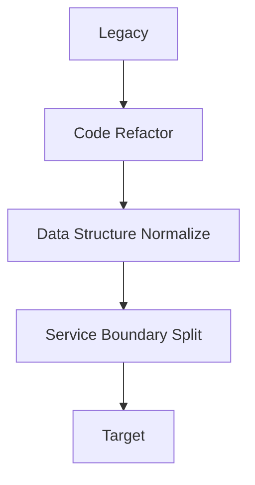

# 05. Migration Path

**Phase 4: Migration Geometry**  
**Document ID:** `docs/80_geometry/05_Migration_Path.md`  
**Date:** 2026-03-05

---

## 1. Introduction

Migration is a process from **Legacy** to **Target**. In the geometry model, this is represented as a **path** (curve) in the Guarantee Space.

---

## 2. Formal Definition

### 2.1 Migration Path

$$
P(t) \in GS \quad t \in [0, 1]
$$

Where:
- $P(0)$ = Legacy state (initial guarantee vector)
- $P(1)$ = Target state (final guarantee vector)

### 2.2 Path as Curve

$P(t)$ is a **continuous curve** in the Guarantee Space. Each $t$ corresponds to an intermediate transformation state.

---

## 3. Example Path

Each step corresponds to a point $P(t_k)$ in $GS$.

---

## 4. Path Risk

$$
Risk(P) = \int_0^1 distance(G(P(t)), Ideal) \, dt
$$

Or discretized over steps $k$:

$$
Risk(P) = \sum_k distance(G(P_k), Ideal)
$$

---

## 5. Conclusion

Migration Path $P(t)$ formalizes the **Legacy → Target** journey as a geometric trajectory. Migration Optimization seeks paths that minimize Risk while staying in the Safe Region.
