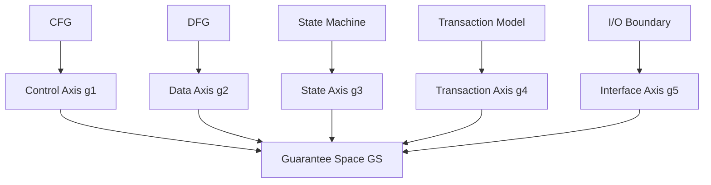

# 09. Guarantee Axis Theory

**Phase 4: Migration Geometry**  
**Document ID:** `docs/80_geometry/09_Guarantee_Axis_Theory.md`  
**Date:** 2026-03-05

---

## 1. Introduction

Each dimension of the Guarantee Vector $G(T) = (g_1, \dots, g_5)$ has a **structural origin**—the program structure from which the guarantee is derived. This document formalizes the **Guarantee Axis Theory**.

---

## 2. Axis–Structure Mapping

| Axis | Meaning | Structural Origin |
| :--- | :--- | :--- |
| $g_1$ (Control) | Control Flow Preservation | CFG |
| $g_2$ (Data) | Data Flow Preservation | DFG |
| $g_3$ (State) | State Transition Preservation | State Machine |
| $g_4$ (Transaction) | Transaction Boundary Preservation | Transaction Model |
| $g_5$ (Interface) | External Interface Preservation | I/O Boundary |

---

## 3. Structural Origin Diagram



---

## 4. Geometry Structure

```mermaid
flowchart LR
    subgraph Structures
        AST[AST]
        CFG[CFG]
        DFG[DFG]
        SM[State Model]
        TM[Transaction Model]
        IO[I/O]
    end
    
    subgraph Axes
        g1[g1 Control]
        g2[g2 Data]
        g3[g3 State]
        g4[g4 Transaction]
        g5[g5 Interface]
    end
    
    subgraph Space
        GS[GS = [0,1]^n]
    end
    
    CFG --> g1
    DFG --> g2
    SM --> g3
    TM --> g4
    IO --> g5
    g1 --> GS
    g2 --> GS
    g3 --> GS
    g4 --> GS
    g5 --> GS
```

---

## 5. Conclusion

Guarantee Axis Theory links each vector dimension to its **structural origin**. This ensures traceability from geometry (Migration Distance, Safe Region) back to program structure (AST, CFG, DFG).
